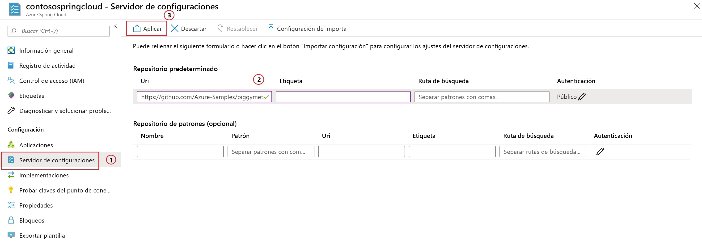

# <a name="quickstart-launch-an-azure-spring-cloud-app-using-the-maven-plug-in"></a>Inicio rápido: Inicio de una aplicación de Azure Spring Cloud mediante el complemento Maven

Con el complemento Maven de Azure Spring Cloud, puede crear y actualizar fácilmente las aplicaciones de Azure Spring Cloud. Al predefinir una configuración, puede implementar aplicaciones en un servicio Azure Spring Cloud existente. En este artículo, se usa una aplicación de ejemplo denominada PiggyMetrics para mostrar esta característica.

En este inicio rápido aprenderá a:

> [!div class="checklist"]
> * Aprovisionar una instancia de servicio
> * Establecer un servidor de configuración para una instancia
> * Clonar y compilar una aplicación de microservicios localmente
> * Implementar cada microservicio
> * Asignar un punto de conexión público para la aplicación

>[!Note]
> Azure Spring Cloud se ofrece actualmente como versión preliminar pública. Las ofertas de versión preliminar pública permiten a los clientes experimentar con nuevas características antes de su publicación oficial.  Los servicios y las características en versión preliminar pública no están diseñados para su uso en producción.  Para más información sobre el soporte técnico durante las versiones preliminares, revise las [preguntas frecuentes](https://azure.microsoft.com/support/faq/) o envíe una [solicitud de soporte técnico](https://docs.microsoft.com/azure/azure-portal/supportability/how-to-create-azure-support-request) para obtener más información.


>[!TIP]
> Azure Cloud Shell es un shell interactivo gratuito que puede usar para ejecutar los comandos de este artículo. Tiene herramientas comunes de Azure preinstaladas, entre las que se incluyen las versiones más recientes de Git, Java Development Kit (JDK), Maven y la CLI de Azure. Si ha iniciado sesión en su suscripción de Azure, inicie [Azure Cloud Shell](https://shell.azure.com). Para más información, vea [Introducción a Azure Cloud Shell](../cloud-shell/overview.md).

Para completar esta guía de inicio rápido:

1. [Instale Git](https://git-scm.com/).
2. [Instale JDK 8](https://docs.microsoft.com/java/azure/jdk/?view=azure-java-stable).
3. [Instale Maven 3.0, o cualquier versión posterior](https://maven.apache.org/download.cgi).
4. [Regístrese para obtener una suscripción gratuita de Azure](https://azure.microsoft.com/free/).

## <a name="provision-a-service-instance-on-the-azure-portal"></a>Aprovisionamiento de una instancia de servicio en Azure Portal

1. En un explorador web, abra [este vínculo a Azure Spring Cloud en Azure Portal](https://ms.portal.azure.com/#create/Microsoft.AppPlatform) e inicie sesión con su cuenta.

1. Proporcione los **Detalles del proyecto** para la aplicación de ejemplo como se indica a continuación:

    1. Seleccione la **Suscripción** con la que se asociará la aplicación.
    1. Seleccione o cree un grupo de recursos para la aplicación. Se recomienda crear un grupo de recursos.  En el ejemplo siguiente se muestra un nuevo grupo de recursos denominado `myspringservice`.
    1. Asigne un nombre para el nuevo servicio Azure Spring Cloud.  El nombre debe tener entre 4 y 32 caracteres, y solo puede contener números, letras minúsculas y guiones. El primer carácter del nombre del servicio debe ser una letra y el último debe ser una letra o un número.  El servicio en el ejemplo siguiente tiene el nombre `contosospringcloud`.
    1. Seleccione una ubicación para la aplicación a partir de las opciones proporcionadas.  En este ejemplo, se ha seleccionado `East US`.
    1. Seleccione **Revisar + crear** para revisar un resumen del nuevo servicio.  Si todo parece correcto, seleccione **Crear**.

    > [!div class="mx-imgBorder"]
    > 

El servicio tarda aproximadamente 5 minutos en implementarse. Una vez implementado el servicio, seleccione **Ir al recurso**, y aparecerá la página **Información general** de la instancia de servicio.

> [!div class="nextstepaction"]
> [He tenido un problema](https://www.research.net/r/javae2e?tutorial=asc-maven-quickstart&step=provision)

## <a name="set-up-your-configuration-server"></a>Configuración del servidor de configuración

1. En la página **Información general** del servicio y seleccione **Config Server**.
1. En la sección **Default repository** (Repositorio predeterminado), establezca **URI** en **https://github.com/Azure-Samples/piggymetrics-config** y, después, seleccione**Apply** (Aplicar) para guardar los cambios.

    > [!div class="mx-imgBorder"]
    > 

> [!div class="nextstepaction"]
> [He tenido un problema](https://www.research.net/r/javae2e?tutorial=asc-maven-quickstart&step=config-server)

## <a name="clone-and-build-the-sample-application-repository"></a>Clonación y compilación del repositorio de aplicaciones de ejemplo

1. Inicie [Azure Cloud Shell](https://shell.azure.com).

1. Para clonar el repositorio de Git, ejecute el siguiente comando:

    ```console
    git clone https://github.com/Azure-Samples/PiggyMetrics
    ```
  
1. Ejecute el siguiente comando para cambiar el directorio y compilar el proyecto:

    ```console
    cd piggymetrics
    mvn clean package -DskipTests
    ```

## <a name="generate-configurations-and-deploy-to-the-azure-spring-cloud"></a>Generación de configuraciones e implementación en Azure Spring Cloud

1. Para generar configuraciones, ejecute el siguiente comando en la carpeta raíz de PiggyMetrics que contiene el archivo POM primario:

    ```console
    mvn com.microsoft.azure:azure-spring-cloud-maven-plugin:1.0.0:config
    ```

    a. Seleccione los módulos `gateway`, `auth-service` y `account-service`.

    b. Seleccione la suscripción y el clúster de servicio de Azure Spring Cloud.

    c. En la lista de proyectos que se proporcionan, escriba el número correspondiente a `gateway` para concederle acceso público.
    
    d. Confirmación de la configuración.

1. El archivo POM ahora contiene las dependencias y configuraciones del complemento. Implemente las aplicaciones mediante el siguiente comando:

   ```console
   mvn azure-spring-cloud:deploy
   ```

1. Después de que haya terminado la implementación, puede acceder a PiggyMetrics desde la dirección URL que se proporciona en la salida del comando anterior.

> [!div class="nextstepaction"]
> [He tenido un problema](https://www.research.net/r/javae2e?tutorial=asc-maven-quickstart&step=deploy)

## <a name="next-steps"></a>Pasos siguientes

En este inicio rápido, ha implementado una aplicación de Spring Cloud desde un repositorio de Maven. Para más información sobre Azure Spring Cloud, consulte el tutorial sobre la preparación de una aplicación para la implementación.

> [!div class="nextstepaction"]
> [Preparación de la aplicación Azure Spring Cloud para la implementación](spring-cloud-tutorial-prepare-app-deployment.md)
> [Más información sobre los complementos de Maven para Azure](https://github.com/microsoft/azure-maven-plugin)

Hay más ejemplos disponibles en GitHub: [Ejemplos de Azure Spring Cloud](https://github.com/Azure-Samples/Azure-Spring-Cloud-Samples/tree/master/service-binding-cosmosdb-sql).
