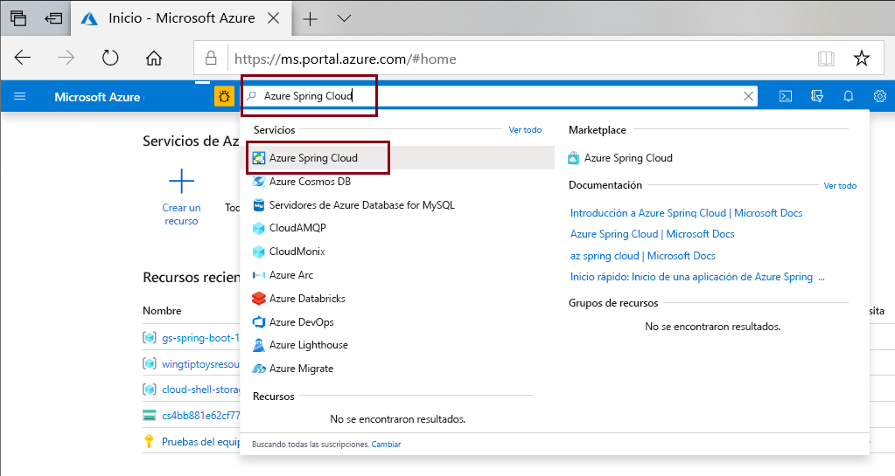
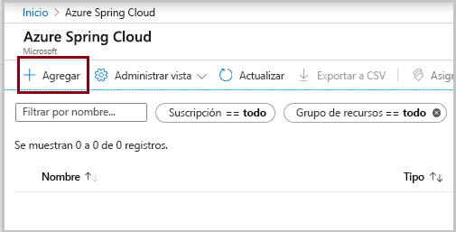
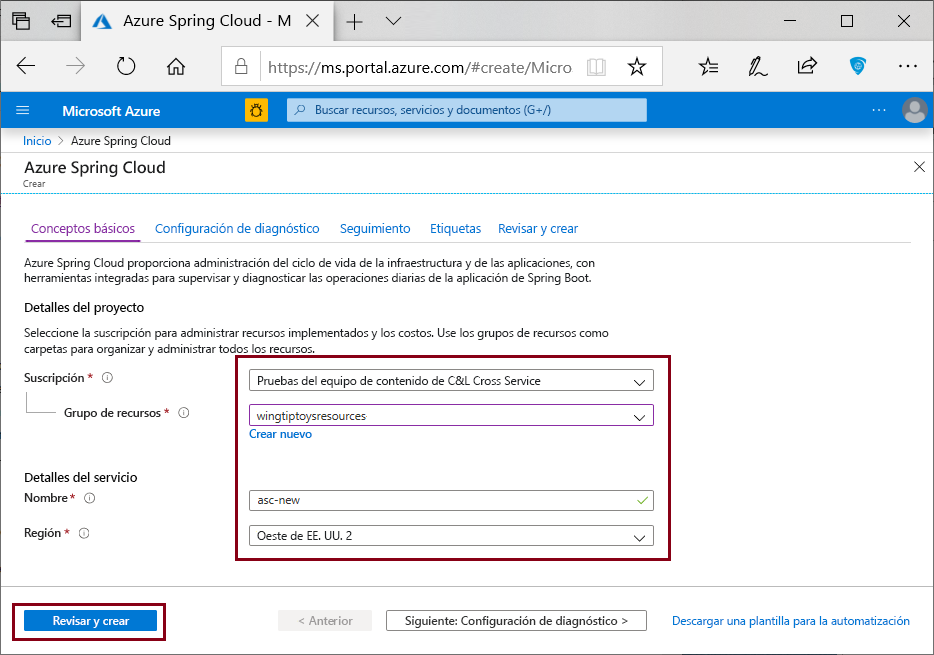

# <a name="quickstart-deploy-your-first-azure-spring-cloud-application"></a>Inicio rápido: implementación de la primera aplicación de Azure Spring Cloud

::: zone pivot="programming-language-csharp"
En este inicio rápido se explica cómo implementar una sencilla aplicación de microservicios de Azure Spring Cloud para que se ejecute en Azure.

>[!NOTE]
> La compatibilidad de Steeltoe con Azure Spring Cloud se ofrece actualmente como versión preliminar pública. Las ofertas de versión preliminar pública permiten a los clientes experimentar con nuevas características antes de su publicación oficial.  Los servicios y las características en versión preliminar pública no están diseñados para su uso en producción.  Para obtener más información sobre el soporte técnico durante las versiones preliminares, revise las [preguntas frecuentes](https://azure.microsoft.com/support/faq/) o envíe una [solicitud de soporte técnico](../azure-portal/supportability/how-to-create-azure-support-request.md).

Al seguir esta guía de inicio rápido, aprenderá a:

> [!div class="checklist"]
> * Generación de un proyecto básico de Steeltoe para .NET Core
> * Aprovisionar una instancia del servicio Azure Spring Cloud
> * Compilar e implementar la aplicación con un punto de conexión público
> * Streaming de registros en tiempo real

El código de aplicación que se usa en esta guía de inicio rápido es una aplicación sencilla compilada con una plantilla de proyecto de API web de .NET Core. Cuando haya completado este ejemplo, se podrá acceder en línea a la aplicación de ejemplo proporcionada y se podrá administrar mediante Azure Portal y la CLI de Azure.

## <a name="prerequisites"></a>Requisitos previos

* Una cuenta de Azure con una suscripción activa. [Cree una cuenta gratuita](https://azure.microsoft.com/free/?WT.mc_id=A261C142F).
* [SDK de .NET Core 3.1](https://dotnet.microsoft.com/download/dotnet-core/3.1). El servicio Azure Spring Cloud admite .NET Core 3.1 y versiones posteriores.
* [CLI de Azure, versión 2.0.67 o posterior](/cli/azure/install-azure-cli?preserve-view=true&view=azure-cli-latest).
* [Git](https://git-scm.com/).

## <a name="install-azure-cli-extension"></a>Instalación de la extensión de la CLI de Azure

Compruebe que la versión de la CLI de Azure sea 2.0.67 o posterior:

```azurecli
az --version
```

Instale la extensión de Azure Spring Cloud para la CLI de Azure con el siguiente comando:

```azurecli
az extension add --name spring-cloud
```

## <a name="log-in-to-azure"></a>Inicio de sesión en Azure

1. Inicio de sesión en la CLI de Azure

    ```azurecli
    az login
    ```

1. Si tiene más de una suscripción, elija la que quiere usar para esta guía de inicio rápido.

   ```azurecli
   az account list -o table
   ```

   ```azurecli
   az account set --subscription <Name or ID of a subscription from the last step>
   ```

## <a name="generate-a-steeltoe-net-core-project"></a>Generación de un proyecto de Steeltoe para .NET Core

En Visual Studio, cree una aplicación web de ASP.NET Core denominada "hello-world" con la plantilla de proyecto de la API. Tenga en cuenta que habrá un WeatherForecastController generado automáticamente, que será el punto de conexión de prueba más adelante.

1. Cree una carpeta para el código fuente del proyecto y genere el proyecto.
 
   ```console
   mkdir source-code
   ```

   ```console
   cd source-code
   ```

   ```dotnetcli
   dotnet new webapi -n hello-world --framework netcoreapp3.1
   ```

1. Vaya al directorio del proyecto.

   ```console
   cd hello-world
   ```

1. Edite el archivo *appsettings.json* para agregar la siguiente configuración:

   ```json
   "spring": {
     "application": {
       "name": "hello-world"
     }
   },
   "eureka": {
     "client": {
       "shouldFetchRegistry": true,
       "shouldRegisterWithEureka": true
     }
   }
   ```

1. También en *appsettings.json*, cambie el nivel de registro de la categoría `Microsoft` de `Warning` a `Information`. Este cambio garantiza que los registros se generarán al ver los registros de streaming en un paso posterior.

   El archivo *appsettings.json* ahora es similar al ejemplo siguiente:

   ```json
   {
     "Logging": {
       "LogLevel": {
         "Default": "Information",
         "Microsoft": "Information",
         "Microsoft.Hosting.Lifetime": "Information"
       }
     },
     "AllowedHosts": "*",
     "spring": {
       "application": {
         "name": "hello-world"
       }
     },
     "eureka": {
       "client": {
         "shouldFetchRegistry": true,
         "shouldRegisterWithEureka": true
       }
     }
   }
   ```
   
1. Agregue dependencias y una tarea `Zip` al archivo *.csproj*:

   ```xml
   <ItemGroup>
     <PackageReference Include="Steeltoe.Discovery.ClientCore" Version="3.0.0" />
     <PackageReference Include="Microsoft.Azure.SpringCloud.Client" Version="2.0.0-preview.1" />
   </ItemGroup>
   <Target Name="Publish-Zip" AfterTargets="Publish">
       <ZipDirectory SourceDirectory="$(PublishDir)" DestinationFile="$(MSBuildProjectDirectory)/deploy.zip" Overwrite="true" />
   </Target>
   ```

   Los paquetes son para la detección de servicios de Steeltoe y la biblioteca cliente de Azure Spring Cloud. La tarea `Zip` es para la implementación en Azure. Al ejecutar el comando `dotnet publish`, se generan los archivos binarios en la carpeta *publish*, y esta tarea comprime la carpeta *publish* en un archivo *.zip* que se carga en Azure.

3. En el archivo *Program.cs*, agregue una directiva `using` y el código que usa la biblioteca cliente de Azure Spring Cloud:

   ```csharp
   using Microsoft.Azure.SpringCloud.Client;
   ```

   ```csharp
   public static IHostBuilder CreateHostBuilder(string[] args) =>
               Host.CreateDefaultBuilder(args)
                   .UseAzureSpringCloudService()
                   .ConfigureWebHostDefaults(webBuilder =>
                   {
                       webBuilder.UseStartup<Startup>();
                   });
   ```

4. En el archivo *Startup.cs*, agregue una directiva `using` y el código que usa la detección de servicios de Steeltoe al final de los métodos `ConfigureServices` y `Configure`:

   ```csharp
   using Steeltoe.Discovery.Client;
   ```

   ```csharp
   public void ConfigureServices(IServiceCollection services)
   {
       // Template code not shown.

       services.AddDiscoveryClient(Configuration);
   }
   ```

   ```csharp
   public void Configure(IApplicationBuilder app, IWebHostEnvironment env)
   {
       // Template code not shown.

       app.UseDiscoveryClient();
   }
   ```

1. Compile el proyecto para asegurarse de que no haya errores de compilación.

   ```dotnetcli
   dotnet build
   ```
 
## <a name="provision-a-service-instance"></a>Aprovisionar una instancia de servicio

En el procedimiento siguiente se crea una instancia de Azure Spring Cloud desde Azure Portal.

1. Abra [Azure Portal](https://ms.portal.azure.com/). 

1. En el cuadro de búsqueda superior, busque *Azure Spring Cloud*.

1. Seleccione *Azure Spring Cloud* en los resultados.

   

1. En la página Azure Spring Cloud, seleccione **+ Add** (+ Agregar).

   

1. Rellene el formulario en la página **Crear** de Azure Spring Cloud.  Tenga en cuenta las directrices siguientes:

   * **Suscripción**: seleccione la suscripción a la que desea que se facture este recurso.
   * **Grupo de recursos**: Cree un nuevo grupo de recursos. El nombre que escriba aquí se usará en pasos posteriores como **\<resource group name\>** .
   * **Detalles o nombre del servicio**: Especifique **\<service instance name\>** .  El nombre debe tener entre 4 y 32 caracteres, y solo puede contener números, letras minúsculas y guiones.  El primer carácter del nombre del servicio debe ser una letra y el último debe ser una letra o un número.
   * **Región**: seleccione la región de la instancia de servicio.

   

6. Seleccione **Revisar y crear**.

## <a name="build-and-deploy-the-app"></a>Compilación e implementación de la aplicación

El procedimiento siguiente genera e implementa el proyecto que creó anteriormente.

1. Asegúrese de que el símbolo del sistema todavía esté en la carpeta del proyecto.

1. Ejecute el siguiente comando para compilar el proyecto, publicar los archivos binarios y almacenar los archivos binarios en un archivo *.zip* en la carpeta del proyecto.

   ```dotnetcorecli
   dotnet publish -c release -o ./publish
   ```

1. Cree una aplicación en la instancia de Azure Spring Cloud con un punto de conexión público asignado. Use el mismo nombre de aplicación "hello-world" que especificó en *appsettings.json*.

   ```console
   az spring-cloud app create -n hello-world -s <service instance name> -g <resource group name> --is-public --runtime-version NetCore_31
   ```

1. Implemente el archivo *.zip* en la aplicación.

   ```azurecli
   az spring-cloud app deploy -n hello-world -s <service instance name> -g <resource group name> --runtime-version NetCore_31 --main-entry hello-world.dll --artifact-path ./deploy.zip
   ```

   La opción `--main-entry` identifica el archivo *.dll* que contiene el punto de entrada de la aplicación. Una vez que el servicio carga el archivo *.zip*, extrae todos los archivos y carpetas e intenta ejecutar el punto de entrada en el archivo *.dll* especificado por `--main-entry`.

   La implementación de la aplicación tarda unos minutos en finalizar. Para confirmar que se ha implementado, vaya a la hoja **Aplicaciones** de Azure Portal.

## <a name="test-the-app"></a>Prueba de la aplicación

Una vez completada la implementación, puede acceder a la aplicación con la dirección URL siguiente:

```http
https://<service instance name>-hello-world.azuremicroservices.io/weatherforecast
```

La aplicación devuelve datos JSON similares al ejemplo siguiente:

```json
[{"date":"2020-09-08T21:01:50.0198835+00:00","temperatureC":14,"temperatureF":57,"summary":"Bracing"},{"date":"2020-09-09T21:01:50.0200697+00:00","temperatureC":-14,"temperatureF":7,"summary":"Bracing"},{"date":"2020-09-10T21:01:50.0200715+00:00","temperatureC":27,"temperatureF":80,"summary":"Freezing"},{"date":"2020-09-11T21:01:50.0200717+00:00","temperatureC":18,"temperatureF":64,"summary":"Chilly"},{"date":"2020-09-12T21:01:50.0200719+00:00","temperatureC":16,"temperatureF":60,"summary":"Chilly"}]
```

## <a name="stream-logs-in-real-time"></a>Streaming de registros en tiempo real

Use el comando siguiente para obtener registros en tiempo real de la aplicación.

```azurecli
az spring-cloud app logs -n hello-world -s <service instance name> -g <resource group name> --lines 100 -f
```

Los registros aparecen en la salida:

```output
[Azure Spring Cloud] The following environment variables are loaded:
2020-09-08 20:58:42,432 INFO supervisord started with pid 1
2020-09-08 20:58:43,435 INFO spawned: 'event-gather_00' with pid 9
2020-09-08 20:58:43,436 INFO spawned: 'dotnet-app_00' with pid 10
2020-09-08 20:58:43 [Warning] No managed processes are running. Wait for 30 seconds...
2020-09-08 20:58:44,843 INFO success: event-gather_00 entered RUNNING state, process has stayed up for > than 1 seconds (startsecs)
2020-09-08 20:58:44,843 INFO success: dotnet-app_00 entered RUNNING state, process has stayed up for > than 1 seconds (startsecs)
←[40m←[32minfo←[39m←[22m←[49m: Steeltoe.Discovery.Eureka.DiscoveryClient[0]
      Starting HeartBeat
info: Microsoft.Hosting.Lifetime[0]
      Now listening on: http://[::]:1025
info: Microsoft.Hosting.Lifetime[0]
      Application started. Press Ctrl+C to shut down.
info: Microsoft.Hosting.Lifetime[0]
      Hosting environment: Production
info: Microsoft.Hosting.Lifetime[0]
      Content root path: /netcorepublish/6e4db42a-b160-4b83-a771-c91adec18c60
2020-09-08 21:00:13 [Information] [10] Start listening...
info: Microsoft.AspNetCore.Hosting.Diagnostics[1]
      Request starting HTTP/1.1 GET http://asc-svc-hello-world.azuremicroservices.io/weatherforecast
info: Microsoft.AspNetCore.Routing.EndpointMiddleware[0]
      Executing endpoint 'hello_world.Controllers.WeatherForecastController.Get (hello-world)'
info: Microsoft.AspNetCore.Mvc.Infrastructure.ControllerActionInvoker[3]
      Route matched with {action = "Get", controller = "WeatherForecast"}. Executing controller action with signature System.Collections.Generic.IEnumerable`1[hello_world.WeatherForecast] Get() on controller hello_world.Controllers.WeatherForecastController (hello-world).
info: Microsoft.AspNetCore.Mvc.Infrastructure.ObjectResultExecutor[1]
      Executing ObjectResult, writing value of type 'hello_world.WeatherForecast[]'.
info: Microsoft.AspNetCore.Mvc.Infrastructure.ControllerActionInvoker[2]
      Executed action hello_world.Controllers.WeatherForecastController.Get (hello-world) in 1.8902ms
info: Microsoft.AspNetCore.Routing.EndpointMiddleware[1]
      Executed endpoint 'hello_world.Controllers.WeatherForecastController.Get (hello-world)'
info: Microsoft.AspNetCore.Hosting.Diagnostics[2]
      Request finished in 4.2591ms 200 application/json; charset=utf-8
```

> [!TIP]
> Use `az spring-cloud app logs -h` para explorar más parámetros y funcionalidades de las secuencias de registro.

Para ver las características avanzadas de análisis de registros, visite la pestaña **Registros** en el menú de [Azure Portal](https://portal.azure.com/). Aquí los registros tienen una latencia de unos minutos.
[  ](media/spring-cloud-quickstart-java/logs-analytics.png#lightbox)
::: zone-end

::: zone pivot="programming-language-java"
En este inicio rápido se explica cómo implementar una sencilla aplicación de microservicios de Azure Spring Cloud para que se ejecute en Azure. 

El código de aplicación que se usa en este tutorial es una aplicación sencilla compilada con Spring Initializr. Cuando haya completado este ejemplo, se podrá acceder en línea a la aplicación de ejemplo proporcionada y se podrá administrar mediante Azure Portal.

En este inicio rápido se explica cómo:

> [!div class="checklist"]
> * Generar un proyecto básico de Spring Cloud
> * Aprovisionar una instancia de servicio
> * Compilar e implementar la aplicación con un punto de conexión público
> * Streaming de registros en tiempo real

## <a name="prerequisites"></a>Requisitos previos

Para completar esta guía de inicio rápido:

* [Instalación de JDK 8](/java/azure/jdk/?preserve-view=true&view=azure-java-stable)
* [Registro para obtener una suscripción a Azure](https://azure.microsoft.com/free/)
* (Opcional) [Instale la versión 2.0.67, o cualquier versión superior,](/cli/azure/install-azure-cli?preserve-view=true&view=azure-cli-latest) y la extensión de Azure Spring Cloud con el comando `az extension add --name spring-cloud`
* (Opcional) [Instale Azure Toolkit for IntelliJ](https://plugins.jetbrains.com/plugin/8053-azure-toolkit-for-intellij/) e [inicie sesión](/azure/developer/java/toolkit-for-intellij/create-hello-world-web-app#installation-and-sign-in)

## <a name="generate-a-spring-cloud-project"></a>Generación de un proyecto de Spring Cloud

Comience con [Spring Initializr](https://start.spring.io/#!type=maven-project&language=java&platformVersion=2.3.4.RELEASE&packaging=jar&jvmVersion=1.8&groupId=com.example&artifactId=hellospring&name=hellospring&description=Demo%20project%20for%20Spring%20Boot&packageName=com.example.hellospring&dependencies=web,cloud-eureka,actuator,cloud-starter-sleuth,cloud-starter-zipkin,cloud-config-client) para generar un proyecto de ejemplo con las dependencias recomendadas para Azure Spring Cloud. En la imagen siguiente se muestra la configuración de Initializr para este proyecto de ejemplo.
```url
https://start.spring.io/#!type=maven-project&language=java&platformVersion=2.3.4.RELEASE&packaging=jar&jvmVersion=1.8&groupId=com.example&artifactId=hellospring&name=hellospring&description=Demo%20project%20for%20Spring%20Boot&packageName=com.example.hellospring&dependencies=web,cloud-eureka,actuator,cloud-starter-sleuth,cloud-starter-zipkin,cloud-config-client
```

  

> [!NOTE]
> Se ha identificado un problema con Spring Boot 2.4 en la autenticación de TLS entre las aplicaciones y Eureka, y se está trabajando con la comunidad de Spring para resolverlo. Consulte la sección de [preguntas frecuentes](https://docs.microsoft.com/azure/spring-cloud/spring-cloud-faq?pivots=programming-language-java#development) para obtener una solución alternativa.

1. Haga clic en **Generate** (Generar) cuando se establezcan todas las dependencias. Descargue y desempaquete el paquete y, después, cree un controlador web para una aplicación web simple agregando `src/main/java/com/example/hellospring/HelloController.java` como se indica a continuación:

    ```java
    package com.example.hellospring;
    
    import org.springframework.web.bind.annotation.RestController;
    import org.springframework.web.bind.annotation.RequestMapping;
    
    @RestController
    public class HelloController {
    
        @RequestMapping("/")
        public String index() {
            return "Greetings from Azure Spring Cloud!";
        }
    
    }
    ```
## <a name="provision-an-instance-of-azure-spring-cloud"></a>Aprovisionamiento de una instancia de Azure Spring Cloud

En el procedimiento siguiente se crea una instancia de Azure Spring Cloud desde Azure Portal.

1. Abra [Azure Portal](https://ms.portal.azure.com/) en una pestaña ventana. 

2. En el cuadro de búsqueda superior, busque *Azure Spring Cloud*.

3. Seleccione *Azure Spring Cloud* en los resultados.

    

4. En la página Azure Spring Cloud, haga clic en **+ Add** (+ Agregar).

    

5. Rellene el formulario en la página **Crear** de Azure Spring Cloud.  Tenga en cuenta las directrices siguientes:
    - **Suscripción**: seleccione la suscripción a la que desea que se facture este recurso.
    - **Grupo de recursos**: se recomienda crear grupos de recursos para los nuevos recursos. Se usarán en los pasos posteriores como **\<resource group name\>** .
    - **Detalles o nombre del servicio**: Especifique **\<service instance name\>** .  El nombre debe tener entre 4 y 32 caracteres, y solo puede contener números, letras minúsculas y guiones.  El primer carácter del nombre del servicio debe ser una letra y el último debe ser una letra o un número.
    - **Ubicación**: seleccione la región de la instancia de servicio.

    

6. Haga clic en **Revisar y crear**.

## <a name="build-and-deploy-the-app"></a>Compilación e implementación de la aplicación
    
#### <a name="cli"></a>[CLI](#tab/Azure-CLI)
El siguiente procedimiento compila e implementa la aplicación mediante la CLI de Azure. Ejecute el siguiente comando en la raíz del proyecto.

1. Compile el proyecto mediante Maven:

    ```console
    mvn clean package -DskipTests
    ```

1. Si aún no la ha instalado, instale la extensión de Azure Spring Cloud para la CLI de Azure:

    ```azurecli
    az extension add --name spring-cloud
    ```
    
1. Cree la aplicación con el punto de conexión público asignado:

    ```azurecli
    az spring-cloud app create -n hellospring -s <service instance name> -g <resource group name> --is-public
    ```

1. Implemente el archivo JAR de la aplicación (`target\hellospring-0.0.1-SNAPSHOT.jar` en Windows):

    ```azurecli
    az spring-cloud app deploy -n hellospring -s <service instance name> -g <resource group name> --jar-path <jar file path>
    ```
    
1. La implementación de la aplicación tarda unos minutos en finalizar. Para confirmar que se ha implementado, vaya a la hoja **Aplicaciones** de Azure Portal. Debería ver el estado de la aplicación.

#### <a name="intellij"></a>[IntelliJ](#tab/IntelliJ)

En el procedimiento siguiente se usa el complemento IntelliJ para Azure Spring Cloud para implementar la aplicación de ejemplo en IntelliJ IDEA.  

### <a name="import-project"></a>Importación del proyecto

1. Abra el cuadro de diálogo de **bienvenida** de IntelliJ y seleccione **Import Project** (Importar proyecto) para abrir el asistente para importar.
1. Seleccione la carpeta `hellospring`.

    

### <a name="deploy-the-app"></a>Implementar la aplicación
Para realizar la implementación en Azure, debe iniciar sesión con su cuenta de Azure y elegir su suscripción.  Puede encontrar información sobre el inicio de sesión en [Instalación e inicio de sesión](/azure/developer/java/toolkit-for-intellij/create-hello-world-web-app#installation-and-sign-in).

1. Vaya al explorador de proyectos de IntelliJ, haga clic con el botón derecho en el proyecto y seleccione **Azure** -> **Deploy to Azure Spring Cloud** (Implementar en Azure Spring Cloud).

    [ ](media/spring-cloud-quickstart-java/intellij-deploy-azure-1.png#lightbox)

1. Acepte el nombre de la aplicación en el campo **Name** (Nombre). El **nombre** hace referencia a la configuración, no al nombre de la aplicación. Normalmente, los usuarios no tienen que cambiarlo.
1. En el cuadro de texto **Artefacto**, seleccione *hellospring-0.0.1-SNAPSHOT.jar*.
1. En el cuadro de texto **Suscripción**, compruebe su suscripción.
1. En el cuadro de texto **Spring Cloud**, seleccione la instancia de Azure Spring Cloud que creó en el artículo sobre el [aprovisionamiento de una instancia de Azure Spring Cloud](./spring-cloud-quickstart-provision-service-instance.md).
1. En **Punto de conexión público**, seleccione *Habilitar*.
1. En el cuadro de texto **Aplicación:** , seleccione **Crear aplicación...** .
1. Escriba *hellospring* y, después, haga clic en **Aceptar**.

    [  ](media/spring-cloud-quickstart-java/intellij-deploy-to-azure.png#lightbox)

1. Para iniciar la implementación haga clic en el botón **Run** (Ejecutar) en la parte inferior del cuadro de diálogo **Deploy Azure Spring Cloud app** (Implementar una aplicación de Azure Spring Cloud). El complemento ejecutará el comando `mvn package` en la aplicación `hellospring` e implementará el archivo .jar que ha generado el comando `package`.
---

Una vez completada la implementación, puede acceder a la aplicación en `https://<service instance name>-hellospring.azuremicroservices.io/`.

  [  ](media/spring-cloud-quickstart-java/access-app-browser.png#lightbox)

## <a name="streaming-logs-in-real-time"></a>Registros de streaming en tiempo real

#### <a name="cli"></a>[CLI](#tab/Azure-CLI)

Use el comando siguiente para obtener registros en tiempo real de la aplicación.

```azurecli
az spring-cloud app logs -n hellospring -s <service instance name> -g <resource group name> --lines 100 -f

```
Los registros aparecen en los resultados:

[  ](media/spring-cloud-quickstart-java/streaming-logs.png#lightbox)

>[!TIP]
> Use `az spring-cloud app logs -h` para explorar más parámetros y funcionalidades de las secuencias de registro.

#### <a name="intellij"></a>[IntelliJ](#tab/IntelliJ)

1. Seleccione **Azure Explorer** (Explorador de Azure) y, luego, **Spring Cloud**.
1. Haga clic con el botón derecho en la aplicación en ejecución.
1. Seleccione **Streaming Logs** (Registros de streaming) en la lista desplegable.
1. Seleccione la instancia.

    [  ](media/spring-cloud-quickstart-java/intellij-get-streaming-logs.png)

1. El registro de streaming se verá en la ventana de salida.

    [  ](media/spring-cloud-quickstart-java/intellij-streaming-logs-output.png)
---

Para ver las características avanzadas de los análisis de registros, visite la pestaña **Registros** en el menú de [Azure Portal](https://portal.azure.com/). Aquí los registros tienen una latencia de unos minutos.

[  ](media/spring-cloud-quickstart-java/logs-analytics.png#lightbox)
::: zone-end

## <a name="clean-up-resources"></a>Limpieza de recursos

En los pasos anteriores, creó recursos de Azure que seguirán acumulando cargos mientras permanezcan en la suscripción. Si prevé que no va a necesitar estos recursos en el futuro, elimine el grupo de recursos del portal o ejecutando el siguiente comando en la CLI de Azure:

```azurecli
az group delete --name <your resource group name; for example: hellospring-1558400876966-rg> --yes
```

## <a name="next-steps"></a>Pasos siguientes

En este inicio rápido ha aprendido a:

> [!div class="checklist"]
> * Generar un proyecto de Azure Spring Cloud básico
> * Aprovisionar una instancia de servicio
> * Compilar e implementar la aplicación con un punto de conexión público
> * Streaming de registros en tiempo real

Para aprender a usar más funcionalidades de Azure Spring, avance a la serie de guías de inicio rápido que implementa una aplicación de ejemplo en Azure Spring Cloud:

> [!div class="nextstepaction"]
> [Compilación y ejecución de microservicios](spring-cloud-quickstart-sample-app-introduction.md)

Hay más ejemplos disponibles en GitHub: [Ejemplos de Azure Spring Cloud](https://github.com/Azure-Samples/Azure-Spring-Cloud-Samples).
