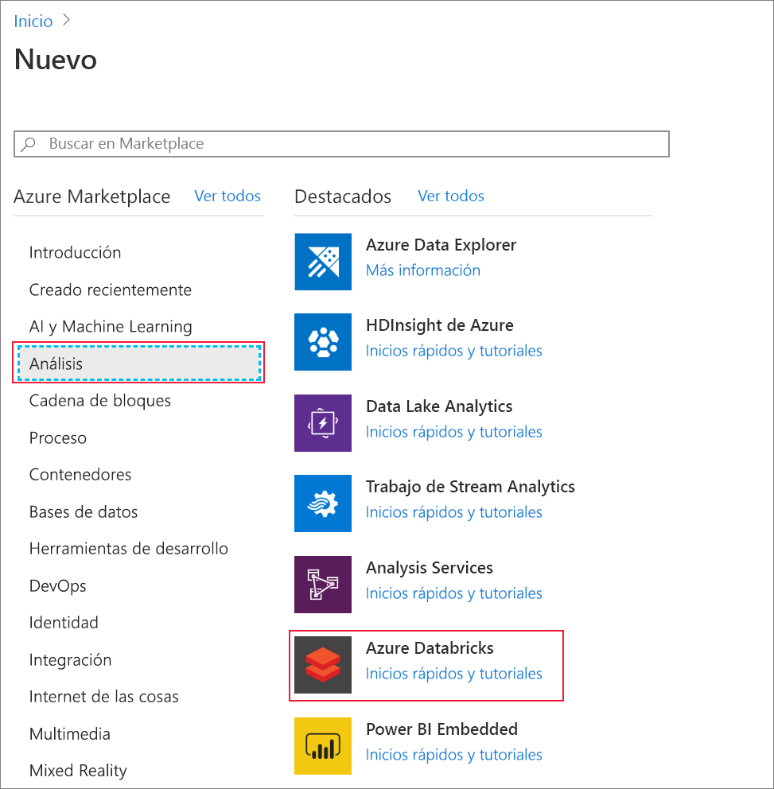
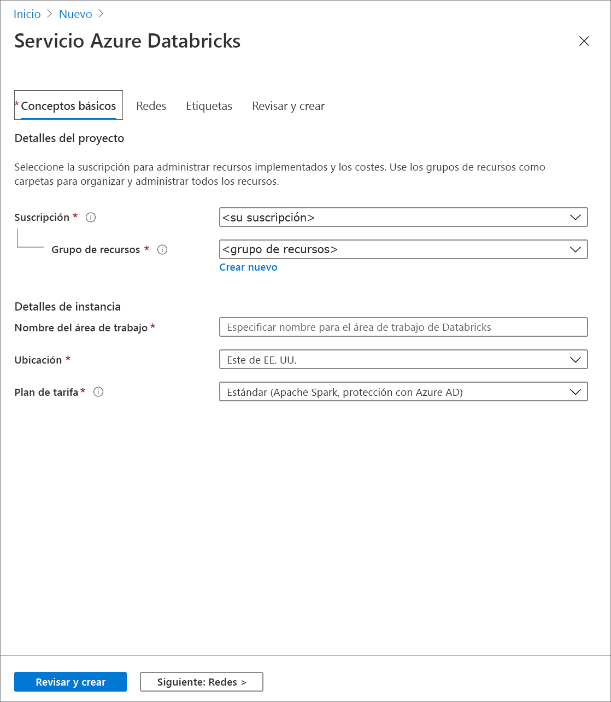
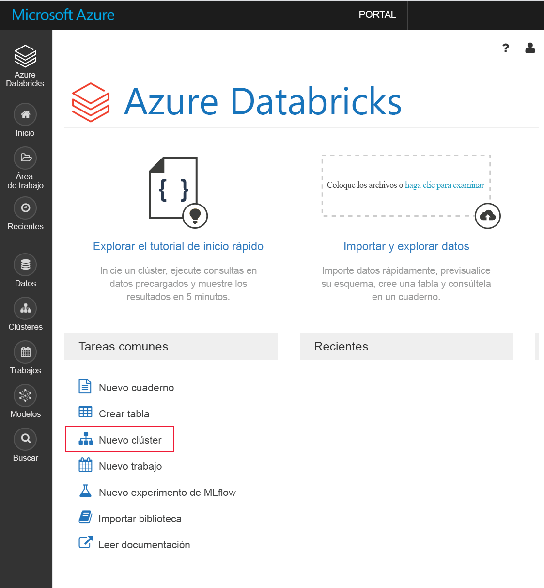
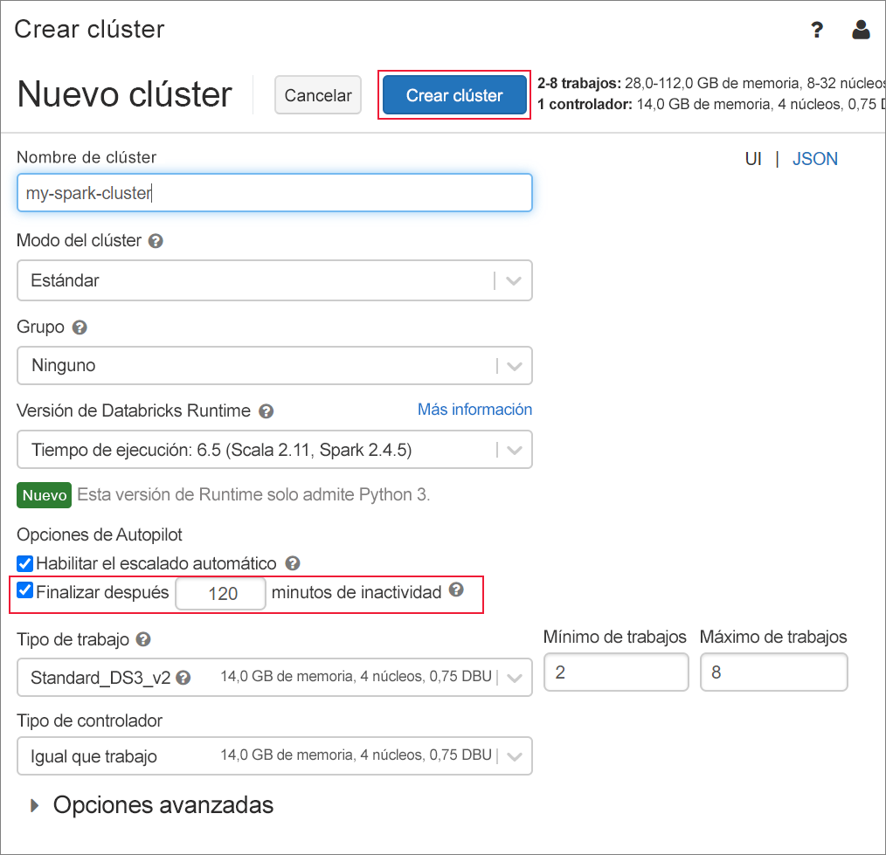
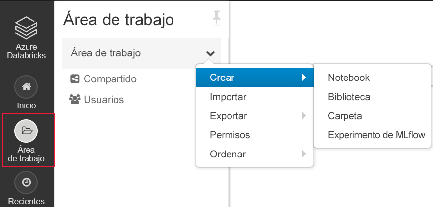

# <a name="quickstart-analyze-data-with-databricks"></a>Inicio rápido: Análisis de datos con Databricks

En este inicio rápido, va a ejecutar un trabajo de Apache Spark con Azure Databricks para realizar análisis de datos almacenados en una cuenta de almacenamiento. Como parte del trabajo de Spark, analizará los datos de la suscripción a un canal de radio para obtener información detallada acerca del uso gratis o de pago basado en datos demográficos.

## <a name="prerequisites"></a>Prerrequisitos

* Una cuenta de Azure con una suscripción activa. [Cree una cuenta gratuita](https://azure.microsoft.com/free/?ref=microsoft.com&utm_source=microsoft.com&utm_medium=docs&utm_campaign=visualstudio).

* El nombre de la cuenta de almacenamiento de Azure Data Lake Gen2. [Creación de una cuenta de Azure Storage](data-lake-storage-quickstart-create-account.md).

* El identificador de inquilino, el identificador de aplicación y la contraseña de una entidad de servicio de Azure con un rol asignado de **colaborador de datos de blobs de almacenamiento**. [Cree una entidad de servicio](../../active-directory/develop/howto-create-service-principal-portal.md).

  > [!IMPORTANT]
  > Asigne el rol en el ámbito de la cuenta de almacenamiento de Data Lake Storage Gen2. Puede asignar un rol al grupo de recursos o suscripción primario, pero recibirá errores relacionados con los permisos hasta que esas asignaciones de roles se propaguen a la cuenta de almacenamiento.

## <a name="create-an-azure-databricks-workspace"></a>Creación de un área de trabajo de Azure Databricks

En esta sección, creará un área de trabajo de Azure Databricks mediante Azure Portal.

1. En Azure Portal, seleccione **Crear un recurso** > **Análisis** > **Azure Databricks**.

    

2. En **Azure Databricks Service** , proporcione los valores para crear un área de trabajo de Databricks.

    

    Proporcione los valores siguientes:

    |Propiedad  |Descripción  |
    |---------|---------|
    |**Workspace name** (Nombre del área de trabajo)     | Proporcione un nombre para el área de trabajo de Databricks        |
    |**Suscripción**     | En el cuadro desplegable, seleccione la suscripción de Azure.        |
    |**Grupos de recursos**     | Especifique si desea crear un nuevo grupo de recursos o utilizar uno existente. Un grupo de recursos es un contenedor que almacena los recursos relacionados con una solución de Azure. Para más información, consulte [Información general del grupo de recursos de Azure](../../azure-resource-manager/management/overview.md). |
    |**Ubicación**     | Seleccione **Oeste de EE. UU. 2**. No dude en seleccionar otra región pública si lo prefiere.        |
    |**Plan de tarifa**     |  Elija entre **Standard** o **Premium**. Para más información sobre estos planes, consulte la [página de precios de Databricks](https://azure.microsoft.com/pricing/details/databricks/).       |

3. La cuenta tarda unos minutos en crearse. Para supervisar el estado de la operación, consulte la barra de progreso en la parte superior.

4. Seleccione **Anclar al panel** y, después, seleccione **Crear**.

## <a name="create-a-spark-cluster-in-databricks"></a>Creación de un clúster de Spark en Databricks

1. En Azure Portal, vaya al área de trabajo de Databricks que ha creado y, después, seleccione **Launch Workspace** (Iniciar área de trabajo).

2. Se le redirigirá al portal de Azure Databricks. En el portal, seleccione **Nuevo** > **Clúster**.

    

3. En la página **Nuevo clúster** , proporcione los valores para crear un clúster.

    

    Rellene los valores para los campos siguientes y acepte los valores predeterminados para el resto de campos:

    - Escriba un nombre para el clúster.
     
    - Asegúrese de que selecciona la casilla **Terminate after 120 minutes of inactivity** (Terminar después de 120 minutos de inactividad). Proporcione una duración (en minutos) para terminar el clúster, si este no se usa.

4. Seleccione **Create cluster** (Crear clúster). Una vez que el clúster se está ejecutando, puede asociarle notebooks y ejecutar trabajos de Spark.

Para obtener más información sobre la creación de clústeres, consulte [Create a Spark cluster in Azure Databricks](https://docs.azuredatabricks.net/user-guide/clusters/create.html) (Creación de un clúster de Spark en Azure Databricks).

## <a name="create-notebook"></a>Creación de un cuaderno

En esta sección, creará un cuaderno en el área de trabajo de Azure Databricks y, a continuación, ejecutará fragmentos de código para configurar la cuenta de almacenamiento.

1. En [Azure Portal](https://portal.azure.com), vaya al área de trabajo de Azure Databricks que creó y seleccione **Launch Workspace** (Iniciar área de trabajo).

2. En el panel izquierdo, seleccione **Workspace** (Área de trabajo). En la lista desplegable **Workspace** (Área de trabajo), seleccione **Create** > **Notebook** (Crear > Cuaderno).

    

3. En el cuadro de diálogo **Create Notebook** (Crear cuaderno), escriba un nombre para el cuaderno. Seleccione **Scala** como lenguaje y, a continuación, seleccione el clúster de Spark que creó anteriormente.

    

    Seleccione **Crear**.

4. Copie y pegue el siguiente bloque de código en la primera celda, pero no ejecute el código aún.

   ```scala
   spark.conf.set("fs.azure.account.auth.type.<storage-account-name>.dfs.core.windows.net", "OAuth")
   spark.conf.set("fs.azure.account.oauth.provider.type.<storage-account-name>.dfs.core.windows.net", "org.apache.hadoop.fs.azurebfs.oauth2.ClientCredsTokenProvider")
   spark.conf.set("fs.azure.account.oauth2.client.id.<storage-account-name>.dfs.core.windows.net", "<appID>")
   spark.conf.set("fs.azure.account.oauth2.client.secret.<storage-account-name>.dfs.core.windows.net", "<password>")
   spark.conf.set("fs.azure.account.oauth2.client.endpoint.<storage-account-name>.dfs.core.windows.net", "https://login.microsoftonline.com/<tenant-id>/oauth2/token")
   spark.conf.set("fs.azure.createRemoteFileSystemDuringInitialization", "true")
   dbutils.fs.ls("abfss://<container-name>@<storage-account-name>.dfs.core.windows.net/")
   spark.conf.set("fs.azure.createRemoteFileSystemDuringInitialization", "false")

   ```
5. En este bloque de código, reemplace los valores de marcador de posición `storage-account-name`, `appID`, `password` y `tenant-id` por los valores que recopiló cuando creó la entidad de servicio. Establezca el valor del marcador de posición `container-name` en el nombre que desea dar al contenedor.

6. Presione las teclas **MAYÚS + ENTRAR** para ejecutar el código de este bloque.

## <a name="ingest-sample-data"></a>Ingesta de datos de ejemplo

Antes de empezar esta sección, debe completar lo siguientes requisitos previos:

Escriba el código siguiente en una celda del cuaderno:

```bash
%sh wget -P /tmp https://raw.githubusercontent.com/Azure/usql/master/Examples/Samples/Data/json/radiowebsite/small_radio_json.json
```

En la celda, presione **MAYÚS + ENTRAR** para ejecutar el código.

Ahora, en una nueva celda debajo de esta, escriba el siguiente código y reemplace los valores que aparecen entre paréntesis por los mismos valores que usó anteriormente:

```python
dbutils.fs.cp("file:///tmp/small_radio_json.json", "abfss://<container-name>@<storage-account-name>.dfs.core.windows.net/")
```

En la celda, presione **MAYÚS + ENTRAR** para ejecutar el código.

## <a name="run-a-spark-sql-job"></a>Ejecución de un trabajo de Spark SQL

Realice las siguientes tareas para ejecutar un trabajo de Spark SQL en los datos.

1. Ejecute una instrucción SQL para crear una tabla temporal con datos desde el archivo de datos JSON de ejemplo, **small_radio_json.json**. En el siguiente fragmento de código, reemplace los valores del marcador de posición con el nombre del contenedor y el nombre de la cuenta de almacenamiento. Use el cuaderno que ha creado antes, pegue el fragmento de código en una nueva celda de código y, después, presione MAYÚS + ENTRAR.

    ```sql
    %sql
    DROP TABLE IF EXISTS radio_sample_data;
    CREATE TABLE radio_sample_data
    USING json
    OPTIONS (
     path  "abfss://<container-name>@<storage-account-name>.dfs.core.windows.net/small_radio_json.json"
    )
    ```

    Una vez que el comando se completa correctamente, tiene todos los datos desde el archivo JSON como una tabla en el clúster de Databricks.

    El comando mágico del lenguaje `%sql` le permite ejecutar un código SQL desde el notebook, aunque este sea de otro tipo. Para obtener más información, consulte [Combinación de lenguajes en un notebook](https://docs.azuredatabricks.net/user-guide/notebooks/index.html#mixing-languages-in-a-notebook).

2. Echemos un vistazo a una instantánea de los datos JSON de ejemplo para entender mejor la consulta que se ejecuta. Pegue el siguiente fragmento de código en una celda vacía y presione **MAYÚS + ENTRAR**.

    ```sql
    %sql
    SELECT * from radio_sample_data
    ```

3. Verá un resultado tabular como se muestra en la siguiente captura de pantalla (solo se ven algunas columnas):

    

    Entre otros detalles, los datos de ejemplo capturan el género de la audiencia de un canal de radio (nombre de columna, **género** ) y si su suscripción es gratis o de pago (nombre de columna, **nivel** ).

4. Ahora cree una representación visual de estos datos para mostrar para cada género, cuántos usuarios tienen cuentas gratis y cuántas son de suscriptores pagados. En la parte inferior de la salida tabular, haga clic en el icono **Gráfico de barras** y, a continuación, haga clic en **Opciones de trazado**.

    

5. En **Personalizar trazado** , arrastre y coloque los valores como se muestra en la captura de pantalla.

    

    - Establezca **Claves** en **gender** (género).
    - Establezca **Agrupaciones de serie** en **level** (nivel).
    - Establezca **Valores** en **level** (nivel).
    - Establezca **Agregación** en **COUNT** (recuento).

6. Haga clic en **Aplicar**.

7. El resultado muestra la representación visual, como se describe en la siguiente captura de pantalla:

     

## <a name="clean-up-resources"></a>Limpieza de recursos

Cuando haya finalizado con este artículo, puede terminar el clúster. En el área de trabajo de Azure Databricks, seleccione **Clusters** (Clústeres) y localice el clúster que desea terminar. Mueva el cursor sobre el botón de puntos suspensivos en la columna **Actions** (Acciones) y seleccione el icono **Terminate** (Finalizar).


Si no finaliza manualmente el clúster, este se detendrá automáticamente si seleccionó la casilla **Terminate after \_\_ minutes of inactivity** (Finalizar después de \_\_ minutos de inactividad) al crear el clúster. Si establece esta opción, el clúster se detendrá después de haber estado inactivo durante la cantidad de tiempo designada.

## <a name="next-steps"></a>Pasos siguientes

En este artículo, ha creado un clúster de Spark en Azure Databricks y ha ejecutado un trabajo de Spark mediante los datos de una cuenta de almacenamiento con Data Lake Storage Gen2 habilitado.

Vaya al siguiente artículo para aprender cómo realizar una operación ETL (extraer, transformar y cargar datos) mediante Azure Databricks.

> [!div class="nextstepaction"]
>[Extracción, transformación y carga de datos mediante Azure Databricks](../../azure-databricks/databricks-extract-load-sql-data-warehouse.md).

- Para aprender a importar datos de otros orígenes en Azure Databricks, consulte [Orígenes de datos de Spark](https://docs.azuredatabricks.net/spark/latest/data-sources/index.html).

- Para aprender otras formas de acceder a Azure Data Lake Storage Gen2 desde un área de trabajo de Azure Databricks, consulte [Azure Data Lake Storage Gen2](https://docs.azuredatabricks.net/spark/latest/data-sources/azure/azure-datalake-gen2.html).
