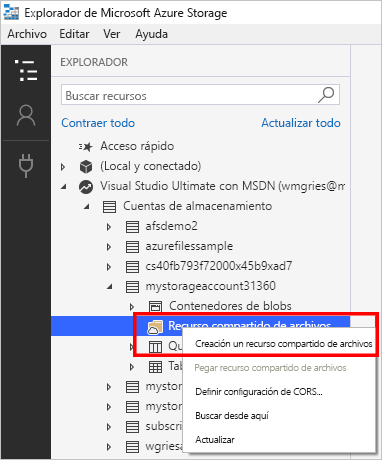
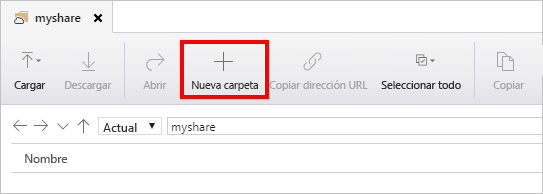

# Guía de inicio rápido: Creación y administración de recursos compartidos de archivos de Azure con el Explorador de Azure Storage
En esta guía se describen los conceptos básicos sobre cómo trabajar con [recursos compartidos de archivos de Azure](storage-files-introduction.md) mediante el Explorador de Azure Storage. Los recursos compartidos de archivos de Azure son iguales a otros recursos compartidos de archivos, pero se almacenan en la nube y están respaldados por la plataforma Azure. Los recursos compartidos de archivos de Azure admiten el protocolo SMB estándar del sector y permiten el uso compartido entre varias máquinas, aplicaciones e instancias. 

El Explorador de Azure Storage es una herramienta de cliente conocida que está disponible para Windows, macOS y Linux. Puede usar el Explorador de Storage para administrar recursos compartidos de archivos de Azure y otros recursos de almacenamiento.

Si no tiene una suscripción a Azure, cree una [cuenta gratuita](https://azure.microsoft.com/free/?WT.mc_id=A261C142F) antes de empezar.

## Prerequisites
Esta guía de inicio rápido requiere que esté instalado el Explorador de Storage. Para su descarga e instalación, vaya a [Explorador de Azure Storage](https://azure.microsoft.com/features/storage-explorer/).

## Crear una cuenta de almacenamiento
No se puede usar el Explorador de Storage para crear nuevos recursos. Para los fines de esta demostración, cree la cuenta de almacenamiento en [Azure Portal](https://portal.azure.com/). 

[!INCLUDE [storage-files-create-storage-account-portal](../../../includes/storage-files-create-storage-account-portal.md)]

## Conexión del Explorador de Storage a los recursos de Azure
Cuando se inicia por primera vez el Explorador de Storage, aparece la ventana **Explorador de Microsoft Azure Storage - Conectar**. El Explorador de Storage proporciona varias maneras de conectar con las cuentas de almacenamiento: 

- **Inicio de sesión con la cuenta de Azure**: puede iniciar sesión con las credenciales de usuario de su organización o su cuenta Microsoft. 
- **Conexión a una cuenta de almacenamiento específica mediante una cadena de conexión o un token de SAS**: una cadena de conexión es una cadena especial que contiene un nombre de cuenta de almacenamiento una clave de cuenta de almacenamiento o un token de SAS. Con el token, el Explorador de Storage accede directamente a la cuenta de almacenamiento (en lugar de simplemente ver todas las cuentas de almacenamiento de una cuenta de Azure). Para más información sobre las cadenas de conexión, consulte [Configuración de las cadenas de conexión de Azure Storage](../common/storage-configure-connection-string.md?toc=%2fazure%2fstorage%2ffiles%2ftoc.json).
- **Conexión a una cuenta de almacenamiento específica con el nombre y la clave de una cuenta de almacenamiento**: use el nombre y la clave de la cuenta de almacenamiento para conectarse a Azure Storage.

Para los fines de esta guía de inicio rápido, inicie sesión con su cuenta de Azure. Seleccione **Add an Azure Account** (Agregar una cuenta de Azure) y, a continuación, seleccione **Sign In** (Iniciar sesión). Siga las indicaciones para iniciar sesión en su cuenta de Azure.

### Creación de un recurso compartido de archivos
Para crear su primer recurso compartido de archivos de Azure en la cuenta de almacenamiento `storageacct<random number>`, siga estos pasos:

1. Expanda la cuenta de almacenamiento que creó.
2. Haga clic con el botón derecho en **File Shares** (Recursos compartidos de archivos) y seleccione **Create File Share** (Crear recurso compartido de archivos).  
    

3. Para el recurso compartido de archivos, escriba *myshare* y, a continuación, presione ENTRAR.

Los nombres de los recursos compartidos solo pueden contener letras minúsculas, números y guiones sencillos (pero no pueden empezar con un guion). Para obtener detalles completos sobre cómo asignar un nombre a los recursos compartidos y los archivos, consulte [Asignación de nombres y referencia a recursos compartidos, directorios, archivos y metadatos](/rest/api/storageservices/Naming-and-Referencing-Shares--Directories--Files--and-Metadata).

Después de crear el recurso compartido de archivos, se abre una pestaña para el recurso compartido de archivos en el panel derecho. 

## Uso de un recurso compartido de archivos de Azure
Ahora que ha creado un recurso compartido de archivos de Azure, puede montarlo con SMB en [Windows](storage-how-to-use-files-windows.md), [Linux](storage-how-to-use-files-linux.md) o [macOS](storage-how-to-use-files-mac.md). Como alternativa, puede trabajar con el recurso compartido de archivos de Azure con el Explorador de Azure Storage. La ventaja de usar el Explorador de Azure Storage en lugar de montar el recurso compartido de archivos mediante SMB es que todas las solicitudes que se realizan con dicho explorador usan la API REST de Azure Files. Puede utilizar la API REST de Azure Files para crear, modificar y eliminar archivos y directorios en los clientes que no tienen acceso mediante SMB.

### Creación de un directorio
Al agregar un directorio se proporciona una estructura jerárquica para administrar el recurso compartido de archivos. Puede crear varios niveles en el directorio. Debe asegurarse de que existen los directorios primarios antes de crear un subdirectorio. Por ejemplo, para la ruta de acceso myDirectory/mySubDirectory, primero debe crear el directorio *myDirectory*. A continuación, puede crear *mySubDirectory*. 

1. En la pestaña del recurso compartido de archivos, en el menú superior, seleccione el botón **New Folder** (Nueva carpeta). Se abre el panel **Create New Directory** (Crear nuevo directorio).
    

2. Para el nombre del directorio, escriba *myDirectory* y, a continuación, seleccione **OK** (Aceptar). 

El directorio *myDirectory* se muestra en la pestaña del recurso compartido de archivos *myshare*.

### Cargar un archivo 
Puede cargar un archivo desde la máquina local hasta el nuevo directorio del recurso compartido de archivos. Puede cargar una carpeta completa o un único archivo.

1. En el menú superior, seleccione **Upload** (Cargar). Esta operación le da la opción de cargar un archivo o una carpeta.
2. Seleccione **Upload File** (Cargar archivo) y, a continuación, seleccione un archivo de la máquina local para cargar.
3. En **Cargar en un directorio**, escriba *myDirectory* y, a continuación, seleccione **Cargar**. 

Cuando haya terminado, el archivo aparece en la lista en el panel *myDirectory*.

### Descarga de un archivo
Para descargar una copia de un archivo desde el recurso compartido de archivos, haga clic con el botón derecho en el archivo y, a continuación, seleccione **Download** (Descargar). Elija dónde desea colocar el archivo en la máquina local y, a continuación, seleccione **Save** (Guardar).

El progreso de la descarga aparece en el panel **Activities** (Actividades) en la parte inferior de la ventana.

## Limpieza de recursos
No se puede usar el Explorador de Storage para eliminar recursos. Para realizar la limpieza de esta guía de inicio rápido, puede usar [Azure Portal](https://portal.azure.com/). 

[!INCLUDE [storage-files-clean-up-portal](../../../includes/storage-files-clean-up-portal.md)]

## Pasos siguientes

> [!div class="nextstepaction"]
> [¿Qué es Azure Files?](storage-files-introduction.md)