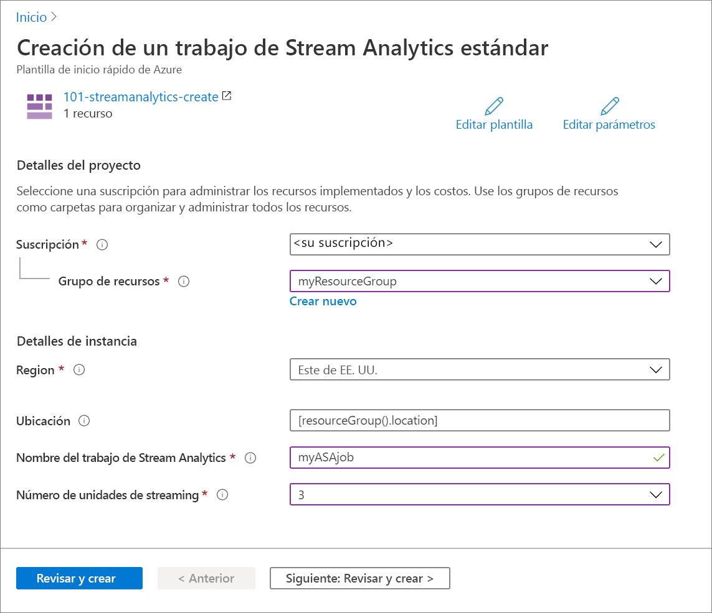

# <a name="quickstart-create-an-azure-stream-analytics-job-by-using-an-arm-template"></a>Inicio rápido: Creación de un trabajo de Azure Stream Analytics mediante una plantilla de ARM

En este inicio rápido, va a usar una plantilla de Azure Resource Manager (plantilla de ARM) para crear un trabajo de Azure Stream Analytics. Una vez creado el trabajo, se valida la implementación.

[!INCLUDE [About Azure Resource Manager](../../includes/resource-manager-quickstart-introduction.md)]

Si su entorno cumple los requisitos previos y está familiarizado con el uso de plantillas de Resource Manager, seleccione el botón **Implementar en Azure**. La plantilla se abrirá en Azure Portal.

[](https://portal.azure.com/#create/Microsoft.Template/uri/https%3A%2F%2Fraw.githubusercontent.com%2FAzure%2Fazure-quickstart-templates%2Fmaster%2F101-streamanalytics-create%2Fazuredeploy.json)

## <a name="prerequisites"></a>Requisitos previos

Para completar este artículo, necesitará lo siguiente:

* Una suscripción a Azure: [cree una cuenta gratuita](https://azure.microsoft.com/free/).

## <a name="review-the-template"></a>Revisión de la plantilla

La plantilla usada en este inicio rápido forma parte de las [plantillas de inicio rápido de Azure](https://azure.microsoft.com/resources/templates/101-streamanalytics-create/).

:::code language="json" source="~/quickstart-templates/101-streamanalytics-create/azuredeploy.json" range="1-66" highlight="41-60":::

El recurso de Azure definido en la plantilla es [Microsoft.StreamAnalytics/StreamingJobs](/azure/templates/microsoft.streamanalytics/streamingjobs): cree un trabajo de Azure Stream Analytics.

## <a name="deploy-the-template"></a>Implementación de la plantilla

En esta sección, creará un trabajo de Azure Stream Analytics mediante la plantilla de ARM.

1. Seleccione la imagen siguiente para iniciar sesión en Azure y abrir una plantilla. La plantilla crea un trabajo de Azure Stream Analytics.

   [](https://portal.azure.com/#create/Microsoft.Template/uri/https%3A%2F%2Fraw.githubusercontent.com%2FAzure%2Fazure-quickstart-templates%2Fmaster%2F101-streamanalytics-create%2Fazuredeploy.json)

2. Proporcione los valores necesarios para crear el trabajo de Azure Stream Analytics.

   

   Proporcione los valores siguientes:

   |Propiedad  |Descripción  |
   |---------|---------|
   |**Suscripción**     | En el cuadro desplegable, seleccione la suscripción de Azure.        |
   |**Grupos de recursos**     | Especifique si desea crear un nuevo grupo de recursos o utilizar uno existente. Un grupo de recursos es un contenedor que almacena los recursos relacionados con una solución de Azure. Para más información, consulte [Información general del grupo de recursos de Azure](../azure-resource-manager/management/overview.md). |
   |**Región**     | Seleccione **Este de EE. UU**. Para otras regiones disponibles, consulte [Productos disponibles por región](https://azure.microsoft.com/regions/services/).        |
   |**Nombre de trabajos de Stream Analytics**     | Proporcione un nombre para el trabajo de Stream Analytics.      |
   |**Número de unidades de streaming**     |  Elija el número correcto de unidades de streaming: Para más información, consulte [Descripción y ajuste de las unidades de streaming](stream-analytics-streaming-unit-consumption.md).       |

3. Seleccione **Revisar y crear** y, a continuación, **Crear**.

## <a name="review-deployed-resources"></a>Revisión de los recursos implementados

Puede usar Azure Portal para comprobar el trabajo de Azure Stream Analytics o utilizar el siguiente script de la CLI de Azure o Azure PowerShell para enumerar el recurso.

### <a name="azure-cli"></a>Azure CLI

```azurecli-interactive
echo "Enter your Azure Stream Analytics job name:" &&
read streamAnalyticsJobName &&
echo "Enter the resource group where the Azure Stream Analytics job exists:" &&
read resourcegroupName &&
az stream-analytics job show -g $resourcegroupName -n $streamAnalyticsJobName
```

### <a name="azure-powershell"></a>Azure PowerShell

```azurepowershell-interactive
$resourceGroupName = Read-Host -Prompt "Enter the resource group name where your Azure Stream Analytics job exists"
(Get-AzResource -ResourceType "Microsoft.StreamAnalytics/StreamingJobs" -ResourceGroupName $resourceGroupName).Name
 Write-Host "Press [ENTER] to continue..."
```

## <a name="clean-up-resources"></a>Limpieza de recursos

Si tiene pensado seguir trabajando con los otros tutoriales, considere la posibilidad de dejar estos recursos activos. Cuando ya no lo necesite, elimine el grupo de recursos, que elimina el trabajo de Azure Stream Analytics. Para eliminar el grupo de recursos mediante la CLI de Azure o Azure PowerShell:

### <a name="azure-cli"></a>Azure CLI

```azurecli-interactive
echo "Enter the Resource Group name:" &&
read resourceGroupName &&
az group delete --name $resourceGroupName &&
echo "Press [ENTER] to continue ..."
```

### <a name="azure-powershell"></a>Azure PowerShell

```azurepowershell-interactive
$resourceGroupName = Read-Host -Prompt "Enter the Resource Group name"
Remove-AzResourceGroup -Name $resourceGroupName
Write-Host "Press [ENTER] to continue..."
```

## <a name="next-steps"></a>Pasos siguientes

En este inicio rápido, ha creado un trabajo de Azure Stream Analytics mediante una plantilla de ARM y ha validado la implementación. Avance al siguiente artículo para aprender a exportar una plantilla de ARM para un trabajo existente mediante VS Code.

> [!div class="nextstepaction"]
> [Exportación de la plantilla de ARM de un trabajo de Azure Stream Analytics](resource-manager-export.md)
