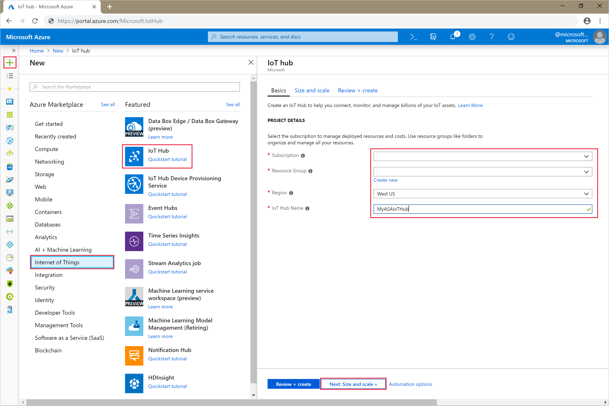
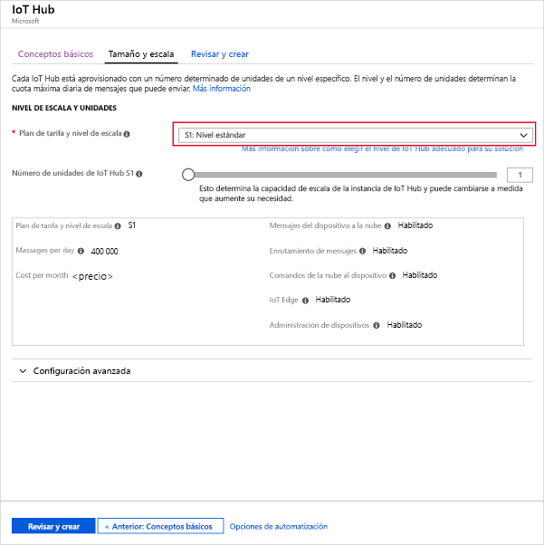
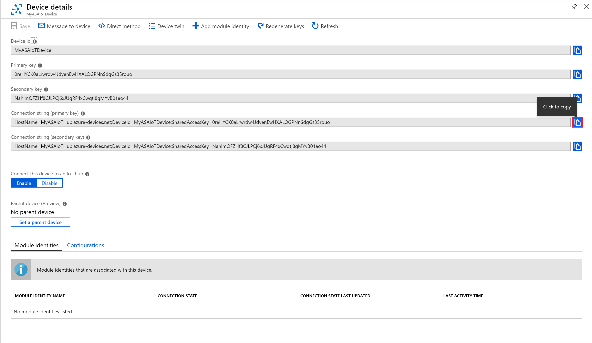
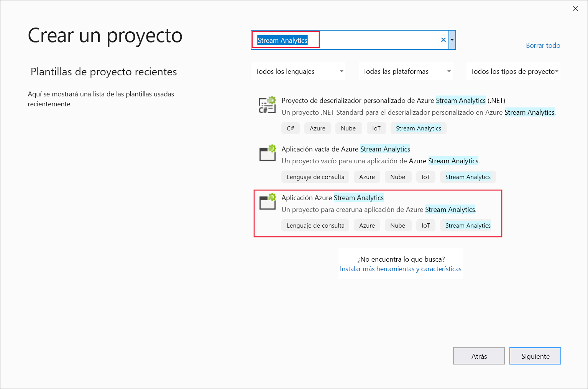
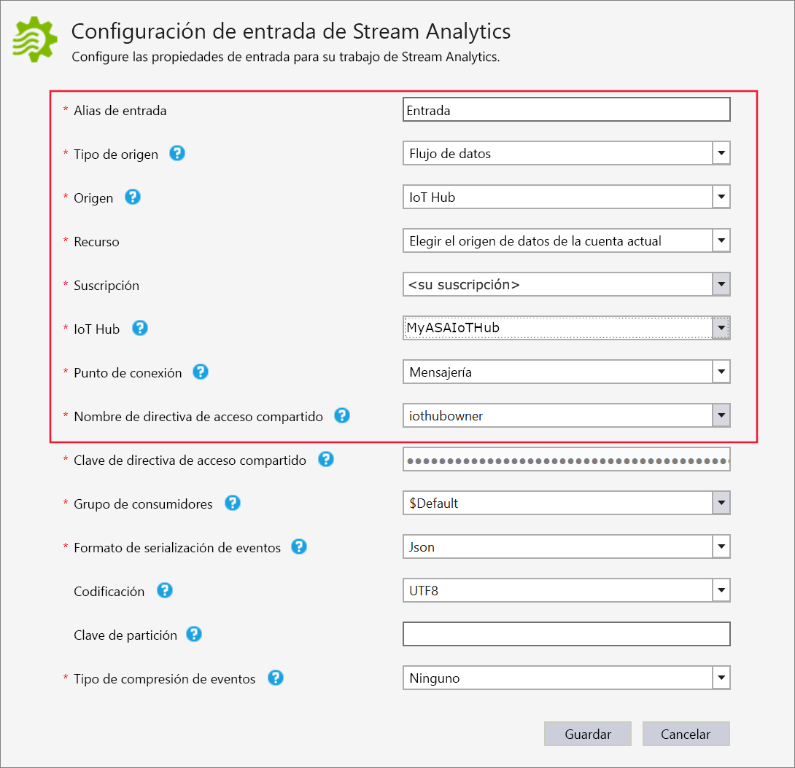
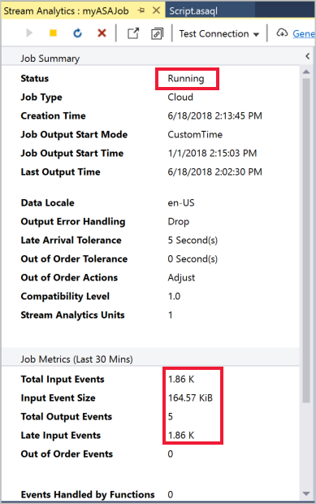

# <a name="quickstart-create-an-azure-stream-analytics-job-by-using-visual-studio"></a>Inicio rápido: Creación de un trabajo de Azure Stream Analytics con Visual Studio

En esta guía de inicio rápido se muestra cómo crear y ejecutar un trabajo de Stream Analytics mediante las herramientas de Azure Stream Analytics para Visual Studio. El trabajo de ejemplo lee los datos de streaming desde el dispositivo de IoT Hub. Va a definir un trabajo que calcula la temperatura media cuando se sobrepasan los 27 ° y escribe los eventos de salida resultantes en un nuevo archivo del almacenamiento de blobs.

> [!NOTE]
> Las herramientas Visual Studio y Visual Studio Code no admiten trabajos de las regiones de Este de China, Norte de China, Centro de Alemania y Noreste de Alemania.

## <a name="before-you-begin"></a>Antes de empezar

* Si no tiene una suscripción a Azure, cree una [cuenta gratuita](https://azure.microsoft.com/free/).

* Inicie sesión en [Azure Portal](https://portal.azure.com/).

* Instale Visual Studio 2019, Visual Studio 2015 o Visual Studio 2013 Update 4. Se admiten las ediciones Enterprise (Ultimate y Premium), Professional y Community. No se admite la edición Express.

* Siga las [instrucciones de instalación](https://docs.microsoft.com/azure/stream-analytics/stream-analytics-tools-for-visual-studio-install) para instalar las herramientas de Stream Analytics para Visual Studio.

## <a name="prepare-the-input-data"></a>Preparación de los datos de entrada

Antes de definir el trabajo de Stream Analytics, debe preparar los datos, que se configuran más adelante como entrada del trabajo. Para preparar los datos de entrada que requiere el trabajo, siga estos pasos:

1. Inicie sesión en [Azure Portal](https://portal.azure.com/).

2. Seleccione **Crear un recurso** > **Internet de las cosas** > **IoT Hub**.

3. En el panel **Centro de IoT**, escriba la siguiente información:
   
   |**Configuración**  |**Valor sugerido**  |**Descripción**  |
   |---------|---------|---------|
   |Subscription  | \<Su suscripción\> |  Seleccione la suscripción de Azure que quiera usar. |
   |Resource group   |   asaquickstart-resourcegroup  |   Seleccione **Crear nuevo** y escriba un nuevo nombre de grupo de recursos para la cuenta. |
   |Region  |  \<Seleccione la región más cercana a los usuarios\> | Seleccione la ubicación geográfica donde puede hospedar la instancia de IoT Hub. Use la ubicación más cercana a los usuarios. |
   |Nombre de la instancia de IoT Hub  | MyASAIoTHub  |   Seleccione un nombre para la instancia de IoT Hub.   |

   

4. Seleccione **Siguiente: Establezca la escala y el tamaño**.

5. Seleccione su **Nivel de precios y de escala**. En esta guía de inicio rápido, seleccione el nivel **F1 - Free** (F1: gratis) si aún está disponible en la suscripción. Si el nivel gratis no está disponible, elija el nivel más bajo disponible. Para más información, consulte [Precios de IoT Hub](https://azure.microsoft.com/pricing/details/iot-hub/).

   

6. Seleccione **Revisar + crear**. Revise la información de IoT Hub y haga clic en **Crear**. La instancia de IoT Hub puede tardar varios minutos en crearse. Puede ver el progreso en el panel **Notificaciones**.

7. En el menú de navegación de IoT Hub, haga clic en **Agregar** en **Dispositivos IoT**. Agregue un **identificador de dispositivo** y haga clic en **Guardar**.

   

8. Después de crear el dispositivo, ábralo desde la lista **Dispositivos de IoT**. Copie el valor de **Cadena de conexión: clave principal** y guárdelo en el Bloc de notas para usarlo más adelante.

   

## <a name="create-blob-storage"></a>Creación de un almacenamiento de blobs

1. En la esquina superior izquierda de Azure Portal, seleccione **Crear un recurso** > **Almacenamiento** > **Cuenta de almacenamiento**.

2. En el panel **Crear cuenta de almacenamiento**, escriba un nombre, una ubicación y un grupo de recursos para la cuenta de almacenamiento. Elija la misma ubicación y grupo de recursos que los de la instancia de IoT Hub que creó. A continuación, haga clic en **Revisar y crear** para crear la cuenta.

   

3. Una vez creada la cuenta de almacenamiento, seleccione el icono **Blobs** en el panel de **información general**.

   

4. En la página **Blob Service**, seleccione **Contenedor** y proporcione un nombre para el contenedor, como *contenedor1*. Deje la opción **Nivel de acceso público** en **Privado (sin acceso anónimo)** y seleccione **Aceptar**.

   

## <a name="create-a-stream-analytics-project"></a>Creación de un trabajo de Stream Analytics

1. Inicie Visual Studio.

2. Seleccione **Archivo > Nuevo proyecto**.  

3. En la lista de plantillas de la izquierda, seleccione **Stream Analytics** y **Aplicación de Azure Stream Analytics**.  

4. Escriba el **nombre** del proyecto, la **ubicación** y el **nombre de la solución** y seleccione **Aceptar**.

   

Observe los elementos que se incluyen en un proyecto de Azure Stream Analytics.

   


## <a name="choose-the-required-subscription"></a>Selección de la suscripción necesaria

1. En Visual Studio, en el menú **Ver**, seleccione **Explorador de servidores**.

2. Haga clic con el botón derecho en **Azure**, seleccione **Connect to Microsoft Azure Subscription** (Conectarse a la suscripción de Microsoft Azure) e inicie sesión con su cuenta de Azure.

## <a name="define-input"></a>Definición de la entrada

1. En el **Explorador de soluciones**, expanda el nodo **Entradas** y haga doble clic en **Input.json**.

2. Rellene la **configuración de entrada de Stream Analytics** con los siguientes valores:

   |**Configuración**  |**Valor sugerido**  |**Descripción**   |
   |---------|---------|---------|
   |Alias de entrada  |  Entrada   |  Escriba un nombre para identificar la entrada del trabajo.   |
   |Tipo de origen   |  Flujo de datos |  Elija el origen de entrada correspondiente: flujo de datos o datos de referencia.   |
   |Source  |  IoT Hub |  Elija el origen de entrada correspondiente.   |
   |Resource  | Selección del origen de datos desde la cuenta actual | Elija escribir los datos manualmente o seleccione una cuenta existente.   |
   |Subscription  |  \<Su suscripción\>   | Seleccione la suscripción de Azure que tenga el centro de IoT Hub que ha creado.   |
   |IoT Hub  |  MyASAIoTHub   |  Elija o escriba el nombre de su instancia de IoT Hub. Los nombres de IoT Hub se detectan automáticamente si se crean en la misma suscripción.   |
   
3. Deje el resto de opciones con los valores predeterminados y seleccione **Guardar** para guardar la configuración.  

   

## <a name="define-output"></a>Defininición de salida

1. En el **Explorador de soluciones**, expanda el nodo **Salidas** y haga doble clic en **Output.json**.

2. Rellene la **configuración de salida de Stream Analytics** con los siguientes valores:

   |**Configuración**  |**Valor sugerido**  |**Descripción**   |
   |---------|---------|---------|
   |Alias de salida  |  Output   |  Escriba un nombre para identificar la salida del trabajo.   |
   |Receptor   |  Blob Storage |  Elija el receptor adecuado.    |
   |Resource  |  Provisión de la configuración del origen de datos manualmente |  Elija escribir los datos manualmente o seleccione una cuenta existente.   |
   |Subscription  |  \<Su suscripción\>   | Seleccione la suscripción de Azure que tiene la cuenta de almacenamiento que creó. La cuenta de almacenamiento puede estar en la misma suscripción, o en otra diferente. En este ejemplo se da por supuesto que ha creado la cuenta de almacenamiento en la misma suscripción.   |
   |Cuenta de almacenamiento  |  asaquickstartstorage   |  Elija o escriba el nombre de la cuenta de almacenamiento. Los nombres de cuenta de almacenamiento se detectan automáticamente si se crean en la misma suscripción.   |
   |Contenedor  |  Contenedor1   |  Seleccione el contenedor existente que creó en la cuenta de almacenamiento.   |
   |Patrón de la ruta de acceso  |  output   |  Escriba el nombre de una ruta de acceso de archivo que debe crearse en el contenedor.   |
   
3. Deje el resto de opciones con los valores predeterminados y seleccione **Guardar** para guardar la configuración.  

   

## <a name="define-the-transformation-query"></a>Definir la consulta de transformación

1. Abra **Script.asaql** desde el **Explorador de soluciones** en Visual Studio.

2. Agregue la siguiente consulta:

   ```sql
   SELECT *
   INTO BlobOutput
   FROM IoTHubInput
   HAVING Temperature > 27
   ```

## <a name="submit-a-stream-analytics-query-to-azure"></a>Enviar una consulta de Stream Analytics a Azure

1. En el **Editor de consultas**, haga clic en **Enviar a Azure** en el editor de scripts.

2. Seleccione **Create a New Azure Stream Analytics job** (Crear un trabajo de Azure Stream Analytics) y escriba un **nombre para el trabajo**. Elija la **suscripción**, el **grupo de recursos** y la **ubicación** que usó al comienzo de la guía de inicio rápido.

   

## <a name="run-the-iot-simulator"></a>Ejecutar el simulador

1. Abra el [simulador en línea de Raspberry Pi para Azure IoT](https://azure-samples.github.io/raspberry-pi-web-simulator/) en otra ventana o pestaña del explorador.

2. Reemplace el marcador de posición de la línea 15 con la cadena de conexión del dispositivo de Azure IoT Hub que guardó en la sección anterior.

3. Haga clic en **Ejecutar**. La salida debe mostrar los datos y mensajes del sensor que se envían a la instancia de IoT Hub.

   

## <a name="start-the-stream-analytics-job-and-check-output"></a>Inicio del trabajo de Stream Analytics y consulta de la salida

1. Ahora que se ha creado el trabajo, se abre automáticamente la vista del trabajo. Seleccione el botón de la flecha verde para iniciar el trabajo.

   

2. Cambie el **modo de inicio de salida del trabajo** a **JobStartTime** y seleccione **Iniciar**.

   

3. Puede ver que el estado del trabajo ha cambiado a **En ejecución** y que hay eventos de entrada y salida. Esta operación puede tardar unos minutos.

   

4. Para ver los resultados, en el menú **Ver**, seleccione **Cloud Explorer** y vaya a la cuenta de almacenamiento del grupo de recursos. En **Contenedores de blob**, haga doble clic en **contenedor1** y, luego, en la ruta de acceso al archivo de **salida**.

   

## <a name="clean-up-resources"></a>Limpieza de recursos

Cuando no los necesite, elimine el grupo de recursos, el trabajo de streaming y todos los recursos relacionados. La eliminación del trabajo evita la facturación de las unidades de streaming utilizadas por el trabajo. Si piensa utilizar el trabajo en el futuro, puede detenerlo y volver a iniciarlo más adelante cuando sea necesario. Si no va a seguir usando este trabajo, siga estos pasos para eliminar todos los recursos creados en esta guía de inicio rápido:

1. En el menú de la izquierda de Azure Portal, seleccione **Grupos de recursos** y luego el nombre del recurso que creó.  

2. En la página del grupo de recursos, seleccione **Eliminar**, escriba el nombre del recurso que quiere eliminar en el cuadro de texto y, luego, seleccione **Eliminar**.

## <a name="next-steps"></a>Pasos siguientes

En esta guía de inicio rápido, ha implementado un sencillo trabajo de Stream Analytics mediante Visual Studio. También puede implementar trabajos de Stream Analytics mediante [Azure Portal](stream-analytics-quick-create-portal.md) y [PowerShell](stream-analytics-quick-create-powershell.md). 

Para información acerca de las herramientas de Azure Stream Analytics para Visual Studio, consulte el artículo siguiente:

> [!div class="nextstepaction"]
> [Uso de Visual Studio para ver trabajos de Azure Stream Analytics](stream-analytics-vs-tools.md)
