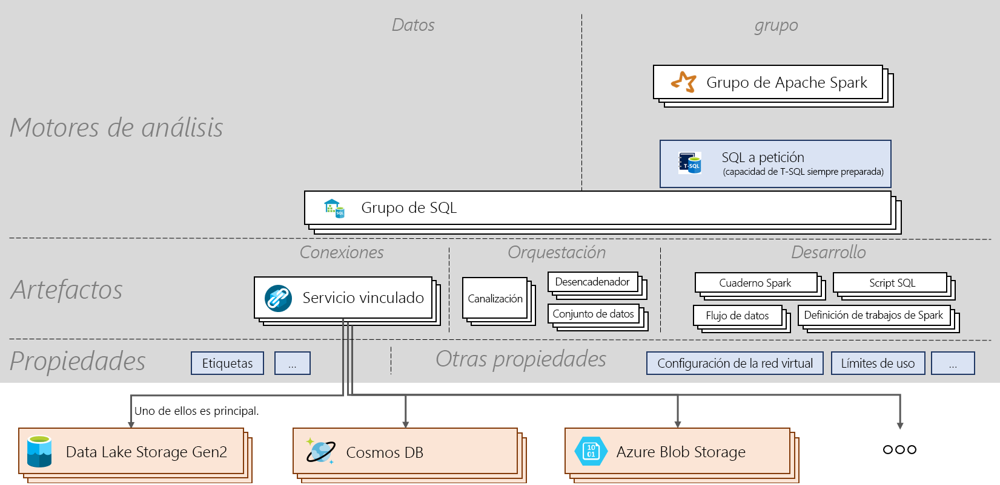

# Hoja de referencia rápida de Azure Synapse Analytics

[!INCLUDE [preview](includes/note-preview.md)]

La hoja de referencia rápida de Azure Synapse Analytics le guiará por los conceptos básicos del servicio y comandos importantes. Este artículo resulta útil para los nuevos usuarios y para los que quieren destacar los temas esenciales de Azure Synapse.

## Architecture

> [!div class="mx-imgBorder"]
>

## Terminología
| Término                         | Definición      |
|:---                                 |:---                 |
| **Área de trabajo de Synapse (versión preliminar)** | Límite de colaboración protegible para realizar análisis empresariales basados en la nube en Azure. El área de trabajo se implementa en una región específica y tiene una cuenta de Azure Data Lake Storage Gen2 y un sistema de archivos asociados (para almacenar los datos temporales). Un área de trabajo está en un grupo de recursos. |
| **Synapse SQL**   | Ejecute el análisis con grupos o con funcionalidades a petición.  |
| **Grupo de SQL**   | Se pueden implementar en un área de trabajo de 0 a N recursos aprovisionados de SQL con sus bases de datos correspondientes. Cada grupo de SQL tiene una base de datos asociada. Un grupo de SQL se puede escalar, pausar y reanudar manual o automáticamente. Un grupo de SQL se puede escalar de 100 DWU a 30 000 DWU.       |
| **SQL a petición (versión preliminar)**   | Sistema de procesamiento de datos distribuido creado para datos a gran escala que permite ejecutar consultas de T-SQL a través de datos en el lago de datos. No tiene servidor, por lo que no tiene que administrar la infraestructura.       |
|**Apache Spark para Synapse** | Entorno de ejecución de Spark que se usa en un grupo de Spark. La versión actual admitida es Spark 2.4 con Python 3.6.1, Scala 2.11.12, compatibilidad con .NET para Apache Spark 0.5 y Delta Lake 0.3.  | 
| **Grupo de Apache Spark (versión preliminar)**  | Se pueden implementar en un área de trabajo de 0 a N recursos aprovisionados de Spark con sus bases de datos correspondientes. Un grupo de Spark se puede pausar, reanudar y escalar automáticamente.  |
| **Aplicación Spark**  |   Consta de un proceso de controlador y un conjunto de procesos del ejecutor. Una aplicación Spark se ejecuta en un grupo de Spark.            |
| **Sesión de Spark**  |   Punto de entrada unificado de una aplicación de Spark. Proporciona una manera de interactuar con las diversas funcionalidades de Spark y con un número menor de construcciones. Para ejecutar un cuaderno, es necesario crear una sesión. Una sesión se puede configurar para que se ejecute en un número específico de ejecutores de un tamaño específico. La configuración predeterminada para una sesión de un cuaderno es ejecutar en dos ejecutores de tamaño medio. |
| **Solicitud de SQL**  |   Operación como, por ejemplo, una consulta ejecutada a través del grupo de SQL o de SQL a petición. |
|**Integración de registros**| Proporciona la funcionalidad de introducir datos entre varios orígenes y coordinar las actividades que se ejecutan en un área de trabajo o fuera de ella.| 
|**Artefactos**| Concepto que encapsula todos los objetos necesarios para que un usuario administre los orígenes de datos y los desarrolle, organice y visualice.|
|**Cuaderno**| Interfaz de ciencia de datos e ingeniería interactiva y reactiva que admite Scala, PySpark, C# y SparkSQL. |
|**Definición de trabajos de Spark**|Interfaz para enviar un trabajo de Spark con el archivo jar del ensamblado que contiene el código y sus dependencias.|
|**Flujo de datos**|  Proporciona una experiencia completamente visual que no requiere codificación para realizar la transformación de macrodatos. Toda la optimización y ejecución se administra sin servidor. |
|**Script de SQL**| Conjunto de comandos SQL guardados en un archivo. Un script SQL puede contener una o varias instrucciones SQL. Se puede usar para ejecutar solicitudes SQL a través del grupo de SQL o de SQL a petición.|
|**Canalización**| Una agrupación lógica de actividades que realizan una tarea juntas.|
|**Actividad**| Define las acciones que se deben realizar en los datos, como la copia de datos, la ejecución de un bloc de notas o un script SQL.|
|**Desencadenador**| Ejecuta una canalización. Se puede ejecutar de forma manual o automática (programación, ventana de saltos de tamaño constante o basada en eventos).|
|**Servicio vinculado**| Las cadenas de conexión que definen la información de conexión necesaria para que el área de trabajo se conecte a recursos externos.|
|**Dataset**|  Vista con nombre de los datos que simplemente apunta o hace referencia a los datos que se van a usar en una actividad como entrada y salida. Pertenece a un servicio vinculado.|

## Pasos siguientes

- [Creación de un área de trabajo](quickstart-create-workspace.md)
- [Inicio rápido: Uso de Synapse Studio (versión preliminar)](quickstart-synapse-studio.md)
- [Creación de un grupo de SQL](quickstart-create-sql-pool-portal.md)
- [Uso de SQL a petición](quickstart-sql-on-demand.md)
- [Creación de un grupo de Apache Spark](quickstart-create-apache-spark-pool-portal.md)

