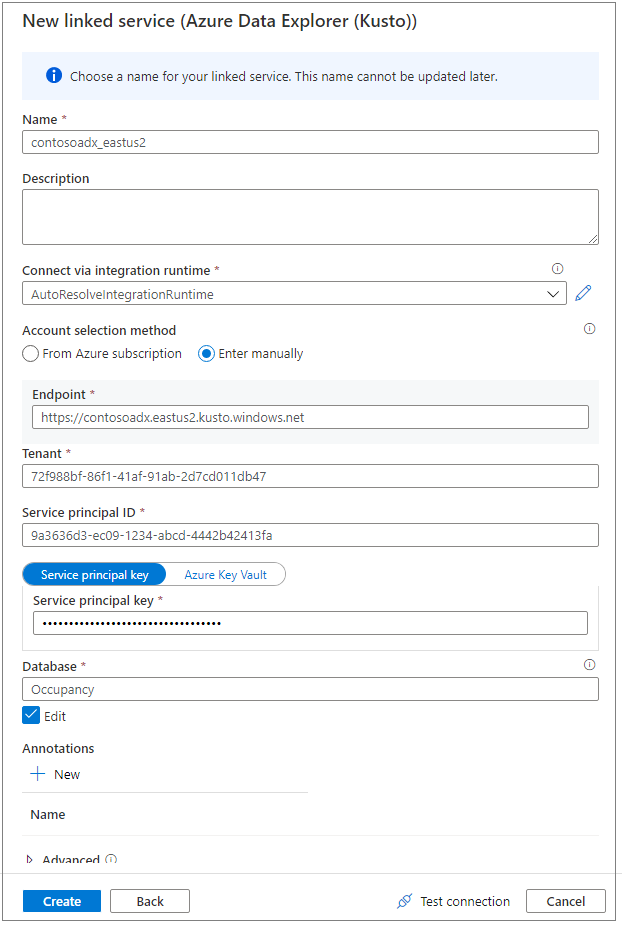

# Conexión a Azure Data Explorer mediante Synapse Apache Spark

En este artículo se describe cómo acceder a las bases de datos de Azure Data Explorer desde Synapse Studio con Synapse Apache Spark. 

## Requisitos previos

* [Cree de un clúster y de la base de datos de Azure Data Explorer](/azure/data-explorer/create-cluster-database-portal).
* Una área de trabajo de Synapse existente o deberá seguir [este inicio rápido](./quickstart-create-workspace.md) para crear una nueva. 
* Un grupo de Synapse Apache Spark existente o uno nuevo que cree mediante este [inicio rápido](./quickstart-create-apache-spark-pool-portal.md).
* [Cree aplicaciones de Azure AD mediante el aprovisionamiento de una aplicación de Azure AD](/azure/data-explorer/kusto/management/access-control/how-to-provision-aad-app).
* Para conceder a la aplicación de Azure AD acceso a la base de datos, siga las indicaciones del artículo [Administración de permisos de base de datos de Azure Data Explorer](/azure/data-explorer/manage-database-permissions)

## Navegación a Synapse Studio

En un área de trabajo de Synapse, seleccione **Iniciar Synapse Studio**. En la página principal de Synapse Studio, seleccione **Data** (Datos) y pasará al **Explorador de objetos de datos**.

## Conexión de una base de datos de Azure Data Explorer a un área de trabajo de Synapse

La conexión de una base de datos de Azure Data Explorer a un área de trabajo se realiza mediante un servicio vinculado. Los servicios vinculados de Azure Data Explorer permiten a los usuarios examinar y explorar datos, leer y escribir contenido de Apache Spark para Azure Synapse Analytics, y ejecutar trabajos de integración en una canalización.

En Azure Data Explorer, siga estos pasos para conectar directamente un clúster de Azure Data Explorer:

1. Seleccione el icono **+** cerca de la opción Datos.
2. Seleccione **Connect** to external data (Conectar a datos externos).
3. Seleccione **Azure Data Explorer (Kusto)**
5. Seleccione **Continuar**
6. Asigne un nombre al servicio vinculado. El nombre se mostrará en el Explorador de objetos y lo usarán los tiempos de ejecución de Synapse para conectarse a la base de datos. Se recomienda utilizar un nombre descriptivo.
7. Seleccione el clúster de Azure Data Explorer desde su suscripción o escriba el URI.
8. Escriba el "identificador de entidad de servicio" y la "clave de entidad de servicio" (asegúrese de que esta entidad de servicio tenga acceso de vista en la base de datos para la operación de lectura y acceso de agente de ingesta para la ingesta de datos)
9. Escriba el nombre de la base de datos de Azure Data Explorer
10. Haga clic en **Probar conexión** para asegurarse de que tiene los permisos adecuados
11. Seleccione **Crear**

    

    > [!NOTE]
    > (Opcional) La conexión de prueba no valida el acceso de escritura, asegúrese de que el identificador de la entidad de servicio tiene acceso de escritura a la base de datos de Azure Data Explorer.

12. Los clústeres y las bases de datos de Azure Data Explorer se ven al hacer clic en la pestaña **Vinculado** de la sección Azure Data Explorer. 

    

    > [!NOTE] 
    > En la versión actual, los objetos de base de datos se rellenan en función de los permisos de las cuentas de AAD en las bases de datos de Azure Data Explorer. Al ejecutar los cuadernos o los trabajos de integración de Apache Spark, se usará la credencial del servicio de vínculo (es decir, la entidad de servicio).

## Interacción rápida con las acciones generadas por el código

* Al hacer clic con el botón derecho en una base de datos o una tabla, tendrá una lista de gestos que desencadenarán un cuaderno de Spark de ejemplo para leer, escribir o transmitir datos a Azure Data Explorer. 
    

* A continuación se muestra un ejemplo de lectura de datos. Conecte el cuaderno a su grupo de Spark y ejecute la celda .

   > [!NOTE] 
   > La primera ejecución puede tardar más de tres minutos en iniciar la sesión de Spark, pero las siguientes serán mucho más rápidas.  

## Limitaciones
Actualmente, el conector de Azure Data Explorer no es compatible con la VNET administrada de Azure Synapse.

## Pasos siguientes

* [Código de ejemplo con opciones avanzadas](https://github.com/Azure/azure-kusto-spark/blob/master/samples/src/main/python/SynapseSample.py)
* [Conector de Spark de Azure Data Explorer (Kusto)](https://github.com/Azure/azure-kusto-spark)