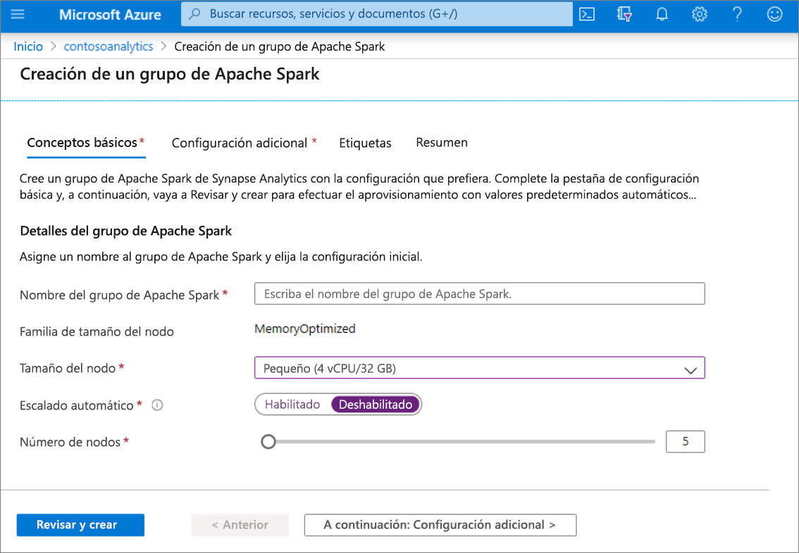
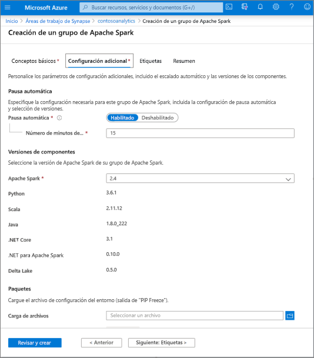
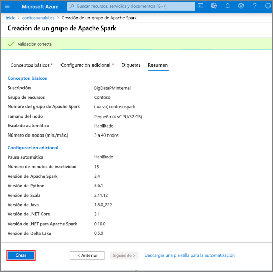
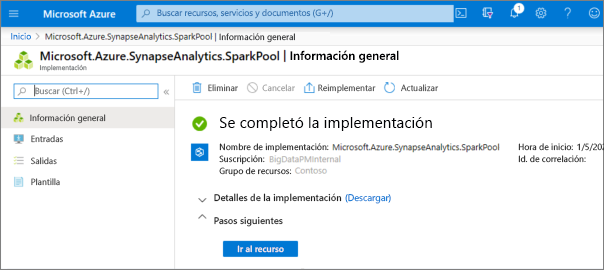
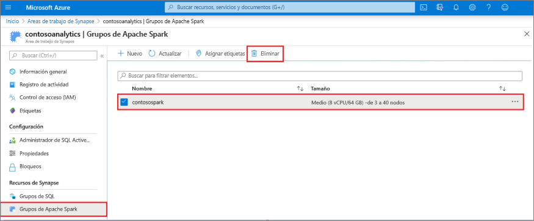
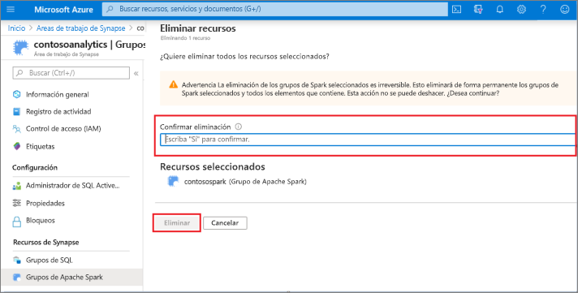

# Inicio rápido: Creación de un grupo de Apache Spark sin servidor mediante Azure Portal

Azure Synapse Analytics ofrece varios motores de análisis que le ayudarán a ingerir, transformar, modelar, analizar y distribuir sus datos. Un grupo de Apache Spark proporciona funcionalidades de proceso de macrodatos de código abierto. Después de crear un grupo de Apache Spark en el área de trabajo de Synapse, los datos se pueden cargar, modelar, procesar y distribuir para tener información para los análisis más rápidamente.

En este inicio rápido, va a aprender a usar Azure Portal para crear un trabajo de Apache Spark en un área de trabajo de Synapse.

> [!IMPORTANT]
> La facturación de las instancias de Spark se prorratea por minuto, tanto si se usan como si no. Asegúrese de cerrar la instancia de Spark después de que haya terminado de usarla, o configure un breve tiempo de espera. Para obtener más información, consulte la sección **Limpieza de recursos** de este artículo.

Si no tiene una suscripción a Azure, [cree una cuenta gratuita antes de empezar](https://azure.microsoft.com/free/).

## Requisitos previos

- Una suscripción a Azure: [cree una cuenta gratuita](https://azure.microsoft.com/free/)
- [Área de trabajo de Synapse Analytics](quickstart-create-workspace.md)

## Inicio de sesión en Azure Portal

Inicie sesión en el [Portal de Azure](https://portal.azure.com/)

## Desplazamiento al área de trabajo de Synapse 
1. Vaya al área de trabajo de Synapse en la que se va a crear el grupo de Apache Spark. Para ello, escriba el nombre del servicio (o el nombre del recurso directamente) en la barra de búsqueda.

1. En la lista de áreas de trabajo, escriba el nombre (o una parte del nombre) del área que desea abrir. En este ejemplo, se usará un área de trabajo denominado **contosoanalytics**.

## Creación de un grupo de Apache Spark

1. En el área de trabajo de Synapse en la que desee crear el grupo de Apache Spark, seleccione **New Apache Spark pool** (Nuevo grupo de Apache Spark) en la barra superior.
    
2. En la pestaña **Datos básicos** , escriba la siguientes información:

    |Configuración | Valor sugerido | Descripción |
    | :------ | :-------------- | :---------- |
    | **Nombre del grupo de Apache Spark** | Un nombre de grupo válido. | Este es el nombre que tendrá el grupo de Apache Spark. |
    | **Tamaño del nodo** | Pequeño (4 vCPU/32 GB) | Establézcalo en el menor tamaño para reducir los costos de este artículo de inicio rápido |
    | **Autoscale** | Disabled | En este inicio rápido no se necesita la escalabilidad automática |
    | **Número de nodos** | 5 | Use un tamaño pequeño para limitar los costos en este inicio rápido |

    
    > [!IMPORTANT]
    > Tenga en cuenta que existen limitaciones específicas para los nombres que pueden usar los grupos de Apache Spark. Los nombres solo deben contener letras o números, deben tener 15 caracteres o menos, deben comenzar con una letra, no contener palabras reservadas y ser únicos en el área de trabajo.

3. Seleccione **Siguiente: Configuración adicional** y examine la configuración predeterminada. No modifique ninguna configuración predeterminada.
    

4. Seleccione **Siguiente: etiquetas**. No agregue ninguna etiqueta.
    

5. Seleccione **Revisar + crear**.

6. Asegúrese de que los detalles son correctos en función de lo que se especificó anteriormente y seleccione **Create** (Crear).
    

7. Llegados a este punto, se iniciará el flujo de aprovisionamiento de recursos, que mandará una indicación al finalizar.
    

8. Una vez completado el aprovisionamiento, al desplazarse al área de trabajo se mostrará una nueva entrada para el grupo de Apache Spark recién creado.
    

9. En este momento, no hay ningún recurso en ejecución, sin cargos por Spark, y ha creado metadatos sobre las instancias de Spark que desea crear.

## Limpieza de recursos

Siga los pasos que se indican a continuación para eliminar el grupo de Apache Spark del área de trabajo.
> [!WARNING]
> Al eliminar un grupo de Apache Spark, se quitará el motor de análisis del área de trabajo. Ya no será posible conectarse al grupo de SQL y todas las consultas, canalizaciones y cuadernos que usen este grupo de Apache Spark dejarán de funcionar.

Si está seguro de que quiere eliminar el grupo de Apache Spark, haga lo siguiente:

1. Vaya a la hoja Grupos de Apache Spark en el área de trabajo.
2. Seleccione el grupo de Apache Spark que se va a eliminar (en este caso, **contosospark** ).
3. Presione **Eliminar**.
 
4. Confirme la eliminación y presione el botón **Eliminar**.
 
5. Cuando el proceso se complete correctamente, el grupo de Apache Spark dejará de aparecer en los recursos del área de trabajo.

## Pasos siguientes

- Consulte [Quickstart: Creación de un cuaderno de Apache Spark](quickstart-apache-spark-notebook.md)
- Consulte [Quickstart: Creación de un grupo de SQL dedicado de Synapse mediante Azure Portal](quickstart-create-sql-pool-portal.md).
