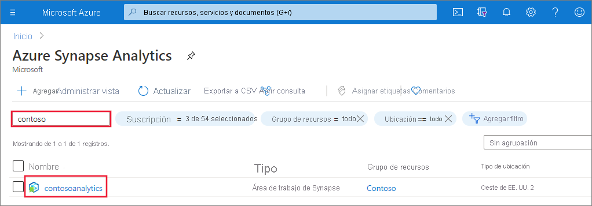
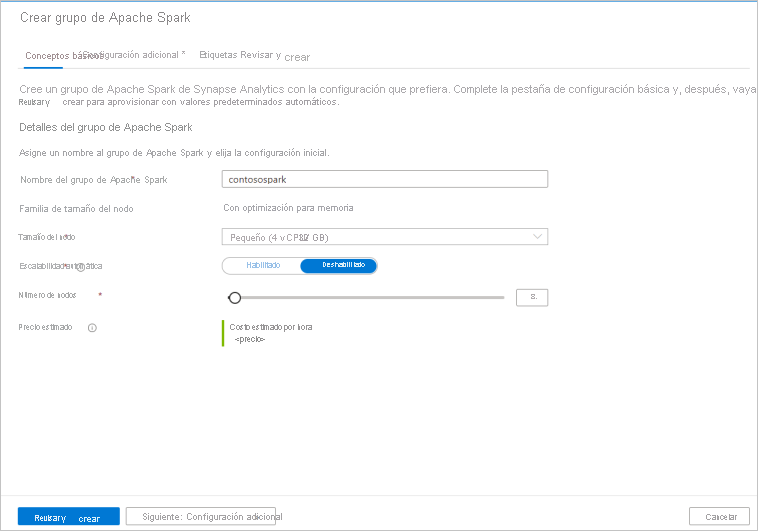
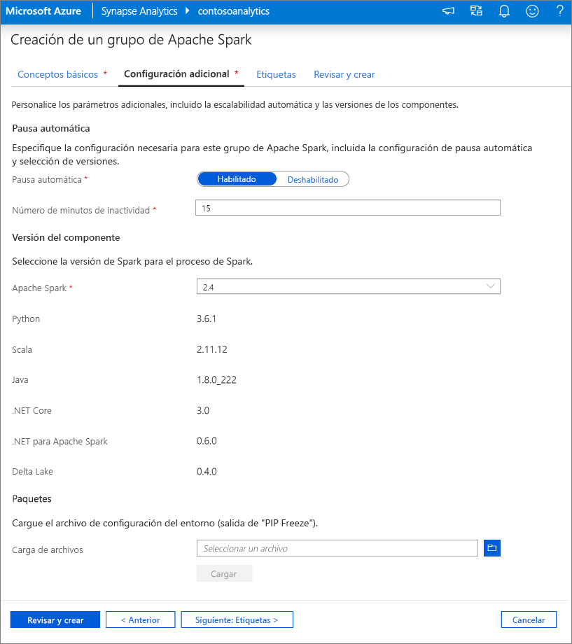
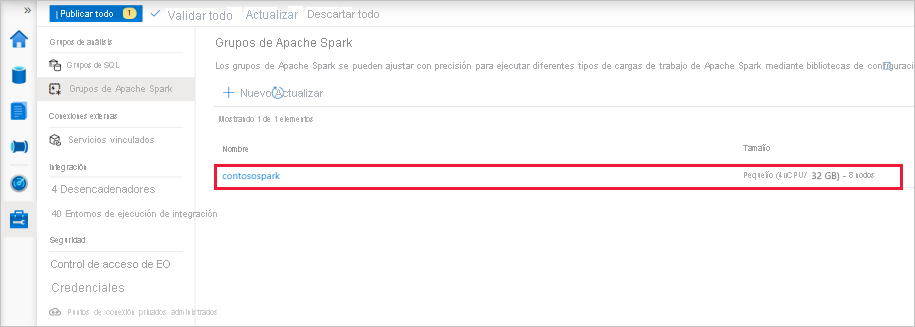
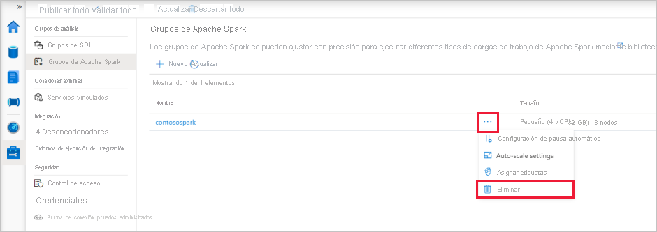

# Inicio rápido: Creación de un grupo de Apache Spark (versión preliminar) mediante Synapse Studio

Azure Synapse Analytics ofrece varios motores de análisis que ayudan a ingerir, transformar, modelar, analizar y servir datos. Los grupos de Apache Spark ofrecen funcionalidades de proceso de macrodatos de código abierto. Después de crear un grupo de Apache Spark en el área de trabajo de Synapse, los datos se pueden cargar, modelar, procesar y servir para obtener información.  

En este inicio rápido se describen los pasos necesarios para crear un grupo de Apache Spark en un área de trabajo de Azure Synapse mediante Synapse Studio.

> [!IMPORTANT]
> La facturación de las instancias de Spark se prorratea por minuto, tanto si se usan como si no. Asegúrese de cerrar la instancia de Spark después de que haya terminado de usarla, o configure un breve tiempo de espera. Para obtener más información, consulte la sección **Limpieza de recursos** de este artículo.

Si no tiene una suscripción a Azure, [cree una cuenta gratuita antes de empezar](https://azure.microsoft.com/free/).

## Requisitos previos

- Una suscripción a Azure: [cree una cuenta gratuita](https://azure.microsoft.com/free/)
- [Área de trabajo de Synapse](./quickstart-create-workspace.md)

## Inicio de sesión en Azure Portal

Inicie sesión en el [Portal de Azure](https://portal.azure.com/)

## Desplazamiento al área de trabajo de Synapse

1. Vaya al área de trabajo de Synapse en la que se va a crear el grupo de Apache Spark. Para ello, escriba el nombre del servicio (o el nombre del recurso directamente) en la barra de búsqueda.

1. En la lista de áreas de trabajo, escriba el nombre (o una parte del nombre) del área que desea abrir. En este ejemplo, se usará un área de trabajo denominado **contosoanalytics**.

## Inicio de Synapse Studio 

1. En la información general del área de trabajo, seleccione **Iniciar Synapse Studio** para abrir la ubicación en la que se va a crear el grupo de Apache Spark. Escriba el nombre del servicio o del recurso directamente en la barra de búsqueda.

## Creación del grupo de Apache Spark en Synapse Studio

1. En la página principal de Synapse Studio, vaya a **Management Hub** (Centro de administración) en el panel de navegación de la izquierda, para lo que debe seleccionar el icono **Manage** (Administrar).

1. Una vez que esté en Management Hub (Centro de administración), vaya a la sección **Apache Spark pools** (Grupos de Apache Spark) para ver la lista actual de grupos de Apache Spark que están disponibles en el área de trabajo.

1. Seleccione **+ New** (+Nuevo) y aparecerá el nuevo Asistente para crear grupos de Apache Spark. 

1. Escriba la siguiente información en la pestaña **Datos básicos**.

    | Configuración | Valor sugerido | Descripción |
    | :------ | :-------------- | :---------- |
    | **Nombre del grupo de Apache Spark** | contosospark | Este es el nombre que tendrá el grupo de Apache Spark. |
    | **Tamaño del nodo** | Pequeño (4 vCPU/32 GB) | Establézcalo en el menor tamaño para reducir los costos de este artículo de inicio rápido |
    | **Autoscale** | Disabled | En este inicio rápido no se necesitará la escalabilidad automática |
    | **Número de nodos** | 8 | Use un tamaño pequeño para limitar los costos en este inicio rápido|
    
    
    > [!IMPORTANT]
    > Tenga en cuenta que existen limitaciones específicas para los nombres que pueden usar los grupos de Apache Spark. Los nombres solo deben contener letras o números, deben tener 15 caracteres o menos, deben comenzar con una letra, no contener palabras reservadas y ser únicos en el área de trabajo.

1. En la pestaña siguiente (Additional settings [Configuración adicional]), deje todos los valores predeterminados y pulse **Review + create** (Revisar y crear) (no se agregarán etiquetas).
 

1. Por ahora no vamos a agregar etiquetas, así que seleccione **Review + create** (Revisar y crear).

1. En la pestaña **Review + create** (Revisar y crear), asegúrese de que los datos son correctos, en función de lo que se especificó anteriormente, y haga clic en **Create** (Crear). 
 

1. El grupo de Apache Spark iniciará el proceso de aprovisionamiento.

1. Una vez que se haya completado el aprovisionamiento, el nuevo grupo de Apache Spark aparecerá en la lista.

## Eliminación de recursos de un grupo de Apache Spark mediante Synapse Studio

Siga los pasos que se indican a continuación para eliminar el grupo de Apache Spark del área de trabajo mediante Synapse Studio.
> [!WARNING]
> Al eliminar un grupo de Apache Spark, se quitará también el motor de análisis del área de trabajo, por lo que no será posible conectarse al grupo y todas las consultas, canalizaciones y cuadernos que usen este grupo de Spark dejarán de funcionar.

Si está seguro de que quiere eliminar el grupo de Apache Spark, haga lo siguiente:

1. Vaya a los grupos de Apache Spark en el centro de administración de Synapse Studio.
1. Seleccione los puntos suspensivos que aparecen al lado del grupo de Apache que se va a eliminar (en este caso, **contosospark**) para mostrar los comandos del grupo de Apache Spark.

1. Presione **Eliminar**.
1. Confirme la eliminación y presione el botón **Eliminar**.
 
1. Cuando el proceso se complete correctamente, el grupo de Apache Spark dejará de aparecer en los recursos del área de trabajo. 

## Pasos siguientes

- Consulte [Quickstart: Creación de un grupo de Apache Spark (versión preliminar) en Synapse Analytics mediante herramientas web](quickstart-apache-spark-notebook.md).
- Consulte [Quickstart: Creación de un grupo de Apache Spark (versión preliminar)](quickstart-create-apache-spark-pool-portal.md).
