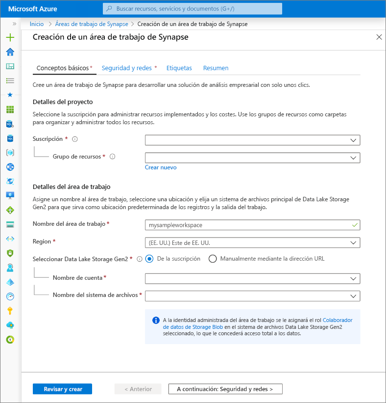
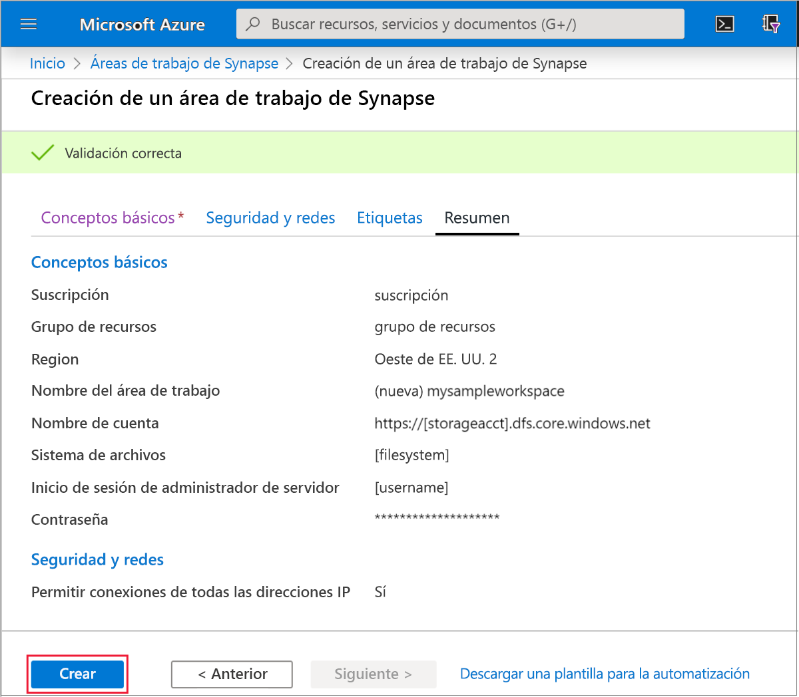
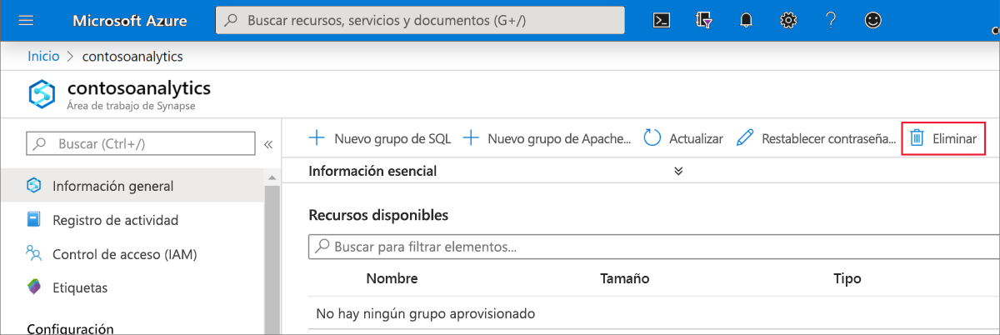
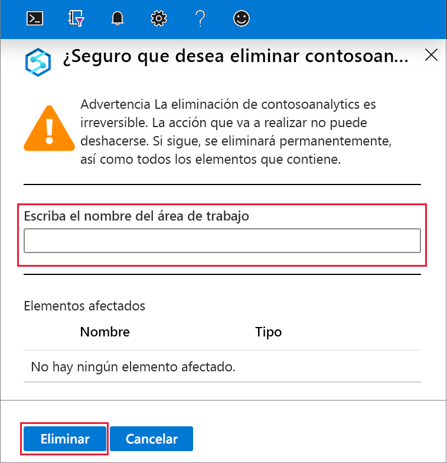

# Inicio rápido: Creación de un área de trabajo de Azure Synapse Analytics (versión preliminar)

En este inicio rápido se describe cómo crear un área de trabajo de Azure Synapse mediante Azure Portal.

Si no tiene una suscripción a Azure, [cree una cuenta gratuita antes de empezar](https://azure.microsoft.com/free/).

## Prerrequisitos

- [Cuenta de almacenamiento de Azure Data Lake Storage Gen2](../storage/common/storage-account-create.md?toc=/azure/synapse-analytics/toc.json&bc=/azure/synapse-analytics/breadcrumb/toc.json):

## Registro de un proveedor de recursos de Azure Synapse
Si aún no lo ha hecho, registre el proveedor de recursos de Azure Synapse. Al registrar un proveedor de recursos se configura la suscripción para que funcione con este. Para registrar un proveedor de recursos de Azure Synapse, consulte el artículo [Tipos y proveedores de recursos de Azure](https://docs.microsoft.com/azure/azure-resource-manager/management/resource-providers-and-types). Elija *Microsoft.Synapse* en la lista de proveedores de recursos al registrarse.

## Inicio de sesión en Azure Portal

Inicie sesión en el [Portal de Azure](https://portal.azure.com/)

## Creación de un área de trabajo de Azure Synapse mediante Azure Portal

1. En el panel búsqueda de Microsoft Azure, escriba **Área de trabajo de Synapse** y, a continuación, seleccione este servicio.

2. En la página **Áreas de trabajo de Synapse**, haga clic en **+ Agregar**.

3. Rellene el formulario **Área de trabajo de Azure Synapse** con la siguiente información:

    | Configuración | Valor sugerido | Descripción |
    | :------ | :-------------- | :---------- |
    | **Suscripción** | *Su suscripción* | Para más información acerca de sus suscripciones, consulte [Suscripciones](https://account.windowsazure.com/Subscriptions). |
    | **Grupos de recursos** | *Cualquier grupo de recursos* | Para conocer cuáles son los nombres de grupo de recursos válidos, consulte el artículo [Convenciones de nomenclatura](/azure/architecture/best-practices/resource-naming?toc=/azure/synapse-analytics/toc.json&bc=/azure/synapse-analytics/breadcrumb/toc.json&view=azure-sqldw-latest). |
    | **Workspace name** (Nombre del área de trabajo) | mysampleworkspace | Especifica el nombre del área de trabajo, que también se utilizará para los puntos de conexión de la conexión.|
    | **Región** | Este de EE. UU. 2 | Especifica la ubicación del área de trabajo.|
    | **Data Lake Storage Gen2** | Cuenta: `storage account name`   Sistema de archivos: `root file system to use` | Especifica el nombre de la cuenta de almacenamiento de ADLS Gen2 que se va a usar como almacenamiento principal y el sistema de archivos que se va a usar.|
    ||||

    

    La cuenta de almacenamiento se puede seleccionar desde:
    - Una lista de cuentas de ADLS Gen2 disponibles en su suscripción
    - escrita manualmente con el nombre de cuenta

    > [!IMPORTANT]
    > El área de trabajo de Azure Synapse debe poder leer y escribir en la cuenta de ADLS Gen2 seleccionada. Además, para cualquier cuenta de almacenamiento que vincule como cuenta de almacenamiento principal, debe haber habilitado el **espacio de nombres jerárquico** en la creación de la cuenta de almacenamiento.
    >
    > Debajo de los campos de selección de ADLS Gen2, hay una nota que indica que a la identidad administrada del área de trabajo se le asignará el rol **Colaborador de datos de Storage Blob** en el sistema de archivos de Data Lake Storage Gen2 seleccionado, lo que le concederá acceso total.

4. (Opcional) Modifique cualquiera de los valores predeterminados de la pestaña **Seguridad y redes**:
5. (Opcional) Agregue etiquetas en la pestaña **Etiquetas**.
6. En la pestaña **Resumen** se ejecutarán las validaciones necesarias para asegurarse de que el área de trabajo se puede crear correctamente. Cuando la validación finalice correctamente, seleccione el botón **Crear** 
7. Cuando el proceso de aprovisionamiento de recursos se completa correctamente, verá una entrada para el área de trabajo creada en la lista de áreas de trabajo de Synapse. 

## Limpieza de recursos

Siga los pasos que se indican a continuación para eliminar el área de trabajo de Azure Synapse.
> [!WARNING]
> Al eliminar un área de trabajo de Azure Synapse, se quitarán los motores de análisis y los datos almacenados en la base de datos de los grupos de SQL y metadatos de área de trabajo incluidos. Ya no será posible conectarse a los puntos de conexión de SQL o de Apache Spark. Se eliminarán todos los artefactos de código (consultas, cuadernos, definiciones de trabajos y canalizaciones).
>
> La eliminación del área de trabajo **no** afectará a los datos de Data Lake Store Gen2 vinculados al área de trabajo.

Si desea eliminar el área de trabajo de Azure Synapse, complete los pasos siguientes:

1. Diríjase al área de trabajo de Azure Synapse para eliminarlo.
1. En la barra de comandos, presione **Eliminar**.
 
1. Confirme la eliminación y haga clic en el botón **Eliminar**.
 
1. Cuando el proceso se complete correctamente, el área de trabajo de Azure Synapse ya no aparecerá en la lista de áreas de trabajo.

## Pasos siguientes

A continuación, puede [crear grupos de SQL](quickstart-create-sql-pool-studio.md) o [crear grupos de Apache Spark](quickstart-create-apache-spark-pool-studio.md) para empezar a analizar y explorar los datos.
