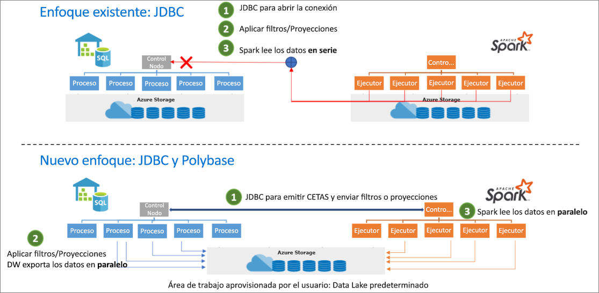

# <a name="introduction"></a>Introducción

El conector de SQL Analytics para Spark está diseñado para transferir datos de forma eficaz entre el grupo de Spark (versión preliminar) y los grupos de SQL de Azure Synapse. El conector de SQL Analytics para Spark solo funciona en grupos de SQL, no funciona con SQL a petición.

## <a name="design"></a>Diseño

La transferencia de datos entre grupos de Spark y grupos de SQL se puede realizar mediante JDBC. Sin embargo, dados dos sistemas distribuidos, como grupos de SQL y de Spark, JDBC tiende a convertirse en un cuello de botella con la transferencia de datos serie.

El conector entre los grupos de Spark y SQL Analytics es una implementación de origen de datos para Apache Spark. Se emplea Azure Data Lake Storage Gen 2 y Polybase en los grupos de SQL para transferir datos de forma eficaz entre el clúster de Spark y la instancia de SQL Analytics.



## <a name="authentication-in-azure-synapse-analytics"></a>Autenticación en Azure Synapse Analytics

La autenticación entre sistemas se realiza sin problemas en Azure Synapse Analytics. Hay un servicio de token que se conecta con Azure Active Directory para obtener los tokens de seguridad que se van a usar al acceder a la cuenta de almacenamiento o al servidor de almacenamiento de datos. Por esta razón, no es necesario crear credenciales ni especificarlas en la API del conector, siempre y cuando AAD-Auth esté configurado en la cuenta de almacenamiento y el servidor de almacenamiento de datos. Si no es así, se puede especificar la autenticación de SQL. Encontrará más detalles en la sección [Uso](#usage).

## <a name="constraints"></a>Restricciones

- Este conector solo funciona en Scala.

## <a name="prerequisites"></a>Prerrequisitos

- Tener el rol **db_exporter** en la base de datos o el grupo de SQL al que quiere, o del que desea, transferir los datos.

Para crear usuarios, conéctese a la base de datos y siga estos ejemplos:

```Sql
CREATE USER Mary FROM LOGIN Mary;
CREATE USER [mike@contoso.com] FROM EXTERNAL PROVIDER;
```

Para asignar un rol:

```Sql
EXEC sp_addrolemember 'db_exporter', 'Mary';
```

## <a name="usage"></a>Uso

No es necesario proporcionar las instrucciones de importación, ya que se importan previamente para la experiencia del cuaderno.

### <a name="transferring-data-to-or-from-a-sql-pool-in-the-logical-server-dw-instance-attached-with-the-workspace"></a>Transferencia de datos hacia o desde un grupo de SQL en el servidor lógico (instancia de DW) asociado al área de trabajo

> [!NOTE]
> **Importaciones no necesarias en la experiencia del cuaderno**

```Scala
 import com.microsoft.spark.sqlanalytics.utils.Constants
 import org.apache.spark.sql.SqlAnalyticsConnector._
```

#### <a name="read-api"></a>Read API

```Scala
val df = spark.read.sqlanalytics("[DBName].[Schema].[TableName]")
```

La API anterior funciona tanto con tablas internas (administradas) como externas en el grupo de SQL.

#### <a name="write-api"></a>Write API

```Scala
df.write.sqlanalytics("[DBName].[Schema].[TableName]", [TableType])
```

donde TableType puede ser Constants.INTERNAL o Constants.EXTERNAL

```Scala
df.write.sqlanalytics("[DBName].[Schema].[TableName]", Constants.INTERNAL)
df.write.sqlanalytics("[DBName].[Schema].[TableName]", Constants.EXTERNAL)
```

Se realiza la autenticación en Storage y en SQL Server

### <a name="if-you-are-transferring-data-to-or-from-a-sql-pool-or-database-in-a-logical-server-outside-the-workspace"></a>Si va a transferir datos hacia o desde un grupo de SQL o una base de datos de un servidor lógico fuera del área de trabajo

> [!NOTE]
> Importaciones no necesarias en la experiencia del cuaderno

```Scala
 import com.microsoft.spark.sqlanalytics.utils.Constants
 import org.apache.spark.sql.SqlAnalyticsConnector._
```

#### <a name="read-api"></a>Read API

```Scala
val df = spark.read.
option(Constants.SERVER, "samplews.database.windows.net").
sqlanalytics("<DBName>.<Schema>.<TableName>")
```

#### <a name="write-api"></a>Write API

```Scala
df.write.
option(Constants.SERVER, "[samplews].[database.windows.net]").
sqlanalytics("[DBName].[Schema].[TableName]", [TableType])
```

### <a name="using-sql-auth-instead-of-aad"></a>Uso de la autenticación de SQL en lugar de AAD

#### <a name="read-api"></a>Read API

Actualmente, el conector no admite la autenticación basada en token en un grupo de SQL que esté fuera del área de trabajo. Debe usar la autenticación de SQL.

```Scala
val df = spark.read.
option(Constants.SERVER, "samplews.database.windows.net").
option(Constants.USER, [SQLServer Login UserName]).
option(Constants.PASSWORD, [SQLServer Login Password]).
sqlanalytics("<DBName>.<Schema>.<TableName>")
```

#### <a name="write-api"></a>Write API

```Scala
df.write.
option(Constants.SERVER, "[samplews].[database.windows.net]").
option(Constants.USER, [SQLServer Login UserName]).
option(Constants.PASSWORD, [SQLServer Login Password]).
sqlanalytics("[DBName].[Schema].[TableName]", [TableType])
```

### <a name="using-the-pyspark-connector"></a>Uso del conector de PySpark

> [!NOTE]
> Este ejemplo está pensado únicamente para la experiencia del cuaderno.

Suponga que tiene una trama de datos "pyspark_df" que quiere escribir en el almacenamiento de datos.

Creación de una tabla temporal con la trama de datos en PySpark

```Python
pyspark_df.createOrReplaceTempView("pysparkdftemptable")
```

Ejecución de una celda de Scala en el cuaderno de PySpark con instrucciones mágicas

```Scala
%%spark
val scala_df = spark.sqlContext.sql ("select * from pysparkdftemptable")

pysparkdftemptable.write.sqlanalytics("sqlpool.dbo.PySparkTable", Constants.INTERNAL)
```
Del mismo modo, en el escenario de lectura, lea los datos mediante Scala y escríbalos en una tabla temporal, y use Spark SQL en PySpark para consultar la tabla temporal en una trama de datos.

## <a name="next-steps"></a>Pasos siguientes

- [Creación de un grupo de SQL]([Create a new Apache Spark pool for an Azure Synapse Analytics workspace](../../synapse-analytics/quickstart-create-apache-spark-pool.md))
- [Creación de un grupo de Apache Spark para un área de trabajo de Azure Synapse Analytics](../../synapse-analytics/quickstart-create-apache-spark-pool.md) 