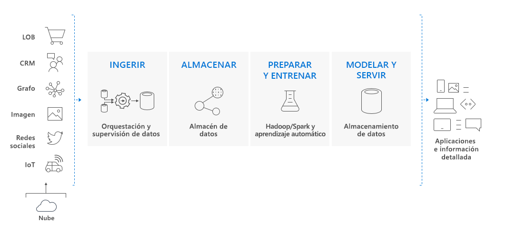

# ¿Qué es Azure Synapse Analytics (anteriormente SQL Data Warehouse)?

> [!NOTE] 
>Explore la [documentación de Azure Synapse (versión preliminar de áreas de trabajo)](../overview-what-is.md).
>

Azure Synapse es un servicio de análisis que engloba el almacenamiento de datos empresariales y el análisis de macrodatos. Le ofrece la libertad de consultar los datos como prefiera, ya sea a petición sin servidor o con recursos aprovisionados, a escala. Azure Synapse reúne estos dos mundos con una experiencia unificada para ingerir, preparar, administrar y servir datos para las necesidades inmediatas de inteligencia empresarial y aprendizaje automático.

Azure Synapse tiene cuatro componentes:

- SQL de Synapse: Análisis basado en T-SQL completo: disponible con carácter general
  - Grupo de SQL (pago por DWU aprovisionado)
  - SQL a petición (pago por TB procesados) (versión preliminar)
- Spark: profunda integración con Apache Spark (versión preliminar)
- Canalizaciones de Synapse: integración de datos híbridos (versión preliminar)
- Studio: Experiencia de usuario unificada (versión preliminar)

## Grupo de SQL de Synapse en Azure Synapse

El grupo de SQL de Synapse hace referencia a las características de almacenamiento de datos empresariales que están disponibles con carácter general en Azure Synapse.

El grupo de SQL representa una colección de recursos de análisis que se aprovisionan al usar SQL de Synapse. El tamaño del grupo de SQL lo determinan las unidades de almacenamiento de datos (DWU).

Importe macrodatos con consultas T-SQL de [PolyBase](/sql/relational-databases/polybase/polybase-guide?toc=/azure/synapse-analytics/sql-data-warehouse/toc.json&bc=/azure/synapse-analytics/sql-data-warehouse/breadcrumb/toc.json&view=azure-sqldw-latest) simples y, después, use la potencia de MPP para realizar análisis de alto rendimiento. Al realizar la integración y el análisis, el grupo de SQL de Synapse pasará a ser la versión única de certeza con la que puede contar su empresa para obtener información.  

## Componente clave de una solución de macrodatos

El almacenamiento de datos un componente clave de una solución de macrodatos de un extremo a otro en la nube.

En una solución de datos en la nube, los datos provenientes de varios orígenes se ingieren en almacenes de macrodatos. Una vez que están en un almacén de macrodatos, Hadoop, y Spark y los algoritmos de aprendizaje automático preparan y entrenan los datos. Cuando los datos están listos para el análisis complejo, el grupo de SQL de Synapse usa PolyBase para consultar los almacenes de macrodatos. PolyBase usa las consultas T-SQL estándar para llevar los datos a tablas del grupo de SQL de Synapse.

El grupo de SQL de Synapse almacena los datos en tablas relacionales con almacenamiento en columnas. Este formato reduce considerablemente los costos de almacenamiento de datos y mejora el rendimiento de las consultas. Una vez que los datos están almacenados, se pueden realizar análisis a gran escala. En comparación con los sistemas de bases de datos tradicionales, las consultas de análisis finalizan en segundos, en lugar de minutos, o en horas, en lugar de días.

Los resultados del análisis pueden ir a aplicaciones o bases de datos de informes mundiales. En ellas, los analistas empresariales pueden obtener información útil para tomar decisiones empresariales bien informadas.

## Pasos siguientes

- Exploración de la [arquitectura de Azure Synapse](massively-parallel-processing-mpp-architecture.md)
- [Creación rápida de un grupo de SQL](create-data-warehouse-portal.md)
- [Cargue datos de ejemplo](load-data-from-azure-blob-storage-using-polybase.md).
- Explore [vídeos](https://azure.microsoft.com/documentation/videos/index/?services=sql-data-warehouse).

O bien, examine algunos de estos otros recursos de Azure Synapse.

- Busque información en [Blogs](https://azure.microsoft.com/blog/tag/azure-sql-data-warehouse/).
- Envíe una [solicitud de característica](https://feedback.azure.com/forums/307516-sql-data-warehouse).
- [Creación de una incidencia de soporte técnico](sql-data-warehouse-get-started-create-support-ticket.md)
- Busque en el [foro de MSDN](https://social.msdn.microsoft.com/Forums/azure/home?forum=AzureSQLDataWarehouse).
- Busque en el [foro Stack Overflow](https://stackoverflow.com/questions/tagged/azure-sqldw).
