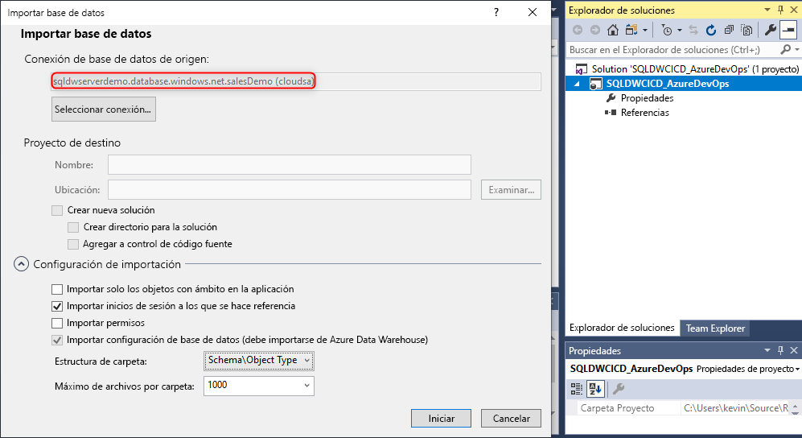
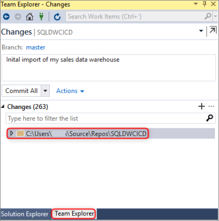

# Integración del control de código fuente para el grupo de SQL

En este tutorial se describe cómo integrar el proyecto de base de datos de SQL Server Data Tools (SSDT) con control de código fuente.  La integración del control de código fuente es el primer paso en la creación de una canalización de integración e implementación continuas con el recurso de grupo de SQL en Azure Synapse Analytics.

## Antes de empezar

- Regístrese como [organización de Azure DevOps](https://azure.microsoft.com/services/devops/)
- Realice el tutorial de [creación y conexión](create-data-warehouse-portal.md)
- [Instale Visual Studio 2019](https://visualstudio.microsoft.com/vs/older-downloads/)

## Configuración y conexión con Azure DevOps

1. En su organización de Azure DevOps, cree un proyecto que hospedará su proyecto de base de datos de SSDT mediante un repositorio de Azure Repos

   

2. Abra Visual Studio y conéctese a su organización y proyecto de Azure DevOps desde el paso 1 y seleccione “Administrar conexiones”.

   

   

3. Clone el repositorio de Azure Repos del proyecto en la máquina local

   

## Creación y conexión del proyecto

1. En Visual Studio, cree un nuevo proyecto de base de datos de SQL Server con un directorio y un repositorio de Git local en el **repositorio local clonado**

     

2. Haga clic con el botón derecho en el proyecto de SQL vacío e importe el almacenamiento de datos en el proyecto de base de datos

     

3. En Team Explorer en Visual Studio, confirme todos los cambios en el repositorio local de Git

     

4. Ahora que ha confirmado los cambios localmente en el repositorio clonado, sincronice e inserte los cambios en el repositorio de Azure Repos en el proyecto de Azure DevOps.

   ")

     

## Validación

1. Compruebe que los cambios se han insertado en el repositorio de Azure Repos mediante la actualización de una columna de tabla del proyecto de base de datos desde Visual Studio SQL Server Data Tools (SSDT)

   

2. Confirme e inserte el cambio del repositorio local en el repositorio de Azure Repos

   

3. Compruebe que el cambio se ha insertado en el repositorio de Azure Repos

   

4. (**Opcional**) Use la comparación de esquemas y actualice los cambios en el almacenamiento de datos de destino con SSDT para asegurarse de que las definiciones de objetos en el repositorio de Azure Repos y el repositorio local reflejan el almacenamiento de datos

## Pasos siguientes

- [Desarrollo para un grupo de SQL](sql-data-warehouse-overview-develop.md)
