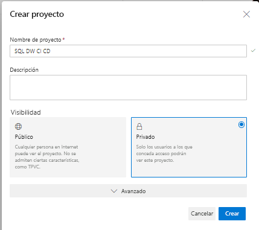
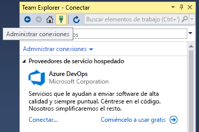
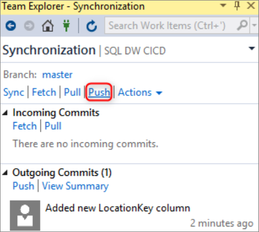
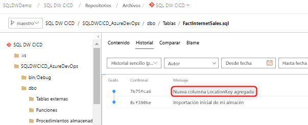

# Integración del control de código fuente para el grupo de SQL dedicado en Azure Synapse Analytics

En este tutorial se describe cómo integrar el proyecto de base de datos de SQL Server Data Tools (SSDT) con el control de código fuente.  La integración del control de código fuente es el primer paso en la creación de una canalización de integración e implementación continuas con el recurso de grupo de SQL dedicado en Azure Synapse Analytics.

## Antes de empezar

- Regístrese como [organización de Azure DevOps](https://azure.microsoft.com/services/devops/)
- Realice el tutorial de [creación y conexión](create-data-warehouse-portal.md)
- [Instale Visual Studio 2019](https://visualstudio.microsoft.com/vs/older-downloads/)

## Configuración y conexión con Azure DevOps

1. En su organización de Azure DevOps, cree un proyecto que hospede su proyecto de base de datos de SSDT mediante un repositorio de Azure Repos.

   

2. Abra Visual Studio y conéctese a su organización y proyecto de Azure DevOps desde el paso un y seleccione **Administrar conexión**.

   

3. Conéctese al proyecto seleccionando **Administrar conexiones** y, después, **Conectarse a un proyecto**.
 
    

4. Busque el proyecto que creó en el paso uno y seleccione **Conectar**.
 
    

3. Clone el repositorio de Azure DevOps del proyecto en la máquina local.

   

Para más información sobre cómo conectar proyectos mediante Visual Studio, consulte [Conexión a proyectos en Team Explorer](https://docs.microsoft.com/visualstudio/ide/connect-team-project?view=vs-2019). Para obtener una guía para clonar un repositorio mediante Visual Studio, consulte el artículo sobre la [clonación de un repositorio de Git existente](https://docs.microsoft.com/azure/devops/repos/git/clone?view=azure-devops&tabs=visual-studio). 

## Creación y conexión del proyecto

1. En Visual Studio, cree un proyecto de base de datos de SQL Server con un directorio y un repositorio de Git local en el **repositorio local clonado**.

     

2. Haga clic con el botón derecho en el proyecto de SQL vacío e importe el almacenamiento de datos en el proyecto de base de datos.

     

3. En Team Explorer, en Visual Studio, confirme los cambios en el repositorio local de Git.

     

4. Ahora que ha confirmado los cambios localmente en el repositorio clonado, sincronice e inserte los cambios en el repositorio de Azure Repos en el proyecto de Azure DevOps.

   ")

     

## Validación

1. Compruebe que los cambios se han insertado en Azure Repos mediante la actualización de una columna de la tabla de su proyecto de base de datos desde Visual Studio SQL Server Data Tools (SSDT).

   

2. Confirme e inserte el cambio del repositorio local en Azure Repos.

   

3. Compruebe que el cambio se ha insertado en el repositorio de Azure Repos.

   

4. (**Opcional**) Use Comparación de esquemas y actualice los cambios en el grupo de SQL dedicado de destino mediante SSDT para asegurarse de que las definiciones de los objetos del repositorio de Azure Repos y del repositorio local reflejan el grupo de SQL dedicado.

## Pasos siguientes

- [Desarrollo para el grupo de SQL dedicado](sql-data-warehouse-overview-develop.md)
