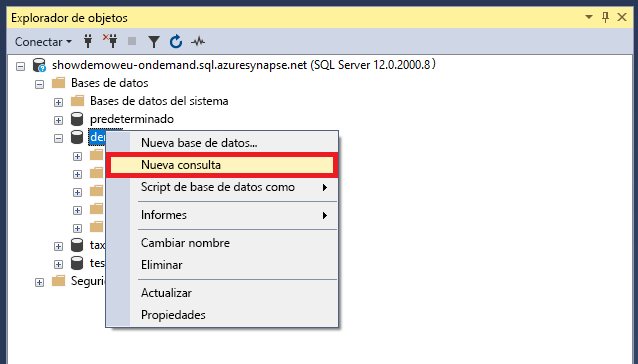

# <a name="connect-to-synapse-sql-with-sql-server-management-studio-ssms"></a>Conexión a Synapse SQL con SQL Server Management Studio (SSMS)
> [!div class="op_single_selector"]
> * [Azure Data Studio](get-started-azure-data-studio.md)
> * [Power BI](get-started-power-bi-professional.md)
> * [Visual Studio](../sql-data-warehouse/sql-data-warehouse-query-visual-studio.md?toc=/azure/synapse-analytics/toc.json&bc=/azure/synapse-analytics/breadcrumb/toc.json)
> * [sqlcmd](../sql/get-started-connect-sqlcmd.md)
> * [SSMS](get-started-ssms.md)
> 
> 

Puede usar [SQL Server Management Studio (SSMS)](/sql/ssms/download-sql-server-management-studio-ssms) para conectarse y realizar consultas a Synapse SQL en Azure Synapse Analytics con los recursos del grupo de SQL sin servidor (versión preliminar) o del grupo de SQL dedicado. 

### <a name="supported-tools-for-serverless-sql-pool-preview"></a>Herramientas admitidas en el grupo de SQL sin servidor (versión preliminar)

[Azure Data Studio](/sql/azure-data-studio/download-azure-data-studio) es totalmente compatible a partir de la versión 1.18.0. SSMS es parcialmente compatible a partir de la versión 18.5, que solo se puede usar para establecer conexión y realizar consultas.

> [!NOTE]
> Si el inicio de sesión de AAD tiene abierta la conexión durante más de una hora en el momento de la ejecución de la consulta, se producirá un error en todas las consultas que usen AAD, lo que incluye la realización de consultas en el almacenamiento mediante el paso a través de AAD y las instrucciones que interactúan con AAD (como CREATE EXTERNAL PROVIDER). Esto afecta a todas las herramientas que mantienen la conexión abierta, como en el editor de consultas de SSMS y ADS. Las herramientas que abren una conexión nueva para ejecutar cada consulta no se ven afectadas, como Synapse Studio.
> Para mitigar este problema, puede reiniciar SSMS, o bien conectarse y desconectarse en ADS. .
## <a name="prerequisites"></a>Prerrequisitos

Asegúrese de que cumple los siguientes requisitos previos antes de empezar:  

* [SQL Server Management Studio (SSMS)](/sql/ssms/download-sql-server-management-studio-ssms). 
* Para el grupo de SQL dedicado, necesita un almacenamiento de datos existente. Para crear uno, consulte [Creación de un grupo de SQL dedicado](../quickstart-create-sql-pool-portal.md). En el caso del grupo de SQL sin servidor, ya se ha aprovisionado uno, llamado Built-in (integrado), en el área de trabajo en el momento de la creación. 
* El nombre del servidor SQL completo. Para encontrar el nombre, consulte [Conexión a Synapse SQL](connect-overview.md).

## <a name="connect"></a>Conectar

### <a name="dedicated-sql-pool"></a>Grupo de SQL dedicado

Para conectarse a Synapse SQL mediante el grupo de SQL dedicado, siga estos pasos: 

1. Abra SQL Server Management Studio (SSMS). 
1. En el cuadro de diálogo **Conectar al servidor** , rellene los campos y seleccione **Conectar** : 
  
    
   
   * **Nombre del servidor** : Escriba el **nombre del servidor** definido anteriormente.
   * **Autenticación** :  Elija un tipo de autenticación como, por ejemplo, **Autenticación de SQL Server** o **Autenticación integrada de Active Directory**.
   * **Nombre de usuario** y **contraseña** : Escriba su nombre de usuario y la contraseña si la autenticación de SQL Server se seleccionó anteriormente.

1. Expanda el servidor de Azure SQL Server en **Explorador de objetos**. Puede ver las bases de datos asociadas al servidor, como la base de datos AdventureWorksDW de ejemplo. Puede expandir la base de datos para ver las tablas:
   
    


### <a name="serverless-sql-pool-preview"></a>Grupo de SQL sin servidor (versión preliminar)

Para conectarse a Synapse SQL mediante el grupo de SQL sin servidor, siga estos pasos: 

1. Abra SQL Server Management Studio (SSMS).
1. En el cuadro de diálogo **Conectar al servidor** , rellene los campos y seleccione **Conectar** : 
   
    
   
   * **Nombre del servidor** : Escriba el **nombre del servidor** definido anteriormente.
   * **Autenticación** : Elija un tipo de autenticación como, por ejemplo, **Autenticación de SQL Server** o **Autenticación integrada de Active Directory** :
   * **Nombre de usuario** y **contraseña** : Escriba su nombre de usuario y la contraseña si la autenticación de SQL Server se seleccionó anteriormente.
   * Seleccione **Conectar**.

4. Para explorar, expanda su Azure SQL Server. Puede ver las bases de datos asociadas al servidor. Expanda *demo* para ver el contenido de la base de datos de ejemplo.
   
    


## <a name="run-a-sample-query"></a>Ejecución de una consulta de ejemplo

### <a name="dedicated-sql-pool"></a>Grupo de SQL dedicado

Ahora que se ha establecido una conexión de base de datos, puede consultar los datos.

1. Haga clic con el botón derecho en la base de datos en el Explorador de objetos de SQL Server.
2. Seleccione **Nueva consulta**. Se abrirá una nueva ventana de consulta.
   
    
3. Copie la siguiente consulta T-SQL en la ventana de consulta:
   
    ```sql
    SELECT COUNT(*) FROM dbo.FactInternetSales;
    ```
4. Ejecute la consulta, para lo que debe seleccionar `Execute` o usar el siguiente acceso directo: `F5`.
   
    
5. Consulte los resultados de la consulta. En el siguiente ejemplo, la tabla FactInternetSales tiene 60398 filas.
   
    

### <a name="serverless-sql-pool"></a>Grupo de SQL sin servidor

Ahora que se ha establecido una conexión de base de datos, puede consultar los datos.

1. Haga clic con el botón derecho en la base de datos en el Explorador de objetos de SQL Server.
2. Seleccione **Nueva consulta**. Se abrirá una nueva ventana de consulta.
   
    
3. Copie la siguiente consulta T-SQL en la ventana de consulta:
   
    ```sql
    SELECT COUNT(*) FROM demo.dbo.usPopulationView
    ```
4. Ejecute la consulta, para lo que debe seleccionar `Execute` o usar el siguiente acceso directo: `F5`.
   
    
5. Consulte los resultados de la consulta. En este ejemplo, la vista usPopulationView tiene 3664512 filas.
   
    

## <a name="next-steps"></a>Pasos siguientes
Ahora que puede conectarse y realizar consultas, intente realizar la [Visualización de datos con Power BI](get-started-power-bi-professional.md).

Para configurar el entorno para la autenticación de Azure Active Directory, consulte [Autenticación en Synapse SQL](../sql-data-warehouse/sql-data-warehouse-authentication.md?toc=/azure/synapse-analytics/toc.json&bc=/azure/synapse-analytics/breadcrumb/toc.json).

