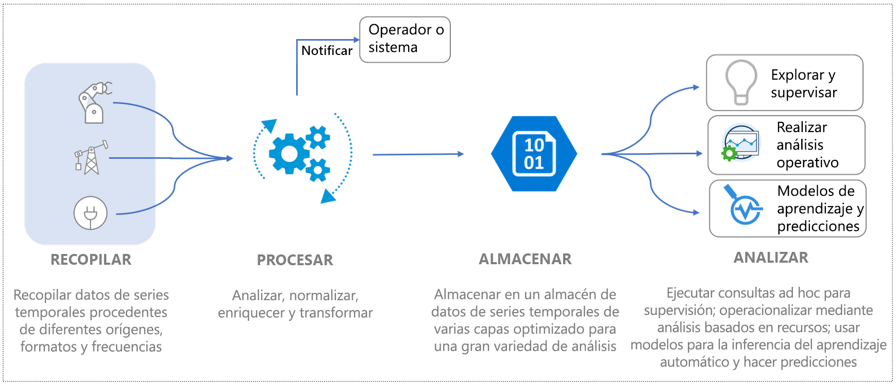
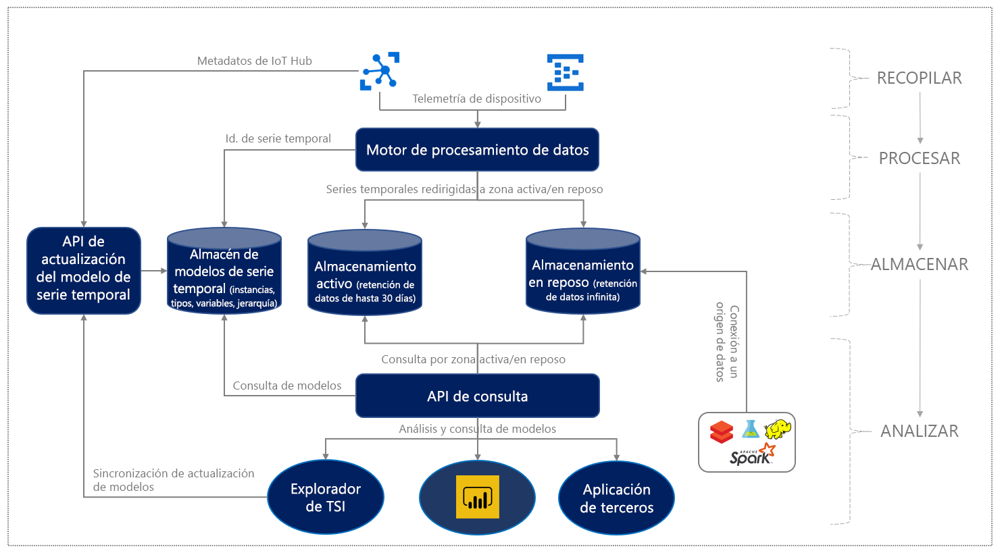

# ¿Qué es la versión preliminar de Azure Time Series Insights?

La versión preliminar de Azure Time Series Insights es una oferta de plataforma como servicio (PaaS) de un extremo a otro. Se usa para recopilar, procesar, almacenar, analizar y consultar datos a escala de IoT optimizados para series temporales y muy contextualizados. Time Series Insights es ideal para la exploración de datos ad hoc y para el análisis operativo. Time Series Insights es una oferta de servicio de extensibilidad única y personalizado, que satisface las amplias necesidades de las implementaciones de IoT industriales.

> [!TIP]
> Para consultar las características de la disponibilidad general (GA), lea [Introducción: ¿Qué es Azure Time Series Insights?](time-series-insights-overview.md).

## Vídeo

### Más información acerca de la versión preliminar de Azure Time Series Insights.  

> [!VIDEO https://channel9.msdn.com/Shows/Internet-of-Things-Show/Azure-Time-Series-Insights-e2e-solution-for-industrial-IoT-analytics/player]

## Definición de datos de IoT

Los datos de IoT hacen referencia a cualquier dato industrial disponible en organizaciones con uso intensivo de los recursos. Los datos de IoT suelen estar muy desestructurados porque se envían desde recursos que registran medidas bastante ruidosas. Estas medidas incluyen temperatura, movimiento y humedad. Estos flujos de datos se caracterizan con frecuencia por incluir vacíos significativos, mensajes dañados y lecturas falsas. Los datos que proceden de estos flujos se deben limpiar antes de que se produzca el análisis.

Los datos de IoT suelen ser significativos solo en el contexto de las entradas de datos adicionales que proceden de orígenes de terceros, como CRM o ERP. Las entradas también proceden de orígenes de datos de terceros, como el tiempo o la ubicación.

Como resultado, solo una fracción de los datos se usa con fines operativos y empresariales. Estos datos proporcionan una información coherente, completa, actualizada y correcta que resulta necesaria para los informes y los análisis empresariales. Para convertir los datos de IoT recopilados en información útil, se requiere:

* Procesamiento de datos para limpiar, filtrar, interpolar, transformar y preparar los datos para su análisis.
* Una estructura para poder explorar y comprender los datos, a fin de normalizarlos y contextualizarlos.
* Almacenamiento rentable para una retención duradera o infinita de datos procesados, derivados o sin procesar durante décadas.

Un flujo de datos de IoT típico se muestra en la siguiente imagen.

  

## Azure Time Series Insights para IoT industrial

El panorama actual de IoT es variado. Los clientes abarcan los sectores de fabricación, automoción, energía, suministros, edificios inteligentes y consultoría. Los escenarios incluyen la exploración de datos ad hoc donde la forma de los datos es desconocida. Entre otros escenarios también destacan los análisis operativos frente a los esquematizados o los datos modelados explícitamente para impulsar la eficacia operativa. Estos escenarios se dan normalmente de forma conjunta y admiten distintos casos de uso. Las funcionalidades de la plataforma que son clave para el éxito de las empresas de IoT industriales y su revolución digital son:

- Almacenamiento multicapa, tanto intermedio como en frío.
- La capacidad de almacenar datos de serie temporal durante décadas.
- La capacidad de modelar y optimizar de forma explícita las consultas de inteligencia operativa basada en recursos.

Time Series Insights es una oferta de PaaS completa y de un extremo a otro para la exploración de datos de IoT, así como para la obtención de información operativa. Time Series Insights ofrece un servicio en la nube totalmente administrado para analizar datos de series temporales a escala de IoT.

Puede almacenar los datos sin procesar en un almacén en memoria sin esquema. A continuación, puede realizar consultas ad hoc interactivas mediante una API y un motor de consultas distribuidas. Benefíciese de la experiencia de usuario enriquecida para visualizar miles de millones de eventos en cuestión de segundos. Obtenga más información sobre las [funcionalidades de exploración de datos](./time-series-insights-overview.md).

Time Series Insights también ofrece funcionalidades de obtención de información operativa que actualmente se encuentran en versión preliminar. Además de la exploración de datos interactiva y la inteligencia operativa, puede usar Time Series Insights para obtener más valor de los datos recopilados de los recursos de IoT. La oferta de la versión preliminar admite:

* Un almacén de datos de series temporales escalable y optimizado para rendimiento y costos. Esta solución de IoT basada en la nube puede tener tendencia a almacenar años de datos de serie temporal en cuestión de segundos.
* Compatibilidad con el modelo semántico que describe el dominio y los metadatos asociados con las señales derivadas y no derivadas de los recursos y dispositivos.
* Una experiencia de usuario mejorada que combina la obtención de información a partir de datos basados en recursos con un análisis enriquecido de datos ad hoc. Esta combinación fomenta la inteligencia empresarial y operativa.
* Integración con herramientas de análisis y aprendizaje automático avanzado. Las herramientas incluyen Azure Databricks, Apache Spark, Azure Machine Learning, Jupyter Notebook y Power BI. Estas herramientas ayudan a afrontar los desafíos de los datos de serie temporal y a impulsar la eficacia operativa.

La exploración de los datos y la obtención de información operativa se ofrece mediante un sencillo modelo de precios de pago por uso para el procesamiento de datos, el almacenamiento y la consulta de estos. Este modelo de facturación es adecuado para sus necesidades empresariales cambiantes.

Las actualizaciones se muestran en este diagrama de flujo de datos de alto nivel.

  

Gracias a la introducción de estas funcionalidades de IoT industriales clave, Time Series Insights ofrece las siguientes ventajas clave.

| | |
| ---| ---|
| Almacenamiento multicapa para datos de series temporales a escala de IoT | Con una canalización de procesamiento de datos común para la ingesta de datos, puede almacenar datos en un almacenamiento intermedio para realizar consultas interactivas. También puede almacenar datos en almacenamiento en frío para grandes volúmenes de datos. Benefíciese de las [consultas](./time-series-insights-update-tsq.md) basadas en recursos de alto rendimiento. |
| Modelo de serie temporal para contextualizar datos de telemetría sin procesar y derivar información basada en recursos | Contextualice datos de telemetría sin procesar con el [modelo de serie temporal](./time-series-insights-update-tsm.md) descriptivo. Derive inteligencia operativa enriquecida con consultas basadas en dispositivos optimizadas para rendimiento y costo. |
| Integración suave y continua con otras soluciones de datos | Los datos de Time Series Insights se [almacenan](./time-series-insights-update-storage-ingress.md) en archivo de Apache Parquet de código abierto. Esta integración con otras soluciones de datos, ya sean propias o de terceros, es fácil para escenarios de un extremo a otro. Estos escenarios incluyen inteligencia empresarial, aprendizaje automático avanzado y análisis predictivo. |
| Exploración de datos casi en tiempo real | La experiencia de usuario del [explorador de la versión preliminar de Azure Time Series Insights](./time-series-insights-update-explorer.md) proporciona la visualización de todos los flujos de datos mediante la canalización de ingesta. Poco después de conectar un origen del evento, puede ver, explorar y consultar datos del evento. De este modo, puede validar si un dispositivo emite los datos según lo previsto. También puede supervisar el mantenimiento, la productividad y la eficacia general de un recurso de IoT. |
| Análisis de las causas principales y detección de anomalías | El [explorador de la versión preliminar de Azure Time Series Insights](./time-series-insights-update-explorer.md) es compatible con patrones y vistas de perspectiva para llevar a cabo y guardar análisis de las causas principales de varios pasos. En combinación con Azure Stream Analytics, puede usar Time Series Insights para detectar alertas y anomalías casi en tiempo real. |
| Aplicaciones personalizadas compiladas en la plataforma de Time Series Insights | Time Series Insights admite el [SDK de JavaScript](https://github.com/microsoft/tsiclient/blob/master/docs/API.md). El SDK ofrece controles enriquecidos y acceso simplificado a las consultas. Use el SDK para compilar aplicaciones personalizadas de IoT en Time Series Insights para satisfacer sus necesidades empresariales específicas. También puede usar las [API de consulta](./time-series-insights-update-tsq.md) de Time Series Insights directamente para dirigir datos a las aplicaciones de IoT personalizadas. |

## Pasos siguientes

Introducción a la versión preliminar de Azure Time Series Insights:

> [!div class="nextstepaction"]
> [Lea la guía de inicio rápido](./time-series-insights-update-quickstart.md)

Conozca los casos de uso:

> [!div class="nextstepaction"]
> [Casos de uso de la versión preliminar de Azure Time Series Insights](./time-series-insights-update-use-cases.md)
