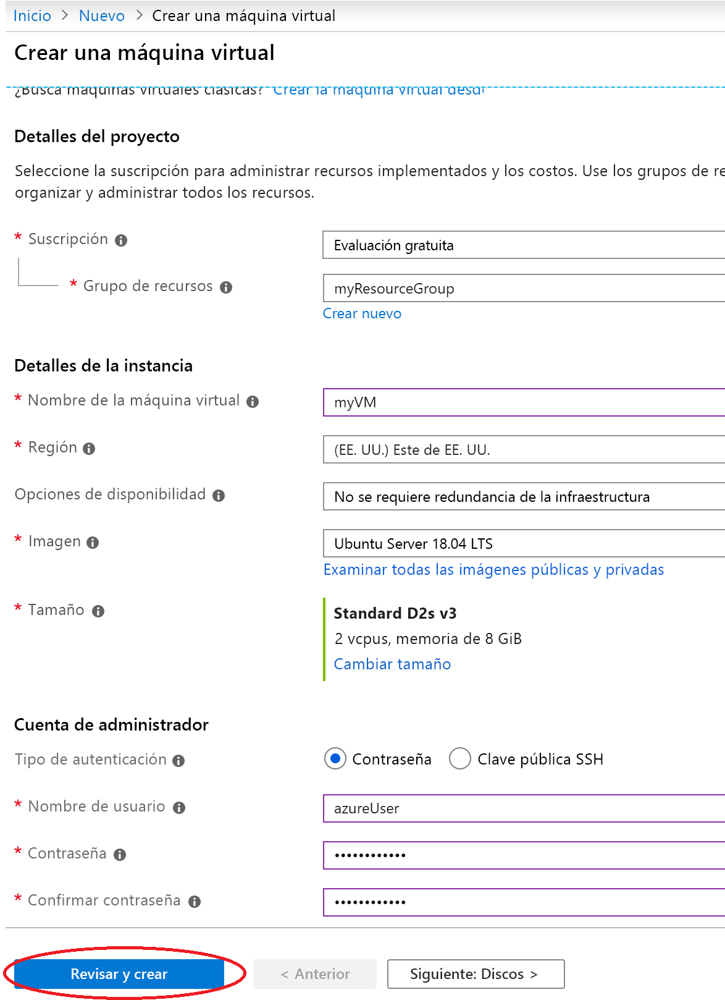

# Inicio rápido: Creación y cifrado de una máquina virtual desde Azure Portal

Las máquinas virtuales de Azure pueden crearse mediante Azure Portal. Azure Portal es una interfaz de usuario basada en explorador para crear máquinas virtuales y recursos asociados. En este inicio rápido se usará Azure Portal para implementar una máquina virtual Linux que usa Ubuntu 18.04 LTS, crear un almacén de claves para el almacenamiento de las claves de cifrado y cifrar la máquina virtual.

Si no tiene una suscripción a Azure, cree una [cuenta gratuita](https://azure.microsoft.com/free/?WT.mc_id=A261C142F) antes de empezar.

## Inicio de sesión en Azure

Inicie sesión en el [Azure Portal](https://portal.azure.com).

## Creación de un Almacén de claves

1. Seleccione la opción **Crear un recurso** de la esquina superior izquierda de Azure Portal.
1. En el cuadro de búsqueda, escriba **Key Vault**.
1. En la lista de resultados, seleccione **Key Vault**.
1. En la sección Key Vault, seleccione **Crear**.
1. En la pantalla **Crear almacén de claves**, elija un nombre único para el nuevo almacén de claves.

    > [!Important]
    > Cada instancia de Key Vault debe tener un nombre único. En el siguiente ejemplo se crea una instancia de Key Vault llamada *myADEKV*, pero debe llamar a la suya de otra forma.

1. Seleccione una **suscripción**.
1.  En **Grupo de recursos**, seleccione **Crear nuevo**. En el menú emergente, escriba *myResourceGroup* para el nombre del grupo de recursos y luego elija **Aceptar**. 

    

1. En el menú desplegable **Ubicación**, elija **Este de EE. UU.**
1. Deje las restantes opciones con sus valores predeterminados.
1. Seleccione "Directivas de acceso", lo que le llevará a una nueva pantalla.
1. Active la casilla que esta junto a "Habilitar el acceso a Azure Disk Encryption para el cifrado de volúmenes".

    

1. En la parte inferior de la pantalla de directivas de acceso, haga clic en "Revisar y crear".
1. Después de revisar, haga clic en "Crear".

## Creación de una máquina virtual

1. Elija **Crear un recurso** en la esquina superior izquierda de Azure Portal.

1. En la página Nuevo, en Popular, seleccione **Ubuntu Server 18.04 LTS**.
1. En la pestaña **Datos básicos**, en **Detalles del proyecto**, asegúrese de que está seleccionada la suscripción correcta.
1. En **Grupo de recursos**, seleccione el grupo de recursos que creó al preparar el almacén de claves (p.ej., **myResourceGroup**).
1. En **Nombre de máquina virtual** , escriba *MyVM*.
1. En **Región**, seleccione la misma región que usó al crear el almacén de claves (p.ej., **Este de EE. UU.** ).
1. Asegúrese de que el valor de **Tamaño** es *Estándar D2s v3*.
1. En **Cuenta de administrador** , seleccione **Contraseña**. Escriba un nombre de usuario y una contraseña.
    
1. Seleccione la pestaña "Administración" y compruebe que tiene una cuenta de almacenamiento de diagnóstico. Si no tiene cuentas de almacenamiento, seleccione "Crear nuevo", asigne un nombre a la cuenta nueva y seleccione "Aceptar" 
1. Haga clic en "Revisar y crear".
1. En la página **Crear una máquina virtual** verá los detalles de la máquina virtual que va a crear. Cuando esté preparado, seleccione **Crear**.

La implementación de la máquina virtual tardará unos minutos. Cuando finalice la implementación, pase a la siguiente sección.

## Cifrado de la máquina virtual

1. Cuando la implementación de la máquina virtual se complete, seleccione **Ir al recurso**.
1. En la barra lateral izquierda, seleccione **Discos**.
1. En la pantalla Discos, seleccione **Cifrado**. 

    

1. En la pantalla de cifrado, en **Disks to encrypt** (Discos que se cifran), elija **OS and data disks** (Discos de SO y de datos).
1. En **Configuración de cifrado**, haga clic en "Seleccionar un almacén de claves y una clave para el cifrado".
1. En la barra lateral derecha, seleccione el nombre del almacén de claves que creó anteriormente como valor de **Almacén de claves** y haga clic en **Seleccionar**.

    
1. En la parte superior de la pantalla de cifrado, haga clic en "Guardar". Un elemento emergente le avisará que la máquina virtual se va a reiniciar la máquina virtual. Haga clic en **Sí**.

## Limpieza de recursos

Cuando ya no los necesite, puede eliminar el grupo de recursos, la máquina virtual y todos los recursos relacionados. Para ello, seleccione el grupo de recursos de la máquina virtual, seleccione Eliminar y confirme el nombre del grupo de recursos que desea eliminar.

## Pasos siguientes

En este inicio rápido ha creado un almacén de claves que se ha habilitado para las claves de cifrado, ha creado una máquina virtual y ha habilitado la máquina virtual para el cifrado.  

> [!div class="nextstepaction"]
> [Introducción a Azure Disk Encryption](disk-encryption-overview.md)
