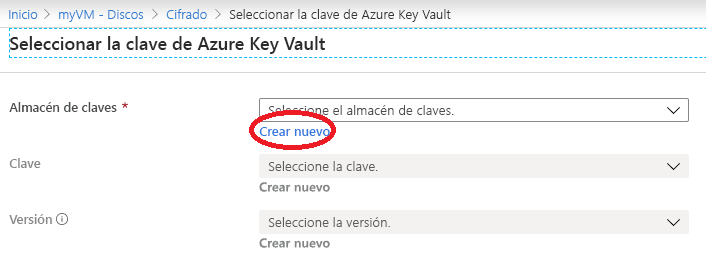

# Inicio rápido: Creación y cifrado de una máquina virtual Windows desde Azure Portal

Las máquinas virtuales de Azure pueden crearse mediante Azure Portal. Azure Portal es una interfaz de usuario basada en explorador para crear máquinas virtuales y recursos asociados. En este inicio rápido se usará Azure Portal para implementar una máquina virtual Windows que usa Ubuntu 18.04 LTS, crear un almacén de claves para las claves de cifrado y cifrar la máquina virtual.

Si no tiene una suscripción a Azure, cree una [cuenta gratuita](https://azure.microsoft.com/free/?WT.mc_id=A261C142F) antes de empezar.

## Inicio de sesión en Azure

Inicie sesión en el [Azure Portal](https://portal.azure.com).

## Creación de una máquina virtual

1. Elija **Crear un recurso** en la esquina superior izquierda de Azure Portal.
1. En la página Nuevo, en Popular, seleccione **Windows Server 2016 Datacenter**.
1. En la pestaña Aspectos básicos, en Detalles del proyecto, asegúrese de que esté seleccionada la suscripción correcta y luego elija **Crear nuevo grupo de recursos**. Como nombre, escriba *myResourceGroup*.
1. En **Nombre de máquina virtual** , escriba *MyVM*.
1. En **Región**, seleccione la misma región que usó al crear el almacén de claves (p.ej., *Este de EE. UU.* ).
1. Asegúrese de que el valor de **Tamaño** es *Estándar D2s v3*.
1. En **Cuenta de administrador** , seleccione **Contraseña**. Escriba un nombre de usuario y una contraseña.
    
1. Seleccione la pestaña "Administración" y compruebe que tiene una cuenta de almacenamiento de diagnóstico. Si no tiene cuentas de almacenamiento, seleccione "Crear nuevo", asigne un nombre a la cuenta nueva y seleccione "Aceptar" 
1. Haga clic en "Revisar y crear".
1. En la página **Crear una máquina virtual** verá los detalles de la máquina virtual que va a crear. Cuando esté preparado, seleccione **Crear**.

La implementación de la máquina virtual tardará unos minutos. Cuando finalice la implementación, pase a la siguiente sección.

## Cifrado de la máquina virtual

1. Cuando la implementación de la máquina virtual se complete, seleccione **Ir al recurso**.
1. En la barra lateral izquierda, seleccione **Discos**.
1. En la pantalla Discos, seleccione **Cifrado**. 

    

1. En la pantalla de cifrado, en **Disks to encrypt** (Discos que se cifran), elija **OS and data disks** (Discos de SO y de datos).
1. En **Configuración de cifrado**, elija **Seleccionar un almacén de claves y una clave para el cifrado**.
1. En la pantalla **Seleccionar la clave de Azure Key Vault**, seleccione **Crear nuevo**.

    

1. En la pantalla **Crear almacén de claves**, asegúrese de que el grupo de recursos sea el mismo que el usado para crear la máquina virtual.
1. Asigne un nombre al almacén de claves.  Cada almacén de claves en Azure debe tener un nombre único.
1. En la pestaña **Directivas de acceso**, active la casilla **Habilitar el acceso a Azure Disk Encryption para el cifrado de volúmenes**.

    

1. Seleccione **Revisar + crear**.  
1. Una vez que el almacén de claves haya superado la validación, seleccione **Crear**. Al hacerlo, regresará a la pantalla **Seleccionar la clave de Azure Key Vault**.
1. Deje en blanco el campo **Clave** y elija **Seleccionar**.
1. En la parte superior de la pantalla de cifrado, haga clic en **Guardar**. Un elemento emergente le avisará que la máquina virtual se va a reiniciar la máquina virtual. Haga clic en **Sí**.

## Limpieza de recursos

Cuando ya no los necesite, puede eliminar el grupo de recursos, la máquina virtual y todos los recursos relacionados. Para ello, seleccione el grupo de recursos de la máquina virtual, seleccione Eliminar y confirme el nombre del grupo de recursos que desea eliminar.

## Pasos siguientes

En este inicio rápido ha creado un almacén de claves que se ha habilitado para las claves de cifrado, ha creado una máquina virtual y ha habilitado la máquina virtual para el cifrado.  

> [!div class="nextstepaction"]
> [Introducción a Azure Disk Encryption](disk-encryption-overview.md)
