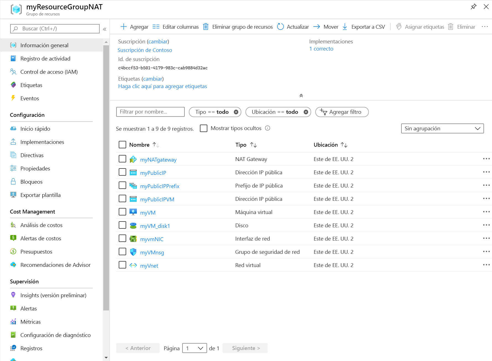

# <a name="quickstart-create-a-nat-gateway---arm-template"></a>Inicio rápido: Creación de una instancia de NAT Gateway: plantilla ARM

Comience a usar Virtual Network NAT mediante una plantilla de Azure Resource Manager (ARM). Esta plantilla implementa una red virtual, un recurso de puerta de enlace NAT y una máquina virtual con Ubuntu. La máquina virtual con Ubuntu se implementa en una subred que está asociada al recurso de puerta de enlace NAT.

[!INCLUDE [About Azure Resource Manager](../../includes/resource-manager-quickstart-introduction.md)]

Si su entorno cumple los requisitos previos y está familiarizado con el uso de plantillas de Resource Manager, seleccione el botón **Implementar en Azure**. La plantilla se abrirá en Azure Portal.

[](https://portal.azure.com/#create/Microsoft.Template/uri/https%3A%2F%2Fraw.githubusercontent.com%2FAzure%2Fazure-quickstart-templates%2Fmaster%2F101-nat-gateway-1-vm%2Fazuredeploy.json)

## <a name="prerequisites"></a>Prerrequisitos

Si no tiene una suscripción a Azure, cree una [cuenta gratuita](https://azure.microsoft.com/free/?WT.mc_id=A261C142F) antes de empezar.

## <a name="review-the-template"></a>Revisión de la plantilla

La plantilla usada en este inicio rápido forma parte de las [plantillas de inicio rápido de Azure](https://azure.microsoft.com/resources/templates/101-nat-gateway-1-vm).

Esta plantilla está configurada para crear lo siguiente:

* Virtual network
* Recurso de puerta de enlace NAT
* Máquina virtual con Ubuntu

La máquina virtual de Ubuntu se implementa en una subred que está asociada al recurso de puerta de enlace NAT.

:::code language="json" source="~/quickstart-templates/101-nat-gateway-1-vm/azuredeploy.json":::

En la plantilla se definen nueve recursos de Azure:

* **[Microsoft.Network/networkSecurityGroups](/azure/templates/microsoft.network/networksecuritygroups)** : Crea un grupo de seguridad de red.
* **[Microsoft.Network/networkSecurityGroups/securityRules](/azure/templates/microsoft.network/networksecuritygroups/securityrules)** : Crea una regla de seguridad.
* **[Microsoft.Network/publicIPAddresses](/azure/templates/microsoft.network/publicipaddresses)** : Crea una dirección IP pública.
* **[Microsoft.Network/publicIPPrefixes](/azure/templates/microsoft.network/publicipprefixes)** : Crea un prefijo de dirección IP pública.
* **[Microsoft.Compute/virtualMachines](/azure/templates/Microsoft.Compute/virtualMachines)** : Crea una máquina virtual.
* **[Microsoft.Network/virtualNetworks](/azure/templates/microsoft.network/virtualnetworks)** : Crea una red virtual.
* **[Microsoft.Network/natGateways](/azure/templates/microsoft.network/natgateways)** : Crea un recurso de puerta de enlace NAT.
* **[Microsoft.Network/virtualNetworks/subnets](/azure/templates/microsoft.network/virtualnetworks/subnets)** : Crea una subred de red virtual.
* **[Microsoft.Network/networkinterfaces](/azure/templates/microsoft.network/networkinterfaces)** : Crea una interfaz de red.

## <a name="deploy-the-template"></a>Implementación de la plantilla

**CLI de Azure**

```azurecli-interactive
read -p "Enter the location (i.e. westcentralus): " location
resourceGroupName="myResourceGroupNAT"
templateUri="https://raw.githubusercontent.com/Azure/azure-quickstart-templates/master/101-nat-gateway-1-vm/azuredeploy.json"

az group create \
--name $resourceGroupName \
--location $location

az deployment group create \
--resource-group $resourceGroupName \
--template-uri  $templateUri
```

**Azure PowerShell**

```azurepowershell-interactive
$location = Read-Host -Prompt "Enter the location (i.e. westcentralus)"
$templateUri = "https://raw.githubusercontent.com/Azure/azure-quickstart-templates/master/101-nat-gateway-1-vm/azuredeploy.json"

$resourceGroupName = "myResourceGroupNAT"

New-AzResourceGroup -Name $resourceGroupName -Location $location
New-AzResourceGroupDeployment -ResourceGroupName $resourceGroupName -TemplateUri $templateUri
```

**Azure Portal**

[](https://portal.azure.com/#create/Microsoft.Template/uri/https%3A%2F%2Fraw.githubusercontent.com%2FAzure%2Fazure-quickstart-templates%2Fmaster%2F101-nat-gateway-1-vm%2Fazuredeploy.json)

## <a name="review-deployed-resources"></a>Revisión de los recursos implementados

1. Inicie sesión en [Azure Portal](https://portal.azure.com).

1. Seleccione **Grupos de recursos** en el panel izquierdo.

1. Seleccione el grupo de recursos que creó en la sección anterior. El nombre predeterminado del grupo de recursos es **myResourceGroupNAT**.

1. Compruebe que los recursos siguientes se han creado en el grupo de recursos:

    

## <a name="clean-up-resources"></a>Limpieza de recursos

**CLI de Azure**

Cuando ya no lo necesite, puede usar el comando [az group delete](/cli/azure/group#az-group-delete) para quitar el grupo de recursos y todos los recursos que contiene.

```azurecli-interactive
  az group delete \
    --name myResourceGroupNAT
```

**Azure PowerShell**

Cuando ya no lo necesite, puede usar el comando [Remove-AzResourceGroup](/powershell/module/az.resources/remove-azresourcegroup) para quitar el grupo de recursos y todos los recursos que contiene.

```azurepowershell-interactive
Remove-AzResourceGroup -Name myResourceGroupNAT
```

**Azure Portal**

Cuando ya no los necesite, elimine el grupo de recursos, la puerta de enlace de NAT y todos los recursos relacionados. Seleccione el grupo de recursos **myResourceGroupNAT** que contiene la puerta de enlace de NAT y, luego, seleccione **Eliminar**.

## <a name="next-steps"></a>Pasos siguientes

En este inicio rápido, ha creado lo siguiente:

* Recurso de puerta de enlace NAT
* Virtual network
* Máquina virtual con Ubuntu

La máquina virtual se implementa en una subred de red virtual asociada a la puerta de enlace NAT.

Para más información sobre Virtual Network NAT y Azure Resource Manager, continúe con los artículos siguientes.

* Lea [Información general de Virtual Network NAT](nat-overview.md).
* Consulte los [recursos de puerta de enlace NAT](nat-gateway-resource.md).
* Obtenga más información sobre [Azure Resource Manager](../azure-resource-manager/management/overview.md).
