# Migración a Azure Virtual WAN

Azure Virtual WAN permite a las empresas simplificar su conectividad global para beneficiarse de la escala de la red global de Microsoft. Este artículo proporciona detalles técnicos para compañías que quieren migrar de una topología en estrella tipo hub-and-spoke existente administrada por el cliente a un diseño que aprovecha los centros de conectividad de Virtual WAN administrados por Microsoft.

Para obtener información sobre las ventajas que Azure Virtual WAN permite a las empresas que adoptan una red global empresarial moderna centrada en la nube, consulte [Arquitectura de red de tránsito global y Virtual WAN](virtual-wan-global-transit-network-architecture.md).

**Figura: Azure Virtual WAN**

Miles de nuestros clientes han adoptado el modelo de conectividad en estrella tipo hub-and-spoke de Azure para aprovechar el comportamiento del enrutamiento transitivo predeterminado de Redes de Azure para crear redes sencillas y escalables en la nube. Azure Virtual WAN se basa en estos conceptos e incorpora nuevas funcionalidades que permiten topologías de conectividad global, no solo entre ubicaciones locales y Azure, sino que también permiten a los clientes aprovechar la escala de la red de Microsoft para aumentar sus redes globales existentes.

En este artículo muestra cómo migrar un entorno híbrido existente a Virtual WAN.

## Escenario

Contoso es una organización financiera global con oficinas en Europa y Asia. En esa organización están planeando trasladar sus aplicaciones existentes desde un centro de datos local a Azure y han creado un diseño básico basado en la arquitectura tipo hub-and-spoke manual, lo que incluye las redes virtuales de centro administradas por el cliente para la conectividad híbrida. Como parte del cambio a tecnologías basadas en la nube, se ha encargado al equipo de red la tarea de asegurarse de que la conectividad está optimizada ante un posible crecimiento en el futuro.

En la figura siguiente se muestra una vista de alto nivel de la red global existente, que incluye la conectividad a varias regiones de Azure.

**Figura: Topología de red de Contoso existente**

Los siguientes puntos se pueden entender a partir de la topología de red existente:

- En varias regiones se usa una topología en estrella tipo hub-and-spoke que incluyen los circuitos Premium de ExpressRoute que proporcionan conectividad a una WAN privada común.

- Algunos de estos sitios también tienen túneles de VPN directamente en Azure para llegar a las aplicaciones hospedadas en la nube de Microsoft.

## Requisitos

El equipo de redes se ha encargado de ofrecer un modelo de red global que puede admitir la migración de Contoso a la nube y debe optimizar en las áreas de costo, escala y rendimiento. En resumen, se deben cumplir los siguientes requisitos:

- Proporcione la oficina central y las sucursales con una ruta de acceso optimizada a las aplicaciones hospedadas en la nube.
- Quitar la dependencia de los centros de datos locales existentes para la terminación de la VPN, pero conservar las siguientes rutas de acceso de conectividad:
  - **De rama a red virtual**: las oficinas conectadas a VPN deben poder acceder a las aplicaciones migradas a la nube en la región local de Azure.
  - **De rama a concentrador a concentrador a red virtual**: las oficinas conectadas a VPN deben poder acceder a las aplicaciones migradas a la nube en la región de Azure remota.
  - **De rama a rama**: las oficinas conectadas a VPN regionales deben poder comunicarse entre sí y con los sitios de la oficina central y controlador de dominio conectados a ExpressRoute.
  - **De rama a concentrador a concentrador a rama**: las oficinas conectadas a VPN separadas globalmente deben ser capaces de comunicarse entre sí y con los sitios de la oficina central y controlador de dominio conectados a ExpressRoute.
  - **De rama a Internet**: Los sitios conectados deben ser capaces de comunicarse con Internet. Este tráfico se debe filtrar y registrar.
  - **De red virtual a red virtual**: las redes virtuales radiales de la misma región deben poder comunicarse entre sí.
  - **De red virtual a concentrador a concentrador a red virtual**: las redes virtuales radiales de las distintas regiones deben ser capaces de comunicarse entre sí.
- Proporcionar la capacidad de los usuarios móviles de Contoso (portátil y teléfono) de acceder a los recursos de la empresa mientras no se encuentren en la red corporativa.

## Arquitectura de Azure Virtual WAN

En la figura siguiente se muestra una vista de alto nivel de la topología de destino actualizada con Azure Virtual WAN para cumplir los requisitos detallados en la sección anterior.

**Figura: Arquitectura de Azure Virtual WAN**

Resumen:

- La oficina central de Europa sigue estando conectada a ExpressRoute, el controlador de dominio local de Europa se migra completamente a Azure y ahora se retira.
- La oficina central y el controlador de dominio de Asia permanecen conectados a una WAN privada. Azure Virtual WAN ahora se usa para aumentar la red del operador local y proporcionar conectividad global.
- Los centros de conectividad de Azure Virtual WAN se implementaron en las regiones de Azure Oeste de Europa y Sudeste Asiático para proporcionar el centro de conectividad para los dispositivos conectados a VPN y ExpressRoute.
- Los centros de conectividad también proporcionan terminación de VPN para los usuarios en itinerancia en varios tipos de cliente mediante la conectividad OpenVPN a la red de malla global, lo que permite acceder no solo a las aplicaciones migradas a Azure, sino también a los recursos que quedan en el entorno local.
- Conectividad a Internet para los recursos de una red virtual que proporciona Azure Virtual WAN.

Conectividad a Internet para sitios remotos, que también proporciona Azure Virtual WAN. El desglose de Internet local se admite a través de la integración de asociados para optimizar el acceso a los servicios de SaaS como Office 365.

## Migración a Virtual WAN

En esta sección se muestran los pasos que deben seguirse para migrar a Azure Virtual WAN.

### Paso 1: Tipo hub-and-spoke administrado por el cliente de una sola región

En la ilustración siguiente se muestra una topología de una sola región para Contoso antes del lanzamiento de Azure Virtual WAN:

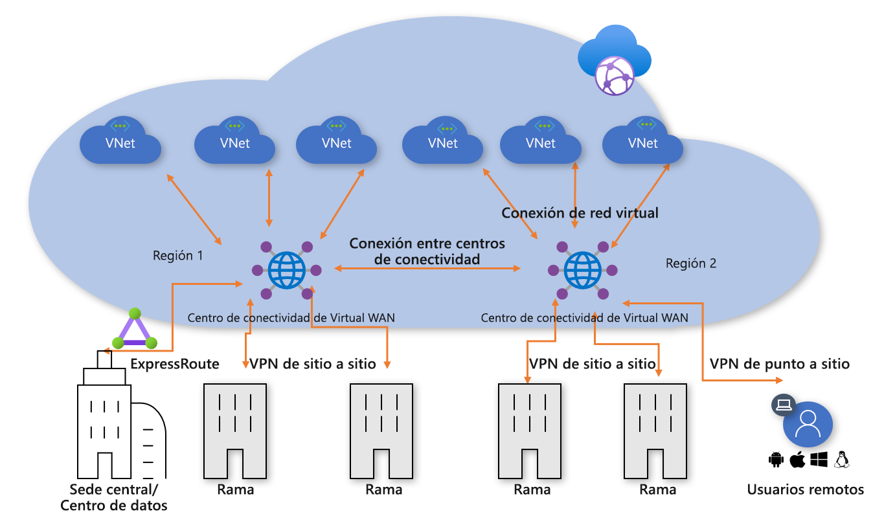
**Figura 1: Tipo hub-and-spoke manual de una sola región**

En línea con el enfoque del tipo hub-and-spoke, la red virtual del centro de conectividad administrado por el cliente contiene varios bloques de funciones:

- Servicios compartidos (cualquier función común requerida por varios radios). Ejemplo: Contoso usa controladores de dominio de Windows Server en máquinas virtuales de infraestructura como servicio (IaaS).
- Los servicios de firewall de IP o enrutamiento los proporcionan una aplicación virtual de red de terceros que permite el enrutamiento IP de nivel 3 de topología en estrella tipo hub-and-spoke.
- Servicios de entrada y salida de Internet, incluido Azure Application Gateway para solicitudes HTTPS entrantes y servicios de proxy de terceros que se ejecutan en máquinas virtuales para el acceso de salida filtrado a recursos de Internet.
- ExpressRoute y puerta de enlace virtual de VPN para la conectividad con redes locales.

### Paso 2: Implementación de centros de conectividad de Virtual WAN

Implemente un centro de conectividad de Virtual WAN en cada región. Configure el centro de conectividad de Virtual WAN con VPN Gateway y una puerta de enlace de ExpressRoute, tal y como se describe en los siguientes artículos:

- [Tutorial: Creación de una conexión de sitio a sitio mediante Azure Virtual WAN](virtual-wan-site-to-site-portal.md)
- [Tutorial: Creación de una asociación de ExpressRoute mediante Azure Virtual WAN](virtual-wan-expressroute-portal.md)

> [!NOTE]
> Azure Virtual WAN debe usar la SKU estándar para habilitar algunas de las rutas de acceso de tráfico mostradas en este artículo.

**Figura 2: Migración de una red en estrella tipo hub-and-spoke administrada por el cliente a Virtual WAN**

### Paso 3: Conexión de sitios remotos (ExpressRoute y VPN) a Virtual WAN

Conecte el centro de conectividad de Virtual WAN a los circuitos de ExpressRoute existentes e instale las VPN de sitio a sitio a través de Internet en las ramas remotas.

> [!NOTE]
> Los circuitos de ExpressRoute se deben actualizar al tipo de SKU Premium para conectarse a un centro de conectividad de Virtual WAN.

**Figura 3: Migración de una red en estrella tipo hub-and-spoke administrada por el cliente a Virtual WAN**

En este punto, el equipo de red local comenzará a recibir rutas que reflejan el espacio de direcciones IP asignado a la red virtual del centro administrado por Virtual WAN. Las ramas conectadas a una VPN remota en esta fase verán dos rutas de acceso a las aplicaciones existentes en las redes virtuales radiales. Estos dispositivos deben estar configurados para seguir usando el túnel al centro de conectividad administrado por el cliente para garantizar el enrutamiento simétrico durante la fase de transición.

### Paso 4: Prueba de la conectividad híbrida mediante Virtual WAN

Antes de usar el centro de conectividad de Virtual WAN administrado para la conectividad de producción, se recomienda que configure una red virtual radial de prueba y una conexión de red virtual de Virtual WAN. Compruebe que las conexiones a este entorno de prueba funcionan mediante ExpressRoute y la VPN de sitio a sitio antes de continuar con los pasos siguientes.

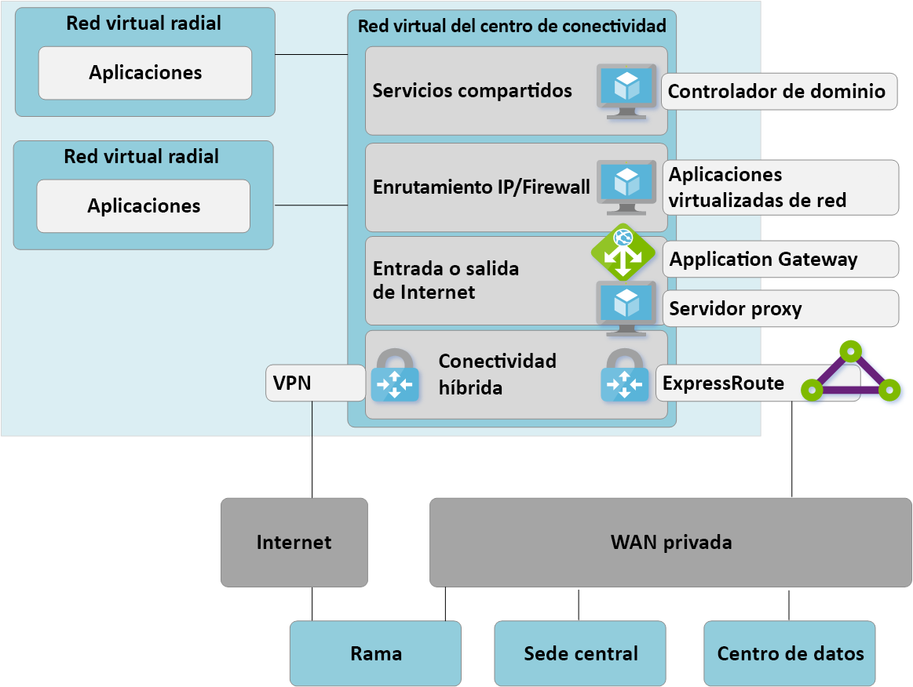
**Figura 4: Migración de una red en estrella tipo hub-and-spoke administrada por el cliente a Virtual WAN**

### Paso 5: Transición de la conectividad al centro de conectividad de Virtual WAN

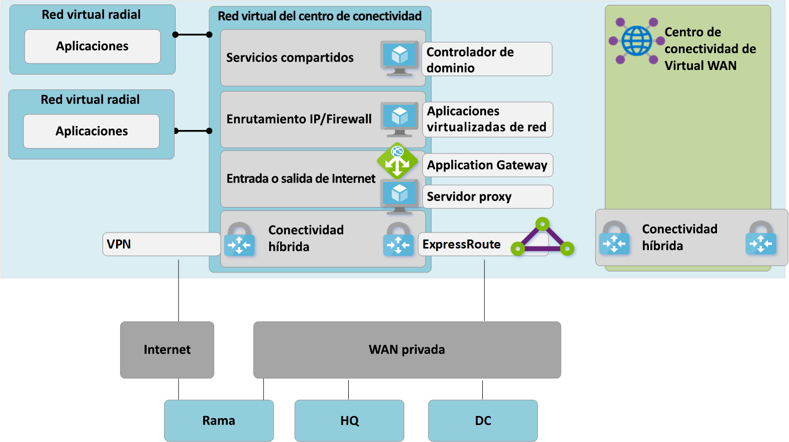
**Figura 5: Migración de una red en estrella tipo hub-and-spoke administrada por el cliente a Virtual WAN**

**a**. Elimine las conexiones de emparejamiento existentes de las redes virtuales radiales al centro administrado por cliente antiguo. El acceso a las aplicaciones en las redes virtuales radiales no está disponible hasta que se completen los pasos a-c.

**b**. Conecte las redes virtuales radiales al centro de conectividad de Virtual WAN mediante conexiones de red virtual.

**c**. Quite todas las rutas definidas por el usuario que se usaron previamente en redes virtuales radiales para las comunicaciones entre radios. Esta ruta de acceso se habilita mediante el enrutamiento dinámico disponible en el centro de conectividad de Virtual WAN.

**d**. Ahora se dan de baja las puertas de enlace de ExpressRoute y de VPN en el centro de conectividad administrado por el cliente para permitir el siguiente paso (e).

**e**. Conecte el centro de conectividad administrado por el cliente antiguo (red virtual del centro de conectividad) al centro de conectividad de Virtual WAN mediante una nueva conexión de red virtual.

### Paso 6: El centro anterior se convierte en un radio de servicios compartidos

Ya hemos rediseñado nuestra red de Azure para que el centro de conectividad de Virtual WAN sea el punto central de la nueva topología.

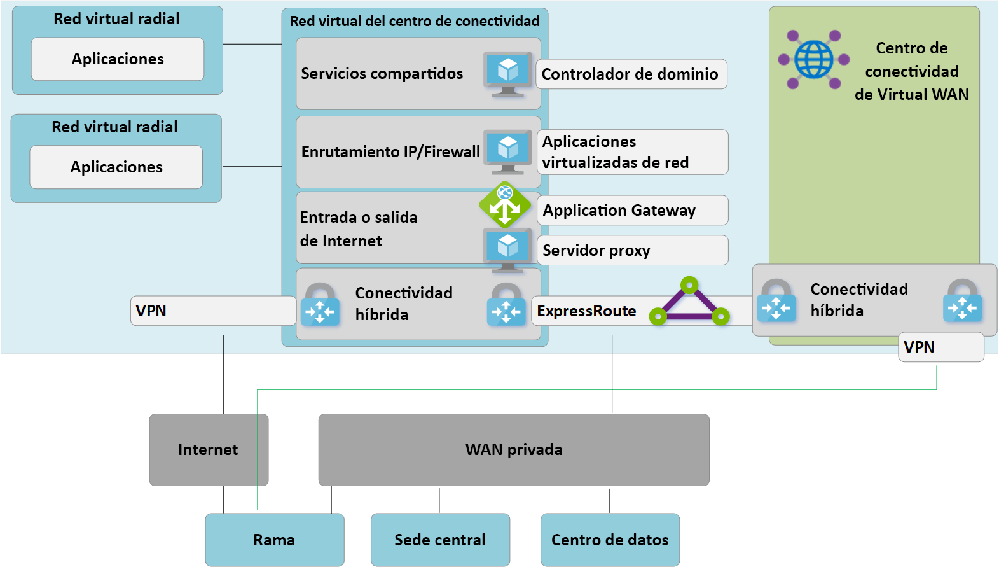
**Figura 6: Migración de una red en estrella tipo hub-and-spoke administrada por el cliente a Virtual WAN**

Dado que el centro de conectividad de Virtual WAN es una entidad administrada y no permite la implementación de recursos personalizados como máquinas virtuales, el bloque de servicios compartidos ahora existe como una red virtual radial que hospeda funciones como la entrada de Internet mediante Azure Application Gateway o una aplicación virtualizada de red. El tráfico entre el entorno de servicios compartidos y las máquinas virtuales de back-end ahora pasa por el centro de conectividad administrado de Virtual WAN.

### Paso 7: Optimización de la conectividad local para usar plenamente Virtual WAN

En esta fase, Contoso ha completado principalmente las migraciones de aplicaciones empresariales en la nube de Microsoft, con solo algunas aplicaciones heredadas que permanecen en el controlador de dominio local.

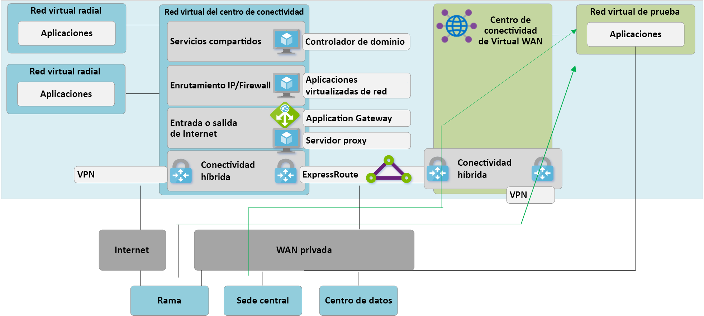
**Figura 7: Migración de una red en estrella tipo hub-and-spoke administrada por el cliente a Virtual WAN**

Para aprovechar toda la funcionalidad de Azure Virtual WAN, Contoso decide retirar sus conexiones VPN locales heredadas. Todas las ramas que siguen accediendo a las redes de la oficina central o del controlador de dominio pueden atravesar la red global de Microsoft mediante el enrutamiento de tránsito integrado de Azure Virtual WAN.

> [!NOTE]
> Global Reach de ExpressRoute es una opción alternativa para los clientes que desean aprovechar la red troncal de Microsoft para complementar sus redes WAN privadas existentes.

## Arquitectura y rutas de acceso de tráfico del estado final

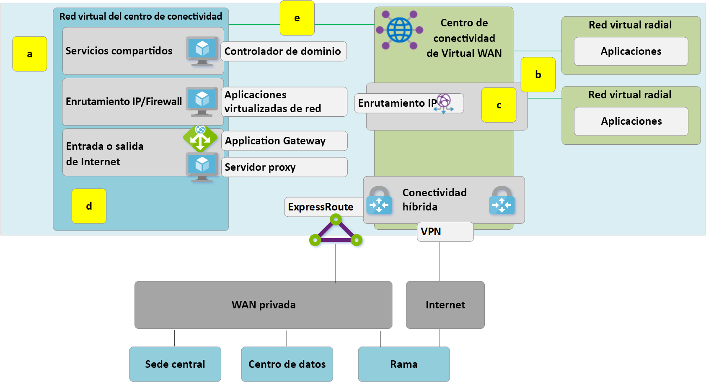
**Figura: Virtual WAN de dos regiones**

En esta sección se proporciona un resumen de cómo esta topología cumple los requisitos originales mediante el examen de algunos flujos de tráfico de ejemplo.

### Ruta de acceso 1

La ruta de acceso 1 muestra el flujo de tráfico de una rama conectada de una VPN de sitio a sitio de Asia a la red virtual de Azure de la región Sudeste Asiático.

El tráfico se enruta de la manera siguiente:

- La rama de Asia está conectada a través de túneles resistentes habilitados para BGP de sitio a sitio en el centro de conectividad de Virtual WAN del Sudeste Asiático.

- El centro de conectividad de Virtual WAN de Asia enruta el tráfico localmente a la red virtual conectada.

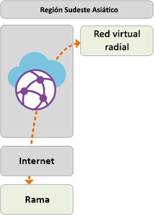

### Ruta de acceso 2

La ruta de acceso 2 muestra el flujo de tráfico desde la sede europea conectada mediante ExpressRoute a una red virtual de Azure en la región Sudeste Asiático.

El tráfico se enruta de la manera siguiente:

- La sede europea está conectada mediante un circuito ExpressRoute Premium al centro de conectividad de Virtual WAN de Oeste de Europa.

- La conectividad global entre centros de conectividad de Virtual WAN permite el tránsito del tráfico a la red virtual conectada en una región remota.

### Ruta de acceso 3

La ruta de acceso 3 muestra el flujo de tráfico desde el controlador de dominio local de Asia conectado a una red WAN privada a una rama europea conectada sitio a sitio.

El tráfico se enruta de la manera siguiente:

- El controlador de dominio de Asia está conectado a un operador de red WAN privada local.

- El circuito ExpressRoute termina localmente en conexiones de la WAN privada al centro de conectividad de Virtual WAN de la región Sudeste Asiático.

- La conectividad global entre centros de conectividad de Virtual WAN permite el tránsito del tráfico.

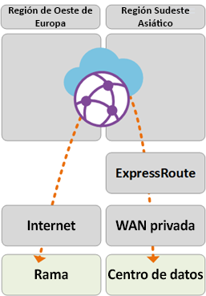

### Ruta de acceso 4

La ruta de acceso 4 muestra el flujo de tráfico desde una red virtual de Azure en la región Sudeste Asiático a la red virtual de Azure de la región Oeste de Europa.

El tráfico se enruta de la manera siguiente:

- La conectividad global entre centros de conectividad de Virtual WAN permite el tránsito nativo de todas las redes virtuales de Azure conectadas sin que sea preciso que el usuario realice ninguna configuración adicional.

### Ruta de acceso 5

En la ruta de acceso 5 muestra el flujo de tráfico desde los usuarios de VPN itinerantes (conexión de punto a sitio) a una red virtual de Azure en la región Oeste de Europa.

El tráfico se enruta de la manera siguiente:

- Los usuarios de portátiles y dispositivos móviles utilizan el cliente OpenVPN para la conectividad transparente en la puerta de enlace de VPN de punto a sitio de la región Oeste de Europa.

- El centro de conectividad de Virtual WAN de Oeste de Europa enruta el tráfico localmente a la red virtual conectada.

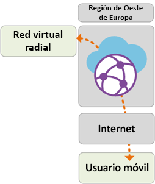

## Seguridad y control de directivas mediante Azure Firewall

Contoso ahora ha validado la conectividad entre todas las ramas y redes virtuales que se ajustan a los requisitos descritos anteriormente en este artículo. Para cumplir sus requisitos de control de seguridad y aislamiento de red, deben seguir separando y registrando el tráfico a través de la red del centro. Anteriormente, esta función la realizaba una aplicación virtual de red (NVA). Contoso también quiere retirar los servicios de proxy existentes y utilizar los servicios nativos de Azure para el filtrado de salida de Internet.

**Figura: Azure Firewall en Virtual WAN (centro virtual protegido)**

Los siguientes pasos de alto nivel son necesarios para introducir Azure Firewall en los centros de conectividad de Virtual WAN para habilitar un punto unificado de control de directivas. Para obtener más información sobre este proceso y el concepto de centros virtuales seguros, consulte [Azure Firewall Manager](../firewall-manager/index.yml).

1. Cree una directiva de Azure Firewall.
2. Vincule la directiva de firewall al centro de conectividad de Azure Virtual WAN. Este paso permite que el centro de conectividad de Virtual WAN existente funcione como un centro virtual protegido e implementa los recursos de Azure Firewall requeridos.

> [!NOTE]
> Si Azure Firewall se implementa en un centro de conectividad de Virtual WAN Estándar (SKU: Estándar): las directivas V2V, B2V, V2I y B2I FW solo se aplican en el tráfico que se origina desde las redes virtuales y las ramas conectadas al centro específico donde se implementa Azure FW (centro protegido). Al tráfico que se origina en redes virtuales y ramas remotas que se conectan a otros centros de conectividad de Virtual WAN en la misma instancia de Virtual WAN no se aplicará el firewall, aunque estas ramas y redes virtuales remotas estén interconectadas mediante vínculos de centro de conectividad a centro de conectividad de Virtual WAN. La compatibilidad con el firewall entre concentradores se encuentra en el mapa de ruta de Azure Virtual WAN y Firewall Manager.

Las rutas de acceso siguientes muestran las rutas de acceso de conectividad habilitadas mediante el uso de los centros virtuales protegidos de Azure:

### Ruta de acceso 6

La ruta de acceso 6 muestra el flujo de tráfico seguro entre redes virtuales dentro de la misma región.

El tráfico se enruta de la manera siguiente:

- Las redes virtuales conectadas al mismo centro virtual protegido ahora enrutan el tráfico mediante Azure Firewall.

- Azure Firewall puede aplicar la directiva a estos flujos.

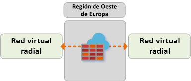

### Ruta de acceso 7

La ruta de acceso 7 muestra el flujo de tráfico de red virtual de Azure a Internet o a un servicio de seguridad de terceros.

El tráfico se enruta de la manera siguiente:

- Las redes virtuales conectadas al centro virtual protegido pueden enviar tráfico a destinos públicos en Internet, mediante el centro protegido como punto central del acceso a Internet.

- Este tráfico se puede filtrar localmente mediante reglas de nombre de dominio completo de Azure Firewall o enviarse a un servicio de seguridad de terceros para su inspección.

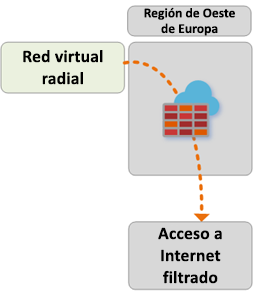

### Ruta de acceso 8

La ruta de acceso 8 muestra el flujo de tráfico de una rama a Internet o a un servicio de seguridad de terceros.

El tráfico se enruta de la manera siguiente:

- Las ramas conectadas al centro virtual protegido pueden enviar tráfico a destinos públicos en Internet mediante el centro protegido como punto central de acceso a Internet.

- Este tráfico se puede filtrar localmente mediante reglas de nombre de dominio completo de Azure Firewall o enviarse a un servicio de seguridad de terceros para su inspección.

 

## Pasos siguientes

Consulte más información sobre [Azure Virtual WAN](virtual-wan-about.md).
