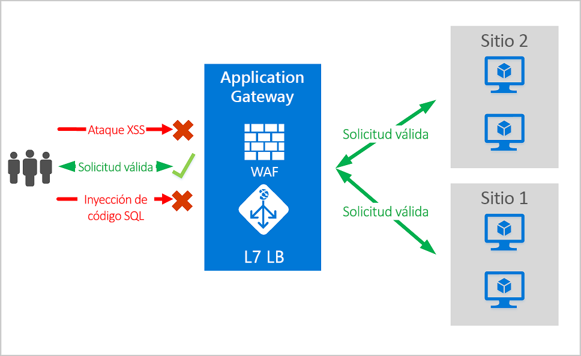
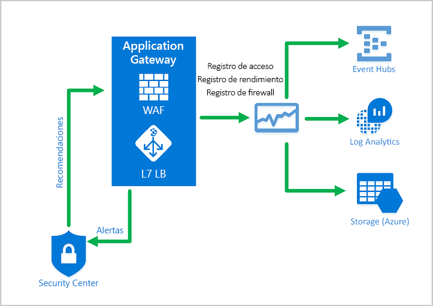
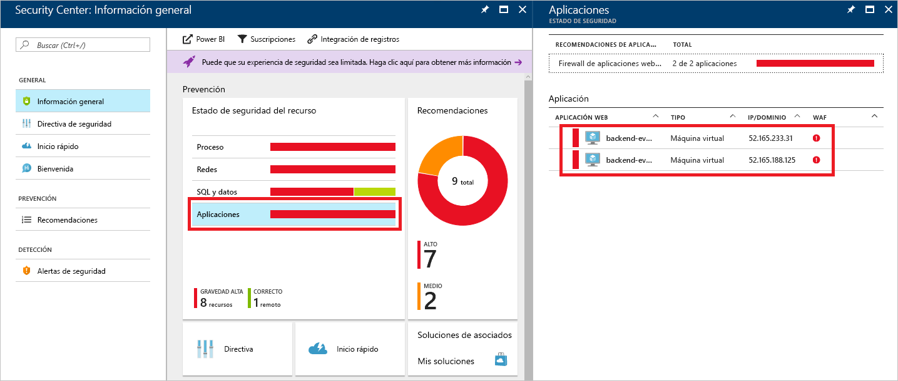
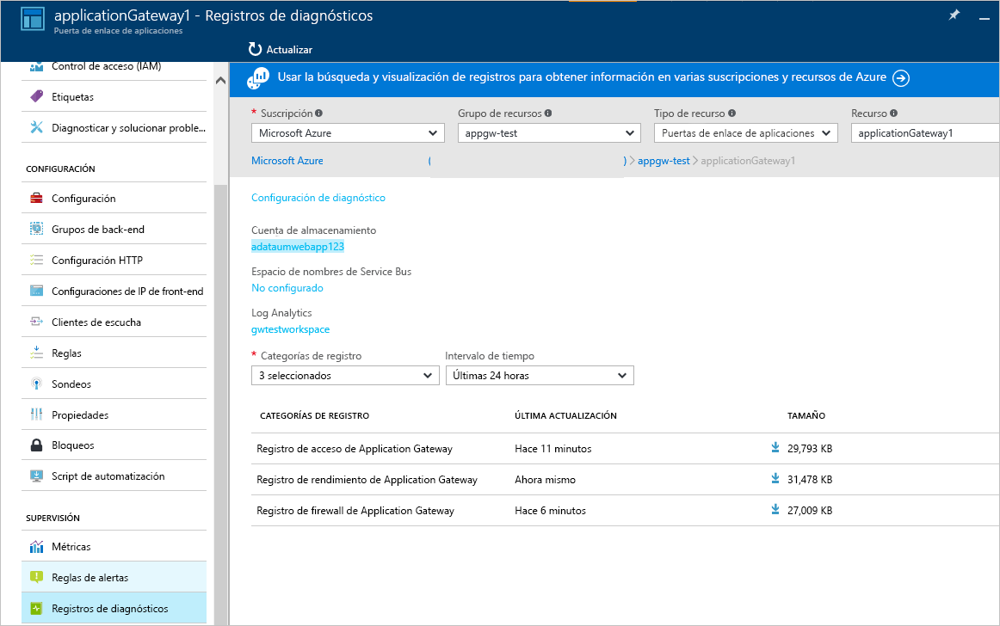

# <a name="azure-web-application-firewall-on-azure-application-gateway"></a>Firewall de aplicaciones web de Azure en Azure Application Gateway

El firewall de aplicaciones web (WAF) de Azure en Azure Application Gateway ofrece una protección centralizada a las aplicaciones web contra vulnerabilidades de seguridad comunes. Las aplicaciones web son cada vez más el objetivo de ataques malintencionados que aprovechan vulnerabilidades habitualmente conocidas. Los scripts entre sitios y las inyecciones de código SQL están dentro de los ataques más comunes.

El firewall de aplicaciones web de Application Gateway se basa en el [conjunto de reglas básicas (CRS)](https://www.owasp.org/index.php/Category:OWASP_ModSecurity_Core_Rule_Set_Project) 3.1, 3.0 o 2.2.9 de OWASP (Open Web Application Security Project). El WAF se actualiza automáticamente para incluir protección frente a nuevas vulnerabilidades sin necesidad de configuración adicional. 

Todas las características de WAF que se enumeran a continuación existen dentro de una directiva de WAF. Puede crear múltiples directivas y se pueden asociar a una instancia de Application Gateway, a clientes de escucha individuales o a reglas de enrutamiento basadas en rutas de acceso en una instancia de Application Gateway. De este modo, puede tener directivas independientes para cada sitio detrás de la instancia Application Gateway si es necesario. Para más información sobre las directivas de WAF, consulte [Creación de una directiva de WAF](create-waf-policy-ag.md).

   > [!NOTE]
   > Las directivas de WAF por sitio y por URI se encuentran en versión preliminar pública. Esto significa que esta característica está sujeta a las Condiciones de uso complementarias de Microsoft. Para más información, consulte [Términos de uso complementarios de las Versiones Preliminares de Microsoft Azure](https://azure.microsoft.com/support/legal/preview-supplemental-terms/).



Application Gateway funciona como un controlador de entrega de aplicaciones (ADC). Ofrece terminación de la Capa de sockets seguros (SSL), afinidad de sesión basada en cookies, distribución de la carga en operaciones por turnos, enrutamiento basado en contenido, posibilidad de hospedar varios sitios y mejoras de seguridad.

Las mejoras de seguridad de Application Gateway incluyen la administración de directivas SSL y la compatibilidad con SSL de extremo a extremo. La integración de WAF con Application Gateway mejora la seguridad de las aplicaciones. La combinación protege las aplicaciones web ante las vulnerabilidades comunes y proporciona una ubicación central fácil de configurar que se va a administrar.

## <a name="benefits"></a>Ventajas

En esta sección se describen las ventajas principales que el firewall de aplicaciones web en Application Gateway proporcionan.

### <a name="protection"></a>Protección

* Proteja las aplicaciones web contra las vulnerabilidades y los ataques web si modificación del código de back-end.

* Proteja varias aplicaciones web al mismo tiempo. Una instancia de Application Gateway puede hospedar hasta 40 sitios web protegidos por un firewall de aplicaciones web.

* Creación de directivas de WAF personalizadas para distintos sitios detrás del mismo WAF 

* Protección de las aplicaciones web de bots malintencionados con el conjunto de reglas de reputación de IP (versión preliminar)

### <a name="monitoring"></a>Supervisión

* Supervise los ataques contra sus aplicaciones web con un registro de WAF en tiempo real. El registro se integra con [Azure Monitor](../../azure-monitor/overview.md) para hacer un seguimiento de las alertas de WAF y permite supervisar con facilidad las tendencias.

* El WAF de Application Gateway está integrado con Azure Security Center. Security Center proporciona una visión centralizada del estado de la seguridad de todos los recursos de Azure.

### <a name="customization"></a>Personalización

* Personalice las reglas y grupos de reglas de WAF para satisfacer los requisitos de su aplicación y eliminar los falsos positivos.

* Asocie una directiva de WAF a cada sitio detrás de la WAF para permitir la configuración específica del sitio.

* Cree reglas personalizadas para satisfacer las necesidades de su aplicación.

## <a name="features"></a>Características

- Protección contra inyección de código SQL.
- Protección contra scripts entre sitios.
- Protección contra otros ataques web comunes, como la inyección de comandos, el contrabando de solicitudes HTTP, la división de respuestas HTTP y la inclusión de archivos remotos.
- Protección contra infracciones del protocolo HTTP.
- Protección contra anomalías del protocolo HTTP, como la falta de agentes de usuario de host y encabezados de aceptación.
- Protección contra rastreadores y escáneres.
- Detección de errores de configuración comunes de las aplicaciones (por ejemplo, Apache e IIS).
- Límites de tamaño de solicitud configurables con límites inferior y superior.
- Las listas de exclusión le permiten omitir determinados atributos de una solicitud de una evaluación del WAF. Un ejemplo común son los tokens insertados de Active Directory que se usan para campos de contraseña o autenticación.
- Cree reglas personalizadas para satisfacer las necesidades específicas de las aplicaciones.
- Filtre geográficamente el tráfico para permitir o impedir que determinados países obtengan acceso a las aplicaciones. (versión preliminar)
- Proteja sus aplicaciones de bots con el conjunto de reglas de mitigación de bots. (versión preliminar)

## <a name="waf-policy"></a>Directiva WAF

Para habilitar un firewall de aplicaciones web en una instancia de Application Gateway, debe crear una directiva de WAF. Esta directiva es donde se encuentran todas las reglas administradas, reglas personalizadas, exclusiones y otras personalizaciones, como el límite de carga de archivos. 

### <a name="core-rule-sets"></a>Conjuntos de reglas principales

Application Gateway admite tres conjuntos de reglas: CRS 3.1, CRS 3.0 y CRS 2.2.9. Estas reglas protegen las aplicaciones web frente a actividades malintencionadas.

Para más información, consulte [Reglas y grupos de reglas de CRS de firewall de aplicaciones web](application-gateway-crs-rulegroups-rules.md).

### <a name="custom-rules"></a>Reglas personalizadas

Application Gateway también admite reglas personalizadas. Con las reglas personalizadas, puede crear reglas propias que se evalúan en cada solicitud que pasa por el WAF. Estas reglas tienen una prioridad mayor que el resto de las reglas de los conjuntos de reglas administrados. Si se cumple un conjunto de condiciones, se realiza una acción para permitir o bloquear. 

El operador geomatch está ahora disponible en versión preliminar pública para reglas personalizadas. Para más información, consulte [Reglas personalizadas de geomatch](custom-waf-rules-overview.md#geomatch-custom-rules-preview).

> [!NOTE]
> El operador geomatch para reglas personalizadas se encuentra actualmente en versión preliminar pública y se proporciona con un Acuerdo de nivel de servicio de versión preliminar. Es posible que algunas características no sean compatibles o que tengan sus funcionalidades limitadas. Para más información, consulte [Términos de uso complementarios de las versiones preliminares de Microsoft Azure](https://azure.microsoft.com/support/legal/preview-supplemental-terms/).

Para más información sobre las reglas personalizadas, consulte [Reglas personalizadas para Application Gateway](custom-waf-rules-overview.md).

### <a name="bot-mitigation-preview"></a>Mitigación de bots (versión preliminar)

Se puede habilitar un conjunto de reglas de protección contra bots administrado para que WAF bloquee o registre las solicitudes de direcciones IP malintencionadas conocidas, junto con el conjunto de reglas administrado. Las direcciones IP proceden de la fuente Inteligencia sobre amenazas de Microsoft. Intelligent Security Graph impulsa la inteligencia sobre amenazas de Microsoft y lo utilizan numerosos servicios, incluido Azure Security Center.

> [!NOTE]
> Actualmente, el conjunto de reglas de protección contra bots se encuentra en versión preliminar pública y se proporciona con un Acuerdo de nivel de servicio de versión preliminar. Es posible que algunas características no sean compatibles o que tengan sus funcionalidades limitadas. Para más información, consulte [Términos de uso complementarios de las versiones preliminares de Microsoft Azure](https://azure.microsoft.com/support/legal/preview-supplemental-terms/).

Si la protección contra bots está habilitada, las solicitudes entrantes que coincidan con las IP de cliente de bots malintencionados se registran en el firewall; consulte más información a continuación. Puede acceder a los registros de WAF desde la cuenta de almacenamiento, el centro de eventos o el análisis de registros. 

### <a name="waf-modes"></a>Modos de WAF

El WAF de Application Gateway se puede configurar para ejecutarse en dos modos:

* **Modo de detección**: supervisa y registra todas las alertas de amenazas. Puede activar el registro de diagnósticos de Application Gateway en la sección **Diagnósticos**. También debe asegurarse de que el registro del WAF está seleccionado y activado. El firewall de aplicaciones web no bloquea solicitudes entrantes cuando se ejecuta en modo de detección.
* **Modo de prevención**: bloquea las intrusiones y los ataques que detectan las reglas. El atacante recibe una excepción de "403: acceso no autorizado" y se cierra la conexión. El modo de prevención registra dichos ataques en los registros del WAF.

> [!NOTE]
> Se recomienda ejecutar un WAF recién implementado en modo de detección durante un breve período en un entorno de producción. Esto proporciona la oportunidad de obtener [registros de firewall](../../application-gateway/application-gateway-diagnostics.md#firewall-log) y actualizar cualquier excepción o [reglas personalizadas](./custom-waf-rules-overview.md) antes de la transición al modo de prevención. Esto puede ayudar a reducir la aparición de tráfico bloqueado inesperado.

### <a name="anomaly-scoring-mode"></a>Modo de puntuación de anomalías

OWASP tiene dos modos para decidir si bloquear el tráfico: el modo tradicional y el modo de puntuación de anomalías.

En el modo tradicional, se considera el tráfico que coincide con alguna regla, independientemente de si otra regla coincide. Este modo es fácil de entender, pero la falta de información sobre cuántas reglas coinciden con una solicitud específica representa una limitación. Es por eso que se introdujo el modo de puntuación de anomalías. Es el valor predeterminado en OWASP 3.*x*.

En el modo de puntuación de anomalías, el tráfico que coincide con alguna regla no se bloquea de inmediato cuando el firewall está en modo de prevención. Las reglas tienen una gravedad determinada: *Crítica*, *Error*, *Advertencia* o *Aviso*. Dicha gravedad afecta a un valor numérico para la solicitud, denominado como la puntuación de anomalía. Por ejemplo, una coincidencia con la regla *Advertencia* contribuye con un valor de 3 a la puntuación. Una coincidencia con la regla *Crítica*, con 5.

|severity  |Valor  |
|---------|---------|
|Crítico     |5|
|Error        |4|
|Advertencia      |3|
|Aviso       |2|

Hay un umbral de 5 para que la puntuación de anomalías bloquee el tráfico. Por lo tanto, solo hace falta una coincidencia con la regla *Crítica* para que el WAF de Application Gateway bloquee una solicitud, includo en modo de prevención. Pero una coincidencia con la regla *Advertencia* solo aumenta la puntuación de anomalías en 3, lo que no es suficiente para bloquear por sí misma el tráfico.

> [!NOTE]
> El mensaje que se registra cuando una regla de WAF coincide con el tráfico incluye el valor de acción "Blocked" (Bloqueado), pero el tráfico en realidad solo se bloquea con una puntuación de anomalías de 5 o más.  

### <a name="waf-monitoring"></a>Supervisión de WAF

Es importante supervisar el estado de la instancia de Application Gateway. La supervisión el estado del firewall de aplicaciones web y las aplicaciones que protege es compatible con la integración con Azure Security Center, Azure Monitor y los registros de Azure Monitor.



#### <a name="azure-monitor"></a>Azure Monitor

Los registros de Application Gateway se integran con [Azure Monitor](../../azure-monitor/overview.md). Esto permite realizar un seguimiento de la información de diagnósticos incluidos los registros y las alertas de WAF. Puede acceder a esta funcionalidad en la pestaña **Diagnósticos** del recurso de Application Gateway en el portal o directamente en Azure Monitor. Para más información sobre cómo habilitar los registros, consulte el artículo sobre los [diagnósticos de Application Gateway](../../application-gateway/application-gateway-diagnostics.md).

#### <a name="azure-security-center"></a>Azure Security Center

[Security Center](../../security-center/security-center-intro.md) ayuda a evitar y a detectar las amenazas, además de responder a ellas. Brinda una visibilidad mejorada y más control sobre la seguridad de los recursos de Azure. Application Gateway se [integra con Security Center](../../application-gateway/application-gateway-integration-security-center.md). Security Center examina su entorno para detectar aplicaciones web no protegidas. Puede recomendar el firewall de aplicaciones web (WAF) de Application Gateway para proteger estos recursos vulnerables. Puede crear los firewalls directamente desde Security Center. Estas instancias de WAF se integran con Security Center. Envían alertas e información de estado a Security Center para generar informes.



#### <a name="azure-sentinel"></a>Azure Sentinel

Microsoft Azure Sentinel es una solución de administración de eventos de información de seguridad (SIEM) y respuesta automatizada de orquestación de seguridad (SOAR) que es escalable y nativa de la nube. Azure Sentinel ofrece análisis de seguridad inteligente e inteligencia frente a amenazas en toda la empresa, de forma que proporciona una única solución para la detección de alertas, la visibilidad de amenazas, la búsqueda proactiva y la respuesta a amenazas.

Con el libro de eventos de firewall integrado de Azure WAF, puede obtener una visión general de los eventos de seguridad en WAF. Esto incluye eventos, reglas coincidentes y bloqueadas, y todo lo demás que se registra en los registros del firewall. Consulte más información sobre el registro a continuación. 


#### <a name="logging"></a>Registro

WAF de Application Gateway ofrece informes detallados sobre cada amenaza que detecta. El registro se integra con los registros de Azure Diagnostics. Las alertas se registran en el formato .json. Estos registros pueden integrarse con los [registros de Azure Monitor](../../azure-monitor/insights/azure-networking-analytics.md).



```json
{
  "resourceId": "/SUBSCRIPTIONS/{subscriptionId}/RESOURCEGROUPS/{resourceGroupId}/PROVIDERS/MICROSOFT.NETWORK/APPLICATIONGATEWAYS/{appGatewayName}",
  "operationName": "ApplicationGatewayFirewall",
  "time": "2017-03-20T15:52:09.1494499Z",
  "category": "ApplicationGatewayFirewallLog",
  "properties": {
    {
      "instanceId": "ApplicationGatewayRole_IN_0",
      "clientIp": "52.161.109.145",
      "clientPort": "0",
      "requestUri": "/",
      "ruleSetType": "OWASP",
      "ruleSetVersion": "3.0",
      "ruleId": "920350",
      "ruleGroup": "920-PROTOCOL-ENFORCEMENT",
      "message": "Host header is a numeric IP address",
      "action": "Matched",
      "site": "Global",
      "details": {
        "message": "Warning. Pattern match \"^[\\\\d.:]+$\" at REQUEST_HEADERS:Host ....",
        "data": "127.0.0.1",
        "file": "rules/REQUEST-920-PROTOCOL-ENFORCEMENT.conf",
        "line": "791"
      },
      "hostname": "127.0.0.1",
      "transactionId": "16861477007022634343"
      "policyId": "/subscriptions/1496a758-b2ff-43ef-b738-8e9eb5161a86/resourceGroups/drewRG/providers/Microsoft.Network/ApplicationGatewayWebApplicationFirewallPolicies/globalWafPolicy",
      "policyScope": "Global",
      "policyScopeName": " Global "
    }
  }
} 

```

## <a name="application-gateway-waf-sku-pricing"></a>Precios de las SKU de WAF de Application Gateway

Los modelos de precios son diferentes de las SKU de WAF_v1 y WAF_v2. Para más información, consulte la página de [precios de Application Gateway](https://azure.microsoft.com/pricing/details/application-gateway/). 

## <a name="next-steps"></a>Pasos siguientes

- Introducción a la [creación de una directiva de WAF](create-waf-policy-ag.md)
- Más información sobre las [reglas administradas de WAF](application-gateway-crs-rulegroups-rules.md)
- Más información sobre las [reglas personalizadas](custom-waf-rules-overview.md)
- Más información sobre [Firewall de aplicaciones web en Azure Front Door](../afds/afds-overview.md)

