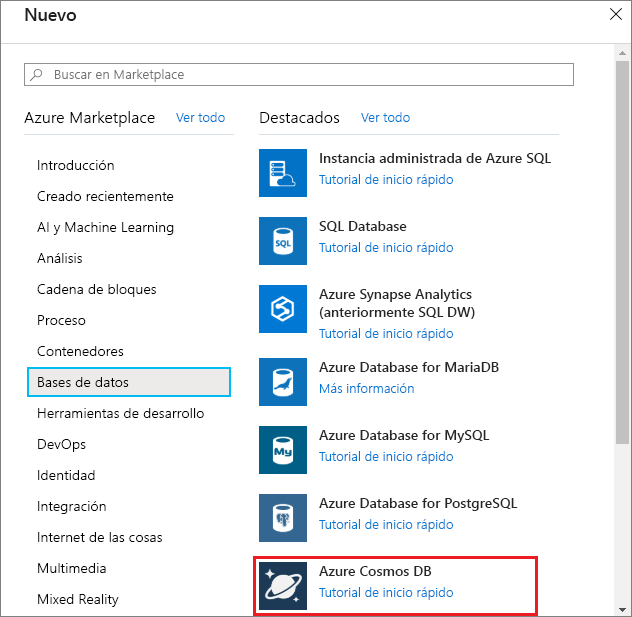

1. En una nueva ventana del explorador, inicie sesión en [Azure Portal](https://portal.azure.com/).

2. En el menú de la izquierda, seleccione **Crear un recurso**.
   
   
   
3. En la página **Nuevo**, seleccione **Bases de datos** > **Azure Cosmos DB**.
   
   
   
3. En la página **Crear una cuenta de Azure Cosmos DB**, especifique la configuración de la nueva cuenta de Azure Cosmos DB. 
 
    Configuración|Value|Descripción
    ---|---|---
    Subscription|Su suscripción|Seleccione la suscripción de Azure que quiere usar para esta cuenta de Azure Cosmos DB. 
    Grupo de recursos|Crear nuevo  A continuación, escriba el mismo nombre que el nombre de cuenta.|Seleccione **Crear nuevo**. Luego, escriba un nombre nuevo de grupo de recursos para la cuenta. Para simplificar, use el mismo nombre que el de la cuenta de Azure Cosmos DB. 
    Nombre de cuenta|Escriba un nombre único.|Escriba un nombre único para identificar la cuenta de Azure Cosmos DB. El URI de la cuenta será *mongo.cosmos.azure.com* y se anexará al nombre único de la cuenta.  El nombre de la cuenta solo puede utilizar letras minúsculas, números y guiones (-), y debe tener entre 3 y 31 caracteres de longitud.
    API|Azure Cosmos DB para la API de Mongo DB|La API determina el tipo de cuenta que se va a crear. Azure Cosmos DB proporciona cinco API: Core (SQL) para bases de datos de documentos, Gremlin para bases de datos de grafos, API Mongo DB de Azure Cosmos DB para bases de datos de documentos, Azure Table y Cassandra. Actualmente, debe crear una cuenta independiente para cada API.   Seleccione **Azure Cosmos DB para la API de Mongo DB**, ya que en este inicio rápido va a crear una colección que funciona con MongoDB.  [Obtenga más información sobre Azure Cosmos DB para la API de Mongo DB](../articles/cosmos-db/mongodb-introduction.md).|
    Location|Seleccionar la región más cercana a los usuarios|Seleccione una ubicación geográfica para hospedar la cuenta de Azure Cosmos DB. Use la ubicación más cercana a los usuarios para proporcionarles el acceso más rápido a los datos.|

    Seleccione **Revisar y crear**. Puede omitir las secciones **Red** y **Etiquetas**. 

    

4. La cuenta tarda unos minutos en crearse. Espere a que el portal muestre la página **¡Enhorabuena! Su cuenta de Azure Cosmos DB para la API de Mongo DB está a punto**.

    
