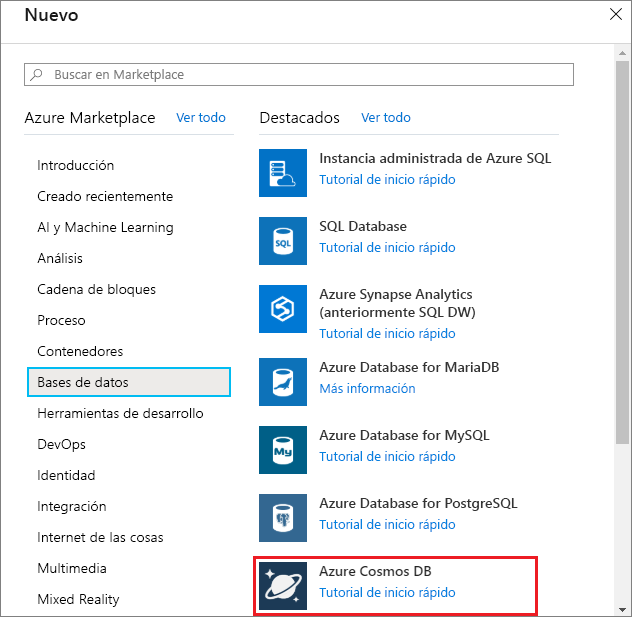

1. En una nueva ventana del explorador, inicie sesión en [Azure Portal](https://portal.azure.com/).

2. En el menú de la izquierda, seleccione **Crear un recurso**.
   
   
   
3. En la página **Nuevo**, seleccione **Bases de datos** > **Azure Cosmos DB**.
   
   
   
3. En la página **Crear una cuenta de Azure Cosmos DB**, especifique la configuración de la nueva cuenta de Azure Cosmos DB. 
 
    Configuración|Value|Descripción
    ---|---|---
    Subscription|Su suscripción|Seleccione la suscripción de Azure que quiere usar para esta cuenta de Azure Cosmos DB. 
    Grupo de recursos|Seleccione **Crear nuevo** y, a continuación, Nombre de cuenta|Seleccione **Crear nuevo**. Luego, escriba un nombre nuevo de grupo de recursos para la cuenta. Para simplificar, use el mismo nombre que el de la cuenta de Azure Cosmos DB. 
    Nombre de cuenta|Un nombre único|Escriba un nombre único para identificar la cuenta de Azure Cosmos DB.  El nombre de la cuenta solo puede utilizar letras minúsculas, números y guiones (-), y debe tener entre 3 y 31 caracteres de longitud.
    API|Tabla|La API determina el tipo de cuenta que se va a crear. Azure Cosmos DB proporciona cinco API: Core (SQL) para bases de datos de documentos, Gremlin para bases de datos de grafos, MongoDB para bases de datos de documentos, Azure Table y Cassandra. Debe crear una cuenta independiente para cada API.   Seleccione **Tabla de Azure**, ya que en este inicio rápido va a crear una tabla que funciona con Table API.   [Más información acerca de Table API](../articles/cosmos-db/table-introduction.md).|
    Location|Región más cercana a los usuarios|Seleccione una ubicación geográfica para hospedar la cuenta de Azure Cosmos DB. Use la ubicación más cercana a los usuarios para proporcionarles el acceso más rápido a los datos.

    En las opciones **Redundancia geográfica**  y **Escrituras en varias regiones**  puede dejar sus valores en **Deshabilitar** para evitar gastos adicionales y omitir las secciones **Red** y **Etiquetas**.

5. Seleccione **Revisar y crear**. Una vez completada la validación, seleccione **Crear** para crear la cuenta. 
 
   

6. La operación de creación de la cuenta tarda unos minutos. Verá el mensaje **La implementación está en curso**. Espere hasta que finalice la implementación y seleccione **Ir al recurso**.

    

