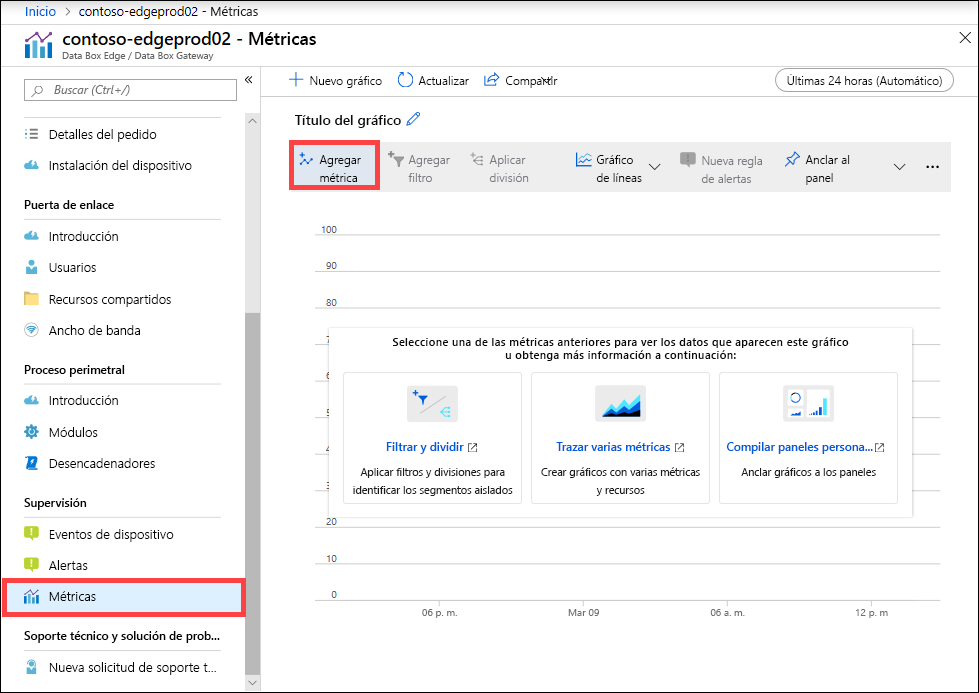
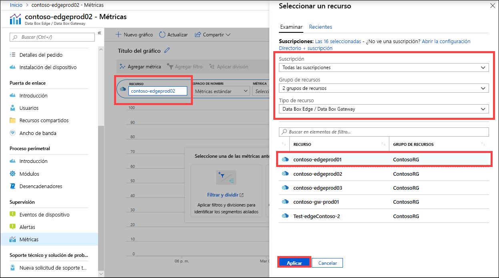

También puede ver las métricas para supervisar el rendimiento del dispositivo y, en algunos casos, para solucionar problemas del dispositivo.

Para crear un gráfico para las métricas del dispositivo seleccionadas, siga estos pasos en Azure Portal.

1. Para el recurso en Azure Portal, vaya a **Supervisión > Métricas** y seleccione **Agregar métrica**.

    

2. El nombre del recurso se rellena automáticamente.  

    

    Para especificar otro recurso, selecciónelo. En la hoja **Seleccionar un recurso**, seleccione la suscripción, el grupo de recursos, el tipo de recurso y el recurso específico para el que quiera mostrar las métricas y seleccione **Aplicar**.

    

3. En la lista desplegable, seleccione una métrica para supervisar el dispositivo. Para obtener una lista completa de estas métricas, consulte [Métricas sobre el dispositivo](#metrics-on-your-device).

4. Cuando se selecciona una métrica en la lista desplegable, también se pueden definir agregaciones. La agregación hace referencia al valor real que se agrega durante un intervalo de tiempo especificado. Los valores agregados pueden ser un valor medio, un valor mín. o un valor máx. Seleccione el valor que quiera para la agregación: medio, mín. o máx.

    

5. Si la métrica que seleccionó tiene varias instancias, tendrá disponible la opción de división. Seleccione **Aplicar división** y, después, seleccione el valor por el que quiere ver el desglose.

    

6. Si solo quiere ver el desglose para algunas instancias, puede filtrar los datos. Por ejemplo, en este caso, si solo quiere ver el rendimiento de la red para las dos interfaces de red conectadas en el dispositivo, se podrían filtrar esas interfaces. Seleccione **Agregar filtro** y especifique el nombre de la interfaz de red para el filtrado.

    

7. También puede anclar el gráfico al panel para facilitar el acceso.

    

8. Para exportar los datos del gráfico a una hoja de cálculo de Excel u obtener un vínculo al gráfico para poder compartirlo, seleccione la opción de recurso compartido en la barra de comandos.

    
