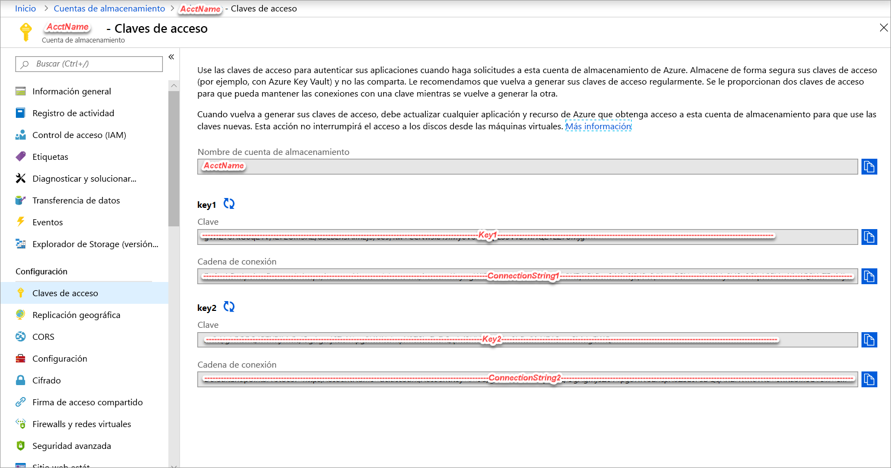
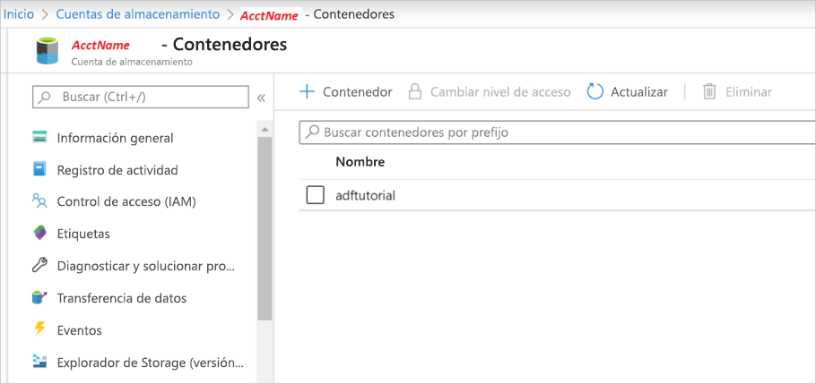

## <a name="prerequisites"></a>Requisitos previos

### <a name="azure-subscription"></a>Suscripción de Azure
Si no tiene una suscripción a Azure, cree una [cuenta gratuita](https://azure.microsoft.com/free/) antes de empezar.

### <a name="azure-roles"></a>Roles de Azure
Para crear instancias de Data Factory, la cuenta de usuario que use para iniciar sesión en Azure debe ser un miembro de los roles *colaborador* o *propietario*, o de *administrador* de la suscripción de Azure. Para ver los permisos que tiene en la suscripción, vaya a [Azure Portal](https://portal.azure.com), seleccione su nombre de usuario en la esquina superior derecha, **Más opciones** (...) y, después, seleccione **Mis permisos**. Si tiene acceso a varias suscripciones, elija la correspondiente.

Para crear y administrar recursos secundarios para Data Factory incluidos los conjuntos de datos, servicios vinculados, canalizaciones, desencadenadores y entornos de ejecución de integración, se aplican los siguientes requisitos:

- Para crear y administrar recursos secundarios en Azure Portal, debe pertenecer al rol **Colaborador de Data Factory** en el nivel de grupo de recursos u otro nivel superior.
- Para crear y administrar recursos secundarios con Powershell o el SDK, el rol de **Colaborador** en el nivel de recurso u otro nivel superior es suficiente.

Para obtener instrucciones de ejemplo sobre cómo agregar un usuario a un rol, consulte el artículo sobre la [adición de roles](../articles/billing/billing-add-change-azure-subscription-administrator.md).

Para más información, consulte los siguientes artículos:

- [Rol de Colaborador de Data Factory](../articles/role-based-access-control/built-in-roles.md#data-factory-contributor)
- [Roles y permisos para Azure Data Factory](../articles/data-factory/concepts-roles-permissions.md)

### <a name="azure-storage-account"></a>Cuenta de almacenamiento de Azure
En esta guía de inicio rápido, use una cuenta de almacenamiento de Azure (en concreto Blob Storage) de uso general como almacén de datos de *origen* y *destino*. Si no dispone de una cuenta de almacenamiento de Azure de uso general, consulte el artículo [Creación de una cuenta de almacenamiento](../articles/storage/common/storage-quickstart-create-account.md), donde se indica cómo crearla. 

#### <a name="get-the-storage-account-name-and-account-key"></a>Obtención de un nombre y una clave de cuenta de almacenamiento
En esta guía de inicio rápido necesitará el nombre y la clave de su cuenta de Azure Storage. El siguiente procedimiento especifica los pasos necesarios para obtener el nombre y la clave de una cuenta de almacenamiento: 

1. En un explorador web, vaya a [Azure Portal](https://portal.azure.com) e inicie sesión con su nombre de usuario y contraseña de Azure.
2. Seleccione **Todos los servicios** > **Almacenamiento** > **Cuentas de almacenamiento**.
3. En la página **Cuentas de Storage**, filtre por su cuenta de almacenamiento (si fuera necesario) y, después, seleccione su cuenta de Storage. 
4. En la barra lateral de la página *\<Nombre de cuenta>*  - **Cuenta de Storage**, vaya a **Configuración** y seleccione **Claves de acceso**. Aparecerá *\<Nombre de cuenta>*  - **Claves de acceso**.

   
5. Copie los valores de los campos **Nombre de cuenta de almacenamiento** y **clave1** en el Portapapeles. Péguelos en el Bloc de notas o en cualquier otro editor y guárdelos. Los usará más adelante en esta guía.   

#### <a name="create-a-blob-container"></a>Creación de un contenedor de blobs
En esta sección se crea un contenedor de blobs denominado **adftutorial** en la instancia de Azure Blob Storage.

1. En la barra lateral de la página *\<Nombre de cuenta>*  - **Claves de acceso**, seleccione **Información general** > **Blobs**.
2. En la barra de herramientas de la página *\<Nombre de cuenta>*  - **Blobs**, seleccione **Contenedor**.
3. En el cuadro de diálogo **Nuevo contenedor**, escriba **adftutorial** para el nombre y seleccione **Aceptar**. La página *\<Nombre de cuenta>*  - **Blobs** está actualizada para incluir **adftutorial** en la lista de contenedores.

   

#### <a name="add-an-input-folder-and-file-for-the-blob-container"></a>Agregar una carpeta de entrada y un archivo para el contenedor de blobs
En esta sección, creará una carpeta denominada **entrada** en el contenedor que acaba de crear y cargará un archivo de ejemplo en la carpeta de entrada. Antes de empezar, abra un editor de texto, como el **Bloc de notas**, y cree un archivo denominado **emp.txt** con el siguiente contenido:

```emp.txt
John, Doe
Jane, Doe
```

Guarde el archivo en la carpeta **C:\ADFv2QuickStartPSH**. (Si la carpeta no existe, créela). A continuación, vuelva a Azure Portal y siga estos pasos:

1. En la página *\<Nombre de cuenta>*  - **Blobs** donde lo dejó, seleccione **adftutorial** en la lista actualizada de contenedores. (Si ha cerrado la ventana o cambiado de página, vuelva a iniciar sesión en [Azure Portal](https://portal.azure.com), seleccione**Todos los servicios** > **Storage** > **Cuentas de Storage**, seleccione su cuenta de Storage y, a continuación, seleccione **Blobs** > **adftutorial**.)
2. En la barra de herramientas de la página del contenedor **adftutorial**, seleccione **Cargar**.
3. En la página **Cargar blob**, seleccione **Archivos** y, a continuación, busque y seleccione el archivo **emp.txt**.
4. Expanda el título **Avanzado**. La página aparece ahora como a continuación:

   
5. En el cuadro **Cargar en carpeta**, escriba **input**.
6. Seleccione el botón **Cargar**. Debería ver el archivo **emp.txt** y el estado de la carga en la lista.
7. Seleccione el icono **Cerrar** (**X**) para cerrar la página **Cargar blob**.

Mantenga abierta la página del contenedor **adftutorial**. Úsela para comprobar la salida al final de esta guía de inicio rápido.