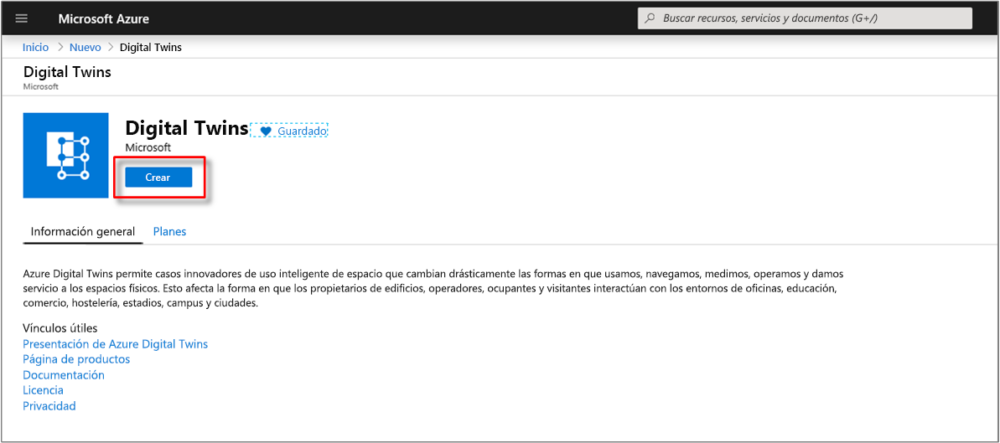
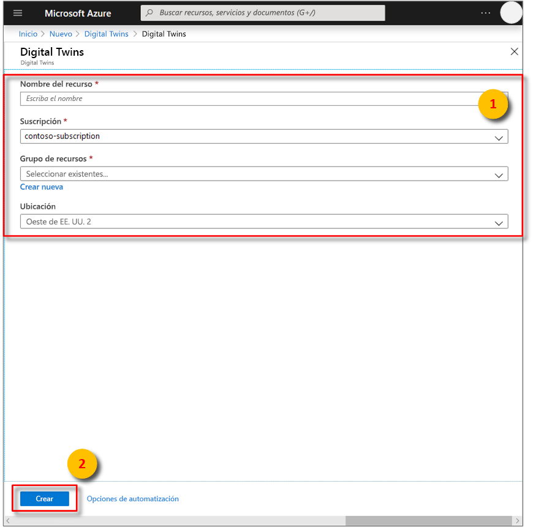

1. Inicie sesión en [Azure Portal](https://portal.azure.com).

1. Seleccione la barra lateral principal, después **+ Crear un recurso**. 

   [](./media/create-digital-twins-portal/azure-portal-create-a-resource.png#lightbox)

1. Busque **Digital Twins** y seleccione **Digital Twins**. 

   [](./media/create-digital-twins-portal/azure-portal-create-digital-twins.png#lightbox)

   Como alternativa, seleccione **Internet de las cosas**y seleccione **Digital Twins(versión preliminar)** .

1. Haga clic en **Crear** para iniciar el proceso de implementación.

   [](./media/create-digital-twins-portal/azure-create-and-confirm-resource.png#lightbox)

1. En el panel **Digital Twins**, escriba la siguiente información:
   * **Nombre del recurso**: cree un nombre único para la instancia de Digital Twins.
   * **Suscripción**: elija la suscripción que quiere usar para crear esta instancia de Digital Twins. 
   * **Grupo de recursos**: seleccione o cree un [grupo de recursos](https://docs.microsoft.com/azure/azure-resource-manager/resource-group-overview#resource-groups) para la instancia de Digital Twins.
   * **Ubicación**: seleccione la ubicación más cercana a sus dispositivos.

     [](./media/create-digital-twins-portal/create-digital-twins-param.png#lightbox)

1. Revise la información de Digital Twins y, a continuación, seleccione **Crear**. La instancia de Digital Twins podría tardar unos minutos en crearse. Puede ver el progreso en el panel **Notificaciones**.

1. Abra el panel **Información general** de la instancia de Digital Twins. Observe el vínculo situado bajo **Management API**. La dirección URL de **Management API** tiene el formato siguiente: 
   
   ```URL
   https://yourDigitalTwinsName.yourLocation.azuresmartspaces.net/management/swagger
   ```
   
   Esta dirección URL le lleva a la documentación de la API REST de Azure Digital Twins que se aplica a la instancia. Lea [Uso de Azure Digital Twins Swagger](../articles/digital-twins/how-to-use-swagger.md) para aprender a leer y usar esta documentación de API. Copie y modifique la dirección URL de **API de Administración** para que tenga este formato: 
    
   ```URL
   https://yourDigitalTwinsName.yourLocation.azuresmartspaces.net/management/api/v1.0/
   ```
    
   La aplicación usará la dirección URL modificada como dirección URL base para acceder a la instancia. Copie esta dirección URL modificada en un archivo temporal. La necesitará en la siguiente sección.

   [](./media/create-digital-twins-portal/digital-twins-management-api.png#lightbox)