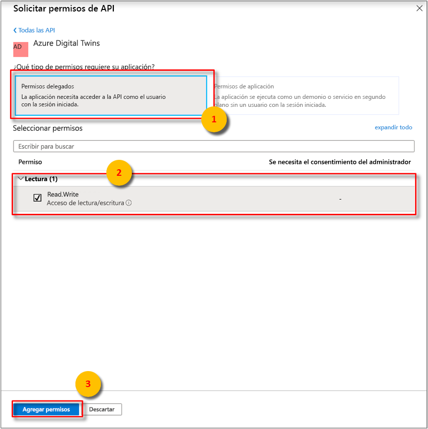
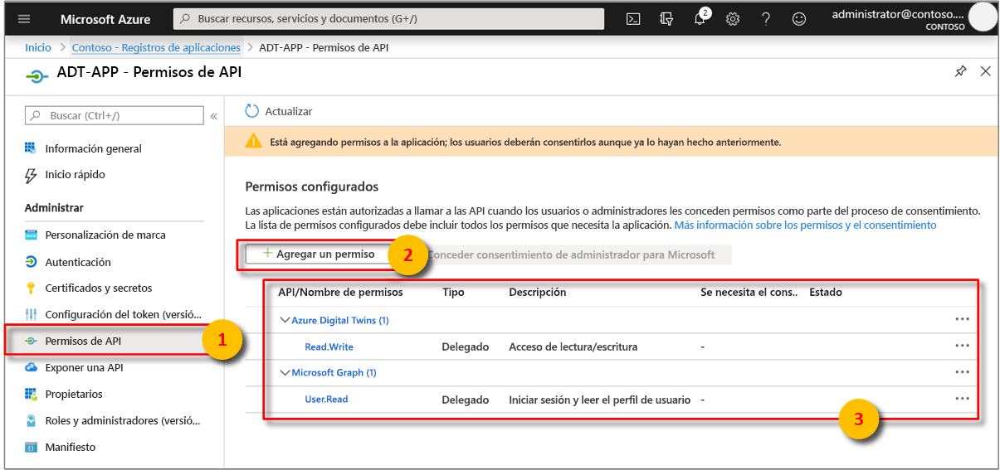

>[!NOTE]
>En esta sección se proporcionan instrucciones para el [registro de la aplicación de Azure AD](https://docs.microsoft.com/azure/active-directory/develop/quickstart-register-app).

1. En [Azure Portal](https://portal.azure.com), abra **Azure Active Directory** desde el menú expansible izquierdo y, luego, abra el panel **Registros de aplicaciones**. 

    

1. Seleccione el botón **+ Nuevo registro**.

    

1. Asigne un nombre descriptivo a este registro de aplicaciones en el cuadro **Nombre**. En la sección **URI de redirección (opcional)** , elija **Cliente público o nativo (móvil y escritorio)** en el menú desplegable de la izquierda y especifique `https://microsoft.com` en el cuadro de texto de la derecha. Seleccione **Registrar**.

    

1. Para asegurarse de que [la aplicación esté registrada como **cliente público**](https://docs.microsoft.com/azure/active-directory/develop/scenario-desktop-app-registration), abra el panel **Autenticación** para el registro de la aplicación y desplácese hacia abajo en ese panel. En la sección **Tipo de cliente predeterminado**, seleccione **Sí** para **Tratar la aplicación como cliente público** y elija **Guardar**.

    Consulte **Tokens de acceso** para habilitar la opción **oauth2AllowImplicitFlow** en el archivo Manifest.json.

    

1.  Abra el panel **Introducción** de la aplicación registrada y copie los valores de las siguientes entidades en un archivo temporal. Usará estos valores para configurar la aplicación de ejemplo en las secciones siguientes.

    - **Id. de la aplicación (cliente)**
    - **Id. de directorio (inquilino)**

    

1. Abra el panel **Permisos de API** para el registro de la aplicación. Seleccione el botón **+ Agregar un permiso**. En el panel **Solicitud de permisos de API**, seleccione la pestaña **API usadas en mi organización** y, a continuación, busque una de las siguientes:
    
    1. `Azure Digital Twins`. Seleccione la API **Azure Digital Twins**.

        

    1. También puede buscar `Azure Smart Spaces Service`. Seleccione la API de **Azure Smart Spaces Service**.

        

    > [!IMPORTANT]
    > El nombre e identificador de la API de Azure AD que se muestran dependerán de su inquilino:
    > * Las cuentas de cliente y los inquilinos de prueba deben buscar `Azure Digital Twins`.
    > * Otras cuentas de Microsoft deben buscar `Azure Smart Spaces Service`.

1. Una vez seleccionada, la API se muestra como **Azure Digital Twins** en el mismo panel **Solicitud de permisos de API**. Seleccione la opción desplegable **Lectura** y, a continuación, activa la casilla **Read.Write**. Seleccione el botón **Agregar permisos**.

    

1. Dependiendo de la configuración de la organización, es posible que tenga que tomar medidas adicionales para conceder acceso de administrador a esta API. Para más información, póngase en contacto con el administrador. Una vez aprobado el acceso de administrador, la columna **Consentimiento del administrador necesario** en el panel **Permisos de API** mostrará los permisos. 

    

    Verifique que aparezca **Azure Digital Twins**.
