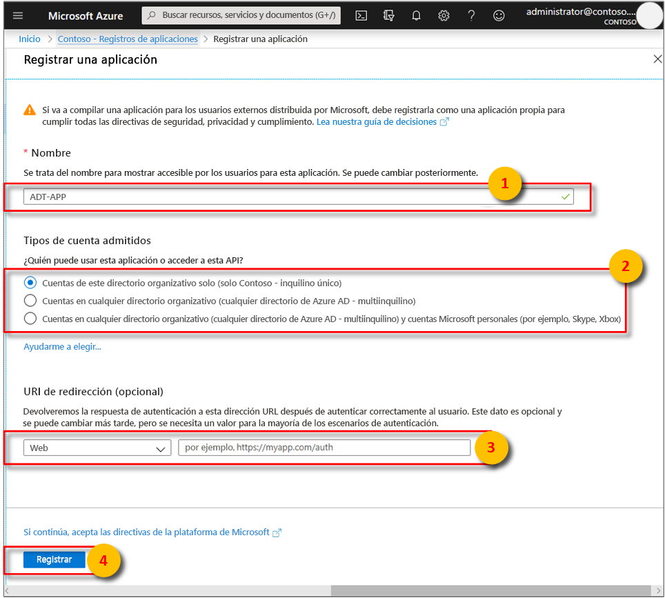

>[!NOTE]
>En esta sección se proporcionan instrucciones para el [nuevo registro de la aplicación de Azure AD](https://docs.microsoft.com/azure/active-directory/develop/quickstart-register-app). Si todavía tiene registro de aplicaciones nativas heredadas, puede utilizarlo siempre que sea compatible. Además, si por alguna razón la nueva forma de registro de la aplicación no funciona en su configuración, puede intentar crear una aplicación nativa de AAD heredada. Consulte [Register your Azure Digital Twins app with Azure Active Directory legacy](../articles/digital-twins/how-to-use-legacy-aad.md) (Registro de la aplicación Azure Digital Twins con Azure Active Directory heredado) para obtener más instrucciones. 

1. En [Azure Portal](https://portal.azure.com), abra **Azure Active Directory** desde el panel izquierdo y, luego, abra el panel **Registros de aplicaciones**. Seleccione el botón **Nuevo registro**.

    

1. Asigne un nombre descriptivo a este registro de aplicaciones en el cuadro **Nombre**. En la sección **URI de redirección (opcional)** , seleccione **Cliente público (móvil y escritorio)** en el menú desplegable de la izquierda y especifique `https://microsoft.com` en el cuadro de texto de la derecha. Seleccione **Registrar**.

    

1. Para asegurarse de que [la aplicación está registrada como una *aplicación nativa*](https://docs.microsoft.com/azure/active-directory/develop/scenario-desktop-app-registration), abra el panel **Autenticación** para el registro de la aplicación y desplácese hacia abajo en ese panel. En la sección **Tipo de cliente predeterminado**, seleccione **Sí** para **tratar la aplicación como cliente público**. 

    

1.  Abra el panel **Introducción** de la aplicación registrada y copie los valores de las siguientes entidades en un archivo temporal. Usará estos valores para configurar la aplicación de ejemplo en las secciones siguientes.

    - **Identificador de la aplicación (cliente)**
    - **Identificador del directorio (inquilino)**

    

1. Abra el panel **Permisos de API** para el registro de la aplicación. Seleccione el botón **Agregar un permiso**. En el panel **Solicitud de permisos de API**, seleccione la pestaña **API usadas en mi organización** y, a continuación, busque **Azure Smart Spaces**. Seleccione la API de **Azure Smart Spaces Service**.

    

1. La API seleccionada se muestra como **Azure Digital Twins** en el mismo panel **Solicitud de permisos de API**. Seleccione la lista desplegable **Read (1)** (Lectura [1]) y, a continuación, activa la casilla **Read.Write**. Seleccione el botón **Agregar permisos**.

    

1. Dependiendo de la configuración de la organización, es posible que tenga que tomar medidas adicionales para conceder acceso de administrador a esta API. Para más información, póngase en contacto con el administrador. Una vez aprobado el acceso de administrador, la columna **CONSENTIMIENTO DEL ADMINISTRADOR NECESARIO** en el panel **Permisos de API** se mostrará de forma similar a lo siguiente para las API:

    

