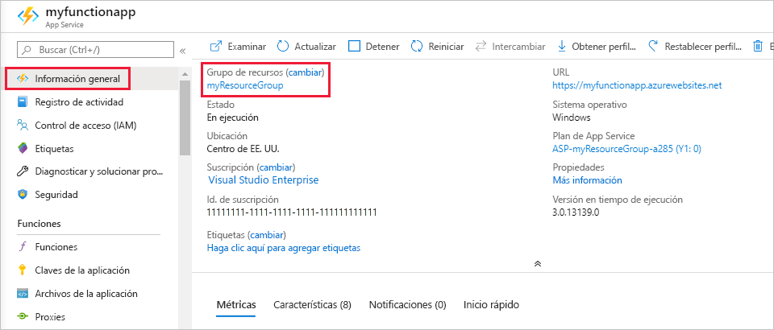

1. En Visual Studio Code, presione F1 para abrir la paleta de comandos. En la paleta de comandos, busque y seleccione `Azure Functions: Open in portal`.

1. Elija la aplicación de funciones y presione Entrar. La página de la aplicación de funciones se abre en Azure Portal.

1. En la pestaña **Introducción**, seleccione el vínculo con nombre en **Grupo de recursos**.

    

1. En la página **Grupo de recursos**, revise la lista de recursos incluidos y compruebe que son los que desea eliminar.
 
1. Seleccione **Eliminar grupo de recursos** y siga las instrucciones.

   El proceso de eliminación tardará un par de minutos. Cuando termine, aparece una notificación durante unos segundos. También puede seleccionar el icono de campana en la parte superior de la página para ver la notificación.
