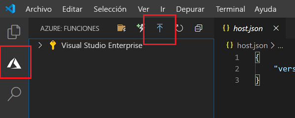

## Publicar el proyecto en Azure

En esta sección, va a crear una aplicación de funciones y los recursos relacionados en su suscripción de Azure y, después, va a implementar el código.

> [!IMPORTANT]
> La publicación en una aplicación de función existente sobrescribe el contenido de esa aplicación en Azure.

1. Seleccione el icono de Azure en la barra de actividades y después en el área **Azure: Functions**, seleccione el botón de **implementación en la aplicación de funciones**.

    

1. Escriba la siguiente información cuando se le indique:

    - **Seleccione la carpeta**: elija una carpeta en el área de trabajo o busque una que contenga la aplicación de funciones. No verá esta opción si ya tiene una aplicación de funciones válida abierta.

    - **Seleccione la suscripción**: elija la suscripción que desee usar. No se mostrará esta opción si solo tiene una suscripción.

    - **Seleccione la aplicación de funciones en Azure**: Elija `- Create new Function App`. (No elija la opción `Advanced`, que no se trata en este artículo).
      
    - **Escriba un nombre único global para la aplicación de funciones**: Escriba un nombre que sea válido en una ruta de acceso de la dirección URL. El nombre que escriba se valida para asegurarse de que es único en Azure Functions.
    
    - **Seleccione una ubicación para los nuevos recursos**:  Para mejorar el rendimiento, elija una [región](https://azure.microsoft.com/regions/) cerca de usted. 
    
1.  Cuando se complete, se crearán los siguientes recursos de Azure en la suscripción con nombres que se basan en el nombre de la aplicación de funciones:
    
    - Un grupo de recursos, que es un contenedor lógico de recursos relacionados.
    - Una cuenta de Azure Storage estándar, que mantiene el estado e información adicional sobre los proyectos.
    - Un plan de consumo, que define el host subyacente para su aplicación de funciones sin servidor. 
    - Una aplicación de funciones, que proporciona el entorno para ejecutar el código de función. Una aplicación de funciones permite agrupar funciones como una unidad lógica para facilitar la administración, la implementación y el uso compartido de recursos en el mismo plan de hospedaje.
    - Una instancia de Application Insights conectada a la aplicación de funciones, que realiza un seguimiento del uso de la función sin servidor.

    Una vez que se haya creado la aplicación de función se mostrará una notificación y se aplicará el paquete de implementación. 
    
1. Seleccione **View Output** (Ver salida) en esta notificación para ver la creación y los resultados de la implementación, incluidos los recursos de Azure que ha creado. Si se pierde la notificación, seleccione el icono de campana en la esquina inferior derecha para verlo de nuevo.

    
