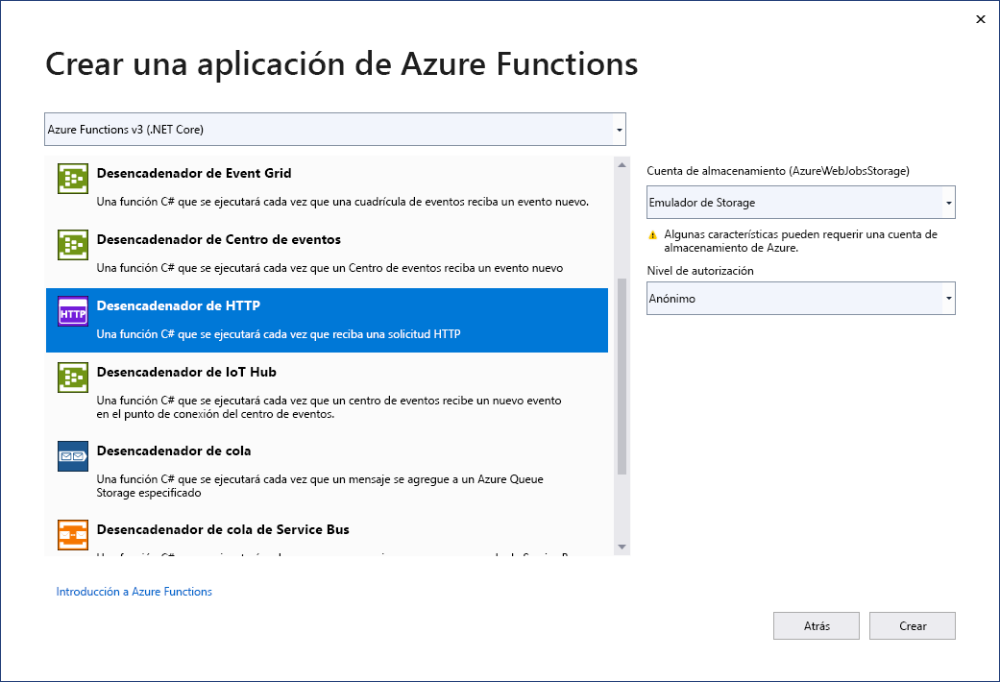

La plantilla del proyecto de Azure Functions de Visual Studio crea un proyecto que puede publicar en una aplicación de función en Azure. Una aplicación de funciones permite agrupar funciones como una unidad lógica para facilitar la administración, la implementación, el escalado y el uso compartido de recursos.

1. En Visual Studio, en el menú **Archivo**, seleccione **Nuevo** > **Proyecto**.

1. En **Crear un nuevo proyecto**, escriba *funciones* en el cuadro de búsqueda y, a continuación, elija la plantilla **Azure Functions**.

1. En **Configurar el nuevo proyecto**, escriba un **nombre de proyecto**  para el proyecto y, a continuación, seleccione **Crear**. El nombre de la aplicación de función debe ser válido como espacio de nombres de C#, por lo que no debe usar guiones bajos, guiones u otros caracteres no alfanuméricos.

1. Para la configuración de **Nuevo proyecto - &lt;nombre del proyecto&gt;** , use los valores de la tabla siguiente:

    | Configuración      | Value  | Descripción                      |
    | ------------ |  ------- |----------------------------------------- |
    | **Entorno en tiempo de ejecución de Functions** | **Azure Functions v2  (.NET Core)** | Este valor crea un proyecto de función que usa la versión 2.x del entorno de ejecución de Azure Functions, que es compatible con .NET Core. Azure Functions 1.x admite .NET Framework. Para más información, consulte [Selección de un destino para versiones de runtime de Azure Functions](../articles/azure-functions/functions-versions.md).   |
    | **Plantilla de función** | **desencadenador HTTP** | Este valor crea una función desencadenada por una solicitud HTTP. |
    | **Storage Account**  | **Emulador de Storage** | Dado que una función de Azure necesita una cuenta de almacenamiento, se asigna una o se crea al publicar el proyecto en Azure. Un desencadenador HTTP no utiliza una cadena de conexión de cuenta de Azure Storage; todos los demás tipos de desencadenador requieren una cadena de conexión de cuenta de Azure Storage válida.  |
    | **Derechos de acceso** | **Anónimo** | Cualquier cliente puede desencadenar una función creada sin tener que proporcionar una clave. Esta configuración de autorización facilita probar la función nueva. Para más información sobre las claves y la autorización, consulte [Claves de autorización](../articles/azure-functions/functions-bindings-http-webhook-trigger.md#authorization-keys) e [Introducción a los enlaces y desencadenadores HTTP de Azure Functions](../articles/azure-functions/functions-bindings-http-webhook.md). |
    

    
    

    Asegúrese de establecer los **derechos de acceso** en **Anónimos**. Al elegir el nivel predeterminado de **Función**, tiene que presentar la [tecla de función](../articles/azure-functions/functions-bindings-http-webhook-trigger.md#authorization-keys) en las solicitudes para acceder al punto de conexión de la función.

1. Seleccione **Aceptar** para crear el proyecto de función y la función que se desencadena mediante HTTP.
