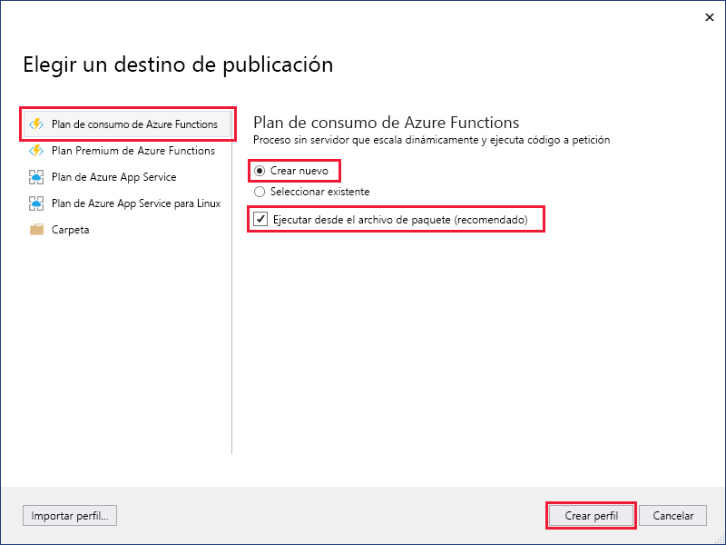
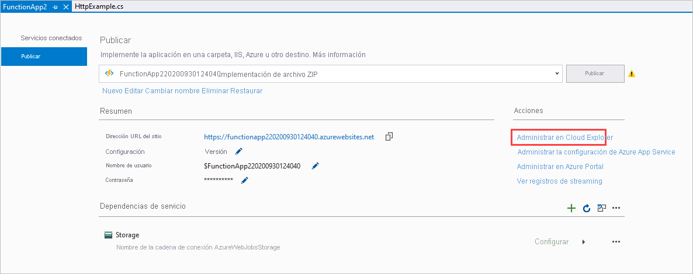

1. En el **Explorador de soluciones**, haga clic con el botón derecho en el proyecto y seleccione **Publicar**.

2. En **Elegir un destino de publicación**, use las opciones de publicación especificadas en la tabla siguiente: 

    | Opción      | Descripción                                |
    | ------------ |  -------------------------------------------------- |
    | **Plan de consumo de Azure Functions** | Cree una aplicación de funciones en un entorno de nube de Azure que se ejecute en un [plan de consumo](../articles/azure-functions/functions-scale.md#consumption-plan). Cuando se usa un plan de consumo, solo se paga por las ejecuciones de la aplicación de funciones. Otros planes de hospedaje suponen costos más elevados. Si ejecuta un plan distinto de Consumo, debe administrar el [escalado de la aplicación de funciones](../articles/azure-functions/functions-scale.md).| 
    | **Crear nuevo** | En Azure se crea una nueva aplicación de funciones, con recursos relacionados.  Si elige **Seleccionar existente**, todos los archivos de la aplicación de función existente en Azure se sobrescriben con los del proyecto local. Use esta opción solo cuando vuelva a publicar actualizaciones en una aplicación de función existente. |
    | **Ejecución desde el archivo de paquete** | La aplicación de funciones se implementa con la [implementación de un archivo zip](../articles/azure-functions/functions-deployment-technologies.md#zip-deploy) y con el modo de [ejecución desde el paquete](../articles/azure-functions/run-functions-from-deployment-package.md) habilitado. Esta implementación, que supone una mejora en el rendimiento, es la forma recomendada de ejecutar las funciones.  Cuando no use esta opción, asegúrese de impedir que el proyecto de aplicación de función se ejecute localmente antes de publicar en Azure. |

    

3. Seleccione **Crear perfil**. Si aún no ha iniciado sesión en la cuenta de Azure desde Visual Studio, seleccione **Iniciar sesión**. También puede crear una cuenta de Azure gratis.

4. En **App Service: Crear nueva**, use los valores especificados en la tabla siguiente:

    | Configuración      | Value  | Descripción                                |
    | ------------ |  ------- | -------------------------------------------------- |
    | **Nombre** | Nombre único globalmente | Nombre que identifica de forma única la nueva aplicación de función. Acepte este nombre o escriba uno nuevo. Los caracteres válidos son `a-z`, `0-9` y `-`. |
    | **Suscripción** | Su suscripción | La suscripción de Azure que se va a usar. Acepte esta suscripción o seleccione una nueva en la lista desplegable. |
    | **[Grupo de recursos](../articles/azure-resource-manager/management/overview.md)** | Nombre del grupo de recursos |  Nombre del grupo de recursos en el que se va a crear la aplicación de función. Seleccione un grupo de recursos existente en la lista desplegable o elija la opción **Nuevo** para crear un nuevo grupo de recursos.|
    | **[Plan de hospedaje](../articles/azure-functions/functions-scale.md)** | Nombre del plan de hospedaje | Seleccione **Nuevo** para configurar un plan sin servidor. Asegúrese de elegir **Consumo** bajo **Tamaño**. Cuando publique el proyecto en una aplicación de funciones que se ejecute en un [plan Consumo](../articles/azure-functions/functions-scale.md#consumption-plan), solo pagará por las ejecuciones de la aplicación. Otros planes de hospedaje suponen costos más elevados. Si ejecuta un plan distinto de **Consumo**, debe administrar el [escalado de la aplicación de funciones](../articles/azure-functions/functions-scale.md).  |
    | **Ubicación** | Ubicación de la instancia de App Service | Elija una **ubicación** en una [región](https://azure.microsoft.com/regions/) próxima a usted o a otros servicios a los que las funciones accedan. |
    | **[Azure Storage](../articles/storage/common/storage-account-create.md)** | Cuenta de almacenamiento de uso general | El entorno de ejecución de Functions necesita una cuenta de Azure Storage. Seleccione **Nueva** para configurar una cuenta de almacenamiento de uso general. También puede elegir una cuenta existente que cumpla los [requisitos de la cuenta de almacenamiento](../articles/azure-functions/functions-scale.md#storage-account-requirements).  |

    

5. Seleccione **Crear** para crear una aplicación de funciones y los recursos relacionados en Azure con esta configuración e implemente el código del proyecto de función. 

6. Seleccione Publicar y, una vez finalizada la implementación, anote el valor de la **dirección URL del sitio**, que es la dirección de la aplicación de funciones en Azure.

    
