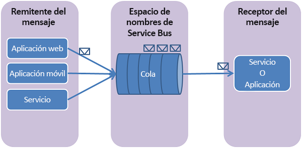

## ¿Qué son las colas de Service Bus?
Las colas de Service Bus son compatibles con el modelo de comunicación de **mensajería asíncrona** . Cuando se usan colas, los componentes de una aplicación distribuida no se comunican directamente entre sí, sino que intercambian mensajes a través de una cola, que actúa como un intermediario (agente). El productor del mensaje (remitente) manda un mensaje a la cola y, a continuación sigue con su procesamiento. De forma asíncrona, el destinatario del mensaje (receptor) extrae el mensaje de la cola y lo procesa. El productor no tiene que esperar una respuesta del destinatario para continuar el proceso y el envío de más mensajes. Las colas ofrecen una entrega de mensajes según el modelo **El primero en entrar es el primero en salir (FIFO)** a uno o más destinatarios de la competencia. Es decir, normalmente los receptores reciben y procesan los mensajes en el orden en el que se agregaron a la cola y solo un destinatario del mensaje recibe y procesa cada uno de los mensajes.

Las colas de Service Bus son una tecnología de uso general que puede utilizarse en una variedad de escenarios:

* Comunicación entre los roles de trabajo y web en una aplicación de Azure de niveles múltiples.
* Comunicación entre aplicaciones locales y aplicaciones hospedadas de Azure en una solución híbrida.
* Comunicación entre componentes de una aplicación distribuida que se ejecuta en local en distintas organizaciones o departamentos de una organización.

El uso de las colas le permite escalar sus aplicaciones más fácilmente y dotar de más resistencia a su arquitectura.

