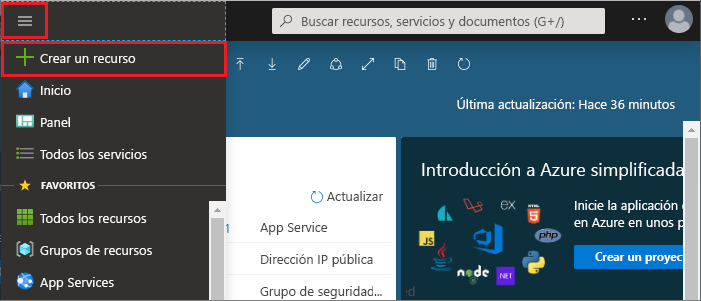
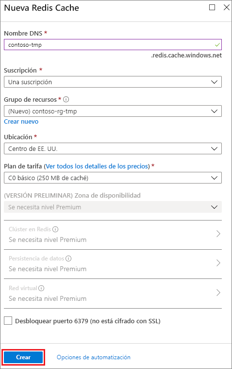

1. Para crear una instancia de caché, inicie sesión en [Azure Portal](https://portal.azure.com) y seleccione **Crear un recurso**. 
   
   
   
1. En la página **Nuevo**, seleccione **Base de datos** y, a continuación, seleccione **Azure Cache for Redis**.
   
   
   
1. En la página **Nueva instancia de Redis Cache**, configure las opciones de la nueva caché.
   
   | Configuración      | Valor sugerido  | Descripción |
   | ------------ |  ------- | -------------------------------------------------- |
   | **Nombre DNS** | Escriba un nombre único global. | El nombre de la memoria caché debe ser una cadena de entre 1 y 63 caracteres, y solo puede contener números, letras o guiones. El nombre debe comenzar y terminar por un número o una letra y no puede contener guiones consecutivos. El *nombre de host* de la instancia de caché será *\<DNS name>.redis.cache.windows.net*. | 
   | **Suscripción** | Desplácese hacia abajo y seleccione su suscripción. | La suscripción en la que se creará esta nueva instancia de Azure Cache for Redis. | 
   | **Grupos de recursos** | Desplácese hacia abajo y seleccione un grupo de recursos o **Crear nuevo** y escriba un nombre nuevo para el grupo de recursos. | Nombre del grupo de recursos en el que se van a crear la caché y otros recursos. Al colocar todos los recursos de la aplicación en un grupo de recursos, puede administrarlos o eliminarlos fácilmente. | 
   | **Ubicación** | Desplácese hacia abajo y seleccione una ubicación. | Seleccione una [región](https://azure.microsoft.com/regions/) cerca de otros servicios que vayan a usar la memoria caché. |
   | **Plan de tarifa** | Desplácese hacia abajo y seleccione un [plan de tarifa](https://azure.microsoft.com/pricing/details/cache/). |  El plan de tarifa determina el tamaño, el rendimiento y las características disponibles para la memoria caché. Para más información, consulte la [introducción a Azure Redis Cache](../articles/azure-cache-for-redis/cache-overview.md). |
   
1. Seleccione **Crear**. 
   
    
   
   La caché tarda un tiempo en crearse. Puede supervisar el progreso en la página **Información general** de Azure Cache for Redis. Cuando **Estado** se muestra como **En ejecución**, la memoria caché está lista para su uso.
   
   

