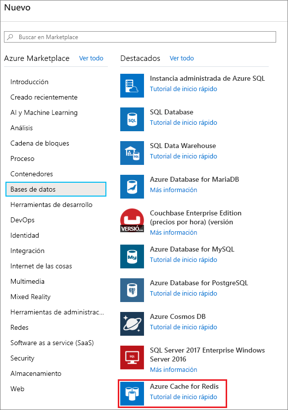
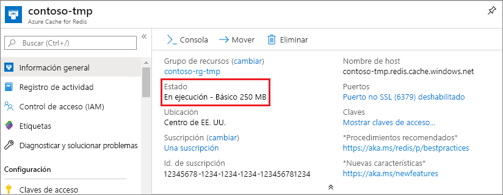

1. Para crear una memoria caché, primero inicie sesión en [Azure Portal](https://portal.azure.com). A continuación, seleccione **Crear un recurso** > **Bases de datos** > **Azure Redis Cache**.

    

2. En **New Azure Cache for Redis** (Nueva instancia de Azure Redis Cache), configure la nueva caché.

    | Configuración      | Valor sugerido  | DESCRIPCIÓN |
    | ------------ |  ------- | -------------------------------------------------- |
    | **Nombre DNS** | Nombre único globalmente | El nombre de caché. Tiene que ser una cadena de entre 1 y 63 caracteres y solo puede contener números, letras y el carácter `-`. El nombre de la memoria caché no puede comenzar ni terminar por el carácter `-` y no se pueden usar varios caracteres `-` consecutivos.  | 
    | **Suscripción** | Su suscripción | La suscripción en la que se crea esta nueva instancia de Azure Redis Cache. | 
    | **Grupos de recursos** |  *TestResources* | Nombre del nuevo grupo de recursos en el que se va a crear la caché. Al colocar todos los recursos de una aplicación en un grupo, puede administrarlos juntos. Por ejemplo, si elimina el grupo de recursos también se eliminarán todos los recursos que están asociados con la aplicación. | 
    | **Ubicación** | Este de EE. UU | Elija una [región](https://azure.microsoft.com/regions/) cerca de otros servicios que vayan a usar la memoria caché. |
    | **[Plan de tarifa](https://azure.microsoft.com/pricing/details/cache/)** |  C0 para básico (caché de 250 MB) |  El plan de tarifa determina el tamaño, el rendimiento y las características disponibles para la memoria caché. Para más información, consulte la [introducción a Azure Redis Cache](../articles/azure-cache-for-redis/cache-overview.md). |
    | **Anclar al panel** |  Seleccionado | Ancle la nueva caché para encontrarla con facilidad. |

     

3. Una vez que las nuevas opciones de caché estén configuradas, seleccione **Crear**. 

    La creación de la caché puede tardar unos minutos. Para comprobar el estado, puede supervisar el progreso en el panel. Después de crear la memoria caché, testa tendrá el estado **En ejecución** y estará lista para su uso.

    

