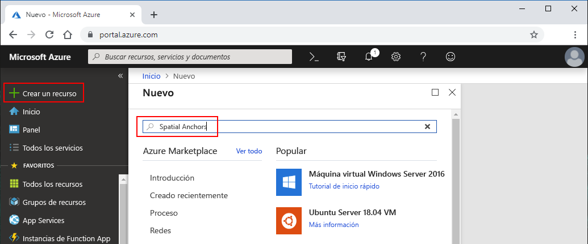

## Creación de un recurso de Spatial Anchors

Vaya a <a href="https://portal.azure.com" target="_blank">Azure Portal</a>.

En el panel de navegación izquierdo de Azure Portal, seleccione **Crear un recurso**.

Use el cuadro de búsqueda para buscar **Spatial Anchors**.

   

Seleccione **Spatial Anchors**. En el cuadro de diálogo, seleccione **Crear**.

En el cuadro de diálogo **Cuenta de Spatial Anchors**:

- Escriba un nombre de recurso único.
- Seleccione la suscripción a la que desea asociar el recurso.
- Cree un grupo de recursos, para lo que debe seleccionar **Crear nuevo**. Asígnele el nombre **myResourceGroup** y seleccione **Aceptar**.
      [!INCLUDE [resource group intro text](resource-group.md)]
- Seleccione la ubicación (región) en la que desea colocar el recurso.
- Seleccione **New** (Nuevo) para empezar a crear el recurso.

   

Una vez creado el recurso, puede ver sus propiedades. Copie el valor de **Id. de cuenta** en un editor de texto, ya que lo necesitará más adelante.

   

En **Configuración**, seleccione **Clave**. Copie el valor de **Clave principal** en un editor de texto. Este valor es `Account Key`. Lo necesitará más adelante.

   
