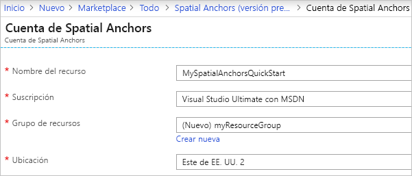
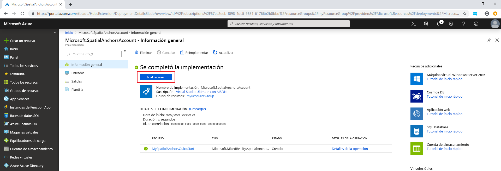
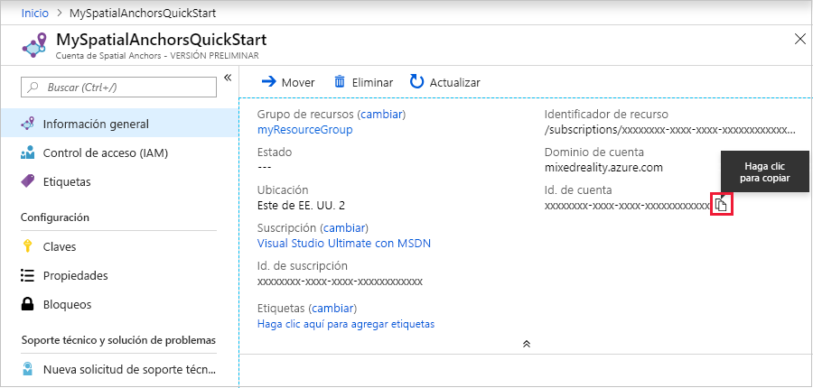
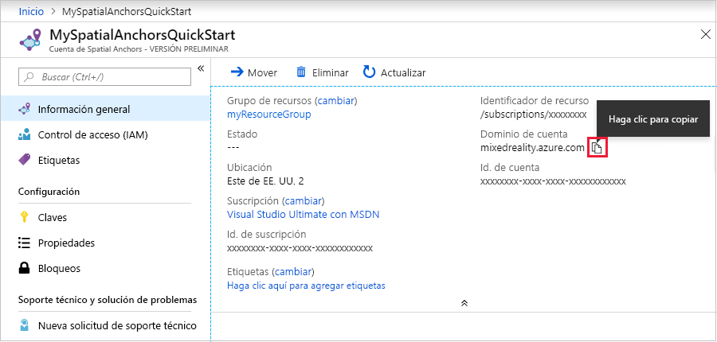

## Creación de un recurso de Spatial Anchors

Vaya a <a href="https://portal.azure.com" target="_blank">Azure Portal</a>.

En el menú izquierdo, seleccione **Crear un recurso**.

Use el cuadro de búsqueda para buscar **Spatial Anchors**.

Seleccione **Spatial Anchors** y, después, seleccione **Crear**.

En el panel **Cuenta de Spatial Anchors**, haga lo siguiente:

* Escriba un nombre de recurso único con caracteres alfanuméricos normales.  
* Seleccione la suscripción a la que desea asociar el recurso.  
* Cree un grupo de recursos, para lo que debe seleccionar **Crear nuevo**. Asígnele el nombre **myResourceGroup** y luego seleccione **Aceptar**.  

  [!INCLUDE [resource group intro text](resource-group.md)]
  
* Seleccione la ubicación (región) en la que desea colocar el recurso.  
* Seleccione **New** (Nuevo) para empezar a crear el recurso.

Una vez creado el recurso, Azure Portal muestra que se ha completado la implementación. 
   

Haga clic en **Go to resource** (Ir al recurso). Ahora puede ver las propiedades del recurso. 
   
Copie el valor de **Id. de cuenta** del recurso en un editor de texto para usarlo más adelante.

Copie también el valor de **Account Domain** (Dominio de cuenta) del recurso en un editor de texto para usarlo más adelante.

En **Configuración**, seleccione **Clave**. Copie el valor de **Clave principal**, **Clave de cuenta**, en un editor de texto para su uso posterior.

