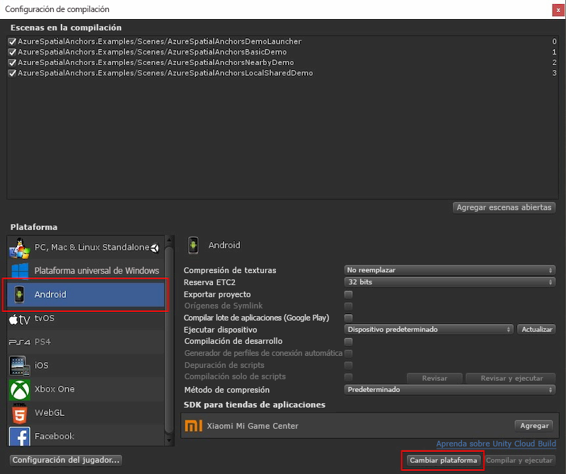

Seleccione **File** > **Build Settings** (Archivo > Configuración de compilación) para abrir **Build Settings** (Configuración de compilación).

En la sección **Platform** (Plataforma), seleccione **Android**. Cambie **Build System** (Sistema de compilación) a **Gradle** y seleccione **Export Project** (Exportar proyecto).

Seleccione **Switch Platform** (Cambiar plataforma) para cambiar la plataforma a **Android**. Unity puede solicitarle que instale los componentes de compatibilidad con Android si no están presentes.

Cierre la ventana **Build Settings** (Configuración de compilación).

### Descargar e importar el SDK de ARCore para Unity

Descargue el archivo `unitypackage` de [ARCore SDK for Unity 1.5 releases](https://github.com/google-ar/arcore-unity-sdk/releases/tag/v1.5.0). De vuelta en el proyecto de Unity, seleccione **Assets** > **Import Package** > **Custom Package** (Recursos > Importar paquete > Paquete personalizado) y seleccione el archivo `unitypackage` que descargó anteriormente. En el cuadro de diálogo **Import Unity Package** (Importar paquete de Unity), asegúrese de que todos los archivos están seleccionados y, después, seleccione **Import** (Importar).
