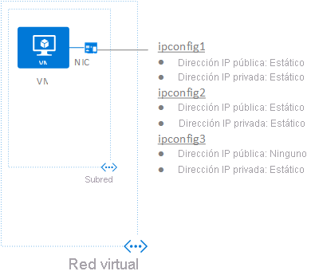

## Escenario
Se crea una máquina virtual con una sola NIC y se conecta a una red virtual. La máquina virtual requiere tres direcciones IP *privadas* y dos direcciones IP *públicas*, todas diferentes. Las direcciones IP se asignan a las siguientes configuraciones de IP:

* **IPConfig-1:** asigna un dirección IP privada *estática* y una dirección IP pública *estática*.
* **IPConfig-2:** asigna un dirección IP privada *estática* y una dirección IP pública *estática*.
* **IPConfig-3:** asigna un dirección IP privada *estática* y ninguna dirección IP pública.
  
    

Las configuraciones de IP se asocian a la NIC cuando esta se crea, y la NIC se conecta a la máquina virtual cuando esta se crea. Los tipos de direcciones IP usados para el escenario tienen fines ilustrativos. Puede asignar cualquier dirección IP y tipo de asignación que necesite.

> [!NOTE]
> Aunque los pasos de este artículo asignan todas las configuraciones de IP a una NIC única, también puede asignar varias configuraciones de IP a cualquiera de las NIC de una máquina virtual con varias NIC. Para aprender a crear una VM con varias NIC, lea el artículo [Implementación de máquinas virtuales con varias NIC mediante PowerShell](../articles/virtual-machines/windows/multiple-nics.md).